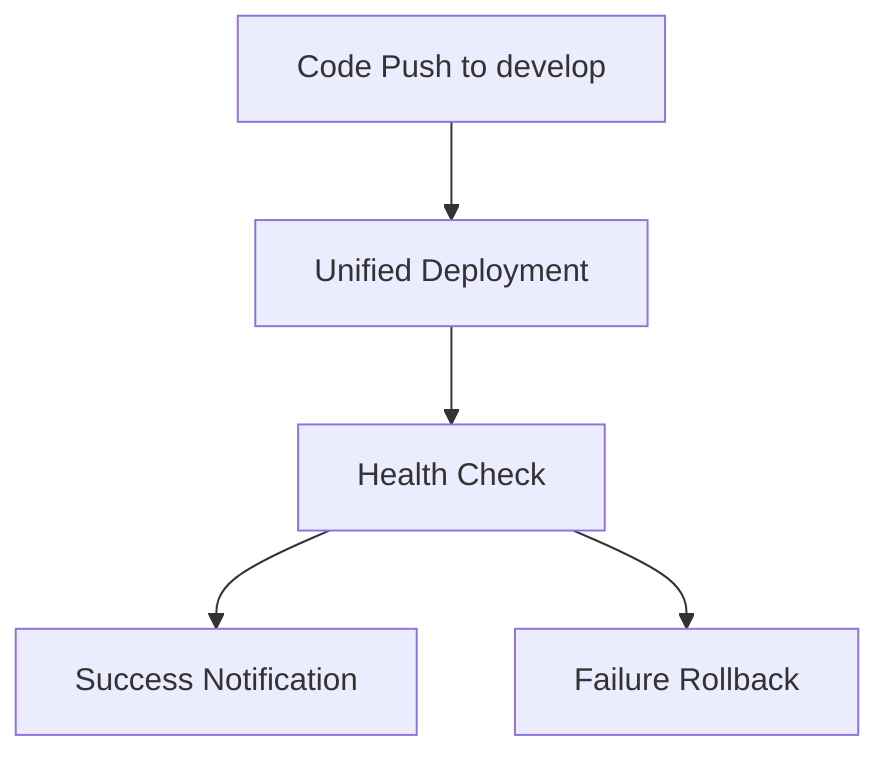
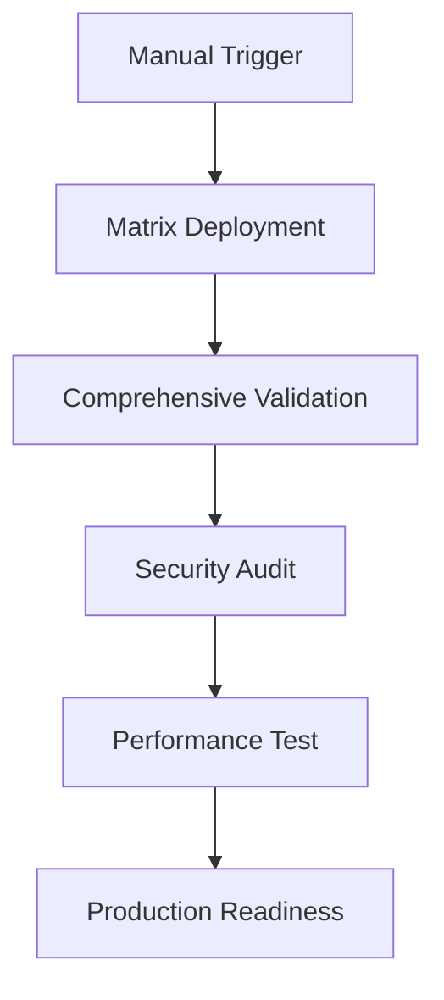
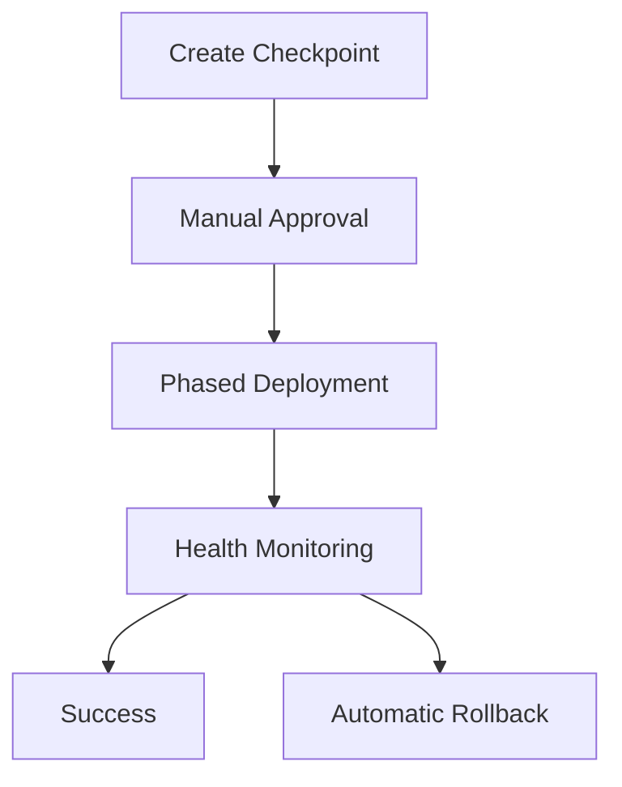

# GitHub Actions CI/CD Deployment Workflows

This directory contains comprehensive GitHub Actions workflows for automated deployment, monitoring, and management of the Cloudya infrastructure on a Hetzner root server.

## 🚀 Workflow Overview

### Core Deployment Workflows

| Workflow | Purpose | Trigger | Environment |
|----------|---------|---------|-------------|
| **Phase 1: Ansible Bootstrap** | Server setup and base configuration | Manual, Workflow Call | All |
| **Phase 3: Terraform Configuration** | Infrastructure provisioning | Manual, Workflow Call | All |
| **Phase 6: Nomad Pack Deployment** | Application deployment via Nomad Packs | Manual, Workflow Call | All |
| **Unified Deployment Orchestration** | Coordinates all phases automatically | Manual, Push, PR | All |

### Management & Operations Workflows

| Workflow | Purpose | Trigger | Environment |
|----------|---------|---------|-------------|
| **Environment Matrix Deployment** | Deploy to multiple environments | Manual, Schedule, Push | Multi-environment |
| **Rollback Management System** | Create checkpoints and perform rollbacks | Manual | All |
| **Monitoring & Validation** | Health checks and system validation | Manual, Schedule | All |

## 📋 Quick Start Guide

### 1. Setup Required Secrets

Before running any workflows, configure the required GitHub Secrets:

```bash
# Required secrets (see docs/GITHUB_SECRETS_SETUP.md for details)
SSH_PRIVATE_KEY                    # SSH key for root@cloudya.net
ANSIBLE_VAULT_PASSWORD             # Ansible vault password
NOMAD_BOOTSTRAP_TOKEN              # Nomad bootstrap token
CONSUL_BOOTSTRAP_TOKEN             # Consul bootstrap token
```

### 2. Run Your First Deployment

#### Option A: Complete Environment Setup
```yaml
# Use Unified Deployment Orchestration
Workflow: unified-deployment-orchestration.yml
Environment: develop
Deployment Phases: all
Dry Run: true (recommended first time)
```

#### Option B: Step-by-Step Deployment
1. **Phase 1**: Run `phase1-ansible-bootstrap.yml`
2. **Phase 3**: Run `phase3-terraform-config.yml` 
3. **Phase 6**: Run `phase6-nomad-pack-deploy.yml`

### 3. Monitor Your Deployment
```yaml
# Use Monitoring & Validation
Workflow: monitoring-validation.yml
Environment: develop
Validation Type: health-check
```

## 🔧 Detailed Workflow Descriptions

### Phase 1: Ansible Bootstrap (`phase1-ansible-bootstrap.yml`)
**Purpose**: Initial server setup, package installation, and base configuration

**Features**:
- System package updates and security hardening
- HashiCorp tools installation (Consul, Nomad, Vault)
- Service configuration and startup
- Security baseline establishment

**Inputs**:
- `environment`: Target environment (develop/staging/production)
- `server_config`: Server configuration profile
- `force_bootstrap`: Complete system reset (destructive)
- `dry_run`: Preview changes without applying

**When to Use**:
- Fresh server setup
- Major system updates
- Recovery from system failures

### Phase 3: Terraform Configuration (`phase3-terraform-config.yml`)
**Purpose**: Infrastructure as Code provisioning and configuration management

**Features**:
- Terraform plan generation and validation
- Infrastructure resource provisioning
- Configuration state management
- Environment-specific customization

**Inputs**:
- `environment`: Target environment
- `terraform_action`: plan/apply/destroy
- `auto_approve`: Skip manual approval (dangerous for production)
- `target_resources`: Specific resources to target

**When to Use**:
- Infrastructure changes
- Resource provisioning
- Configuration updates
- Disaster recovery

### Phase 6: Nomad Pack Deployment (`phase6-nomad-pack-deploy.yml`)
**Purpose**: Application and service deployment using Nomad Packs

**Features**:
- Nomad Pack installation and management
- Application deployment orchestration
- Service health validation
- Job lifecycle management

**Inputs**:
- `environment`: Target environment
- `pack_name`: Specific pack or "all"
- `pack_action`: plan/run/stop/destroy
- `auto_approve`: Skip manual approval

**When to Use**:
- Application deployments
- Service updates
- Scaling operations
- Application rollbacks

### Unified Deployment Orchestration (`unified-deployment-orchestration.yml`)
**Purpose**: Complete end-to-end deployment coordination

**Features**:
- Multi-phase deployment coordination
- Dependency management
- Error handling and recovery
- Comprehensive reporting

**Inputs**:
- `environment`: Target environment
- `deployment_phases`: Which phases to execute
- `force_bootstrap`: Force complete rebuild
- `auto_approve`: Skip all manual approvals
- `dry_run`: Preview all changes

**When to Use**:
- Complete environment setup
- Coordinated updates across all components
- Automated deployments from git triggers

### Environment Matrix Deployment (`environment-matrix-deployment.yml`)
**Purpose**: Deploy to multiple environments simultaneously or sequentially

**Features**:
- Multi-environment deployment coordination
- Parallel or sequential execution strategies
- Cross-environment validation
- Batch operation management

**Inputs**:
- `environments`: Comma-separated environment list
- `deployment_phases`: Which phases to execute
- `parallel_execution`: Execute environments in parallel
- `auto_approve`: Skip approvals (dangerous)

**When to Use**:
- Promoting changes through environments
- Synchronizing multiple environments
- Nightly environment refreshes

### Rollback Management System (`rollback-management.yml`)
**Purpose**: System state management and disaster recovery

**Features**:
- Checkpoint creation and validation
- System state snapshots
- Rollback execution with validation
- Emergency recovery procedures

**Inputs**:
- `environment`: Target environment
- `rollback_action`: list/create/validate/rollback/emergency-rollback
- `checkpoint_id`: Specific checkpoint to use
- `rollback_scope`: Scope of rollback operation

**When to Use**:
- Before major deployments (create checkpoints)
- After deployment failures (rollback)
- Disaster recovery scenarios

### Monitoring & Validation (`monitoring-validation.yml`)
**Purpose**: System health monitoring and validation

**Features**:
- Comprehensive health checks
- Security auditing
- Performance testing
- Automated reporting

**Inputs**:
- `environment`: Target environment
- `validation_type`: Type of validation to perform
- `monitoring_duration`: How long to monitor
- `include_metrics`: Detailed metrics collection

**When to Use**:
- Regular health monitoring
- Post-deployment validation
- Security compliance checks
- Performance baseline establishment

## 🛡️ Security Considerations

### Production Safety Features
- **Manual Approval Gates**: Production deployments require explicit approval
- **Dry Run Mode**: Preview changes before applying
- **Rollback Capabilities**: Quick recovery from failed deployments
- **Audit Logging**: Complete deployment history and tracking

### Secret Management
- All sensitive data stored in GitHub Secrets
- Automatic secret rotation capabilities
- Environment-specific secret isolation
- Secure SSH key management

### Access Control
- Environment-based deployment restrictions
- Branch protection rules
- Required status checks
- Audit trail for all operations

## 🔄 Deployment Patterns

### Development Workflow


### Staging Validation


### Production Deployment


## 📊 Monitoring & Alerting

### Automated Monitoring
- **Health Checks**: Every 6 hours
- **Full Validation**: Daily at 3 AM UTC
- **Security Audits**: Weekly
- **Performance Tests**: On-demand

### Alert Conditions
- Service failures
- Resource exhaustion
- Security vulnerabilities
- Performance degradation

## 🚨 Emergency Procedures

### System Down
1. Run `monitoring-validation.yml` for diagnosis
2. Check recent deployments in workflow history
3. Use `rollback-management.yml` with `emergency-rollback`
4. Escalate to platform team if needed

### Deployment Failure
1. Check workflow logs for specific errors
2. Run rollback to last known good state
3. Fix issues in development environment
4. Re-deploy with validation

### Security Incident
1. Run security audit immediately
2. Document findings
3. Apply fixes via emergency deployment
4. Validate resolution

## 📚 Documentation

### Additional Resources
- **Secret Setup**: [`docs/GITHUB_SECRETS_SETUP.md`](docs/GITHUB_SECRETS_SETUP.md)
- **Infrastructure Guide**: [`../docs/INFRASTRUCTURE_GUIDE.md`](../docs/INFRASTRUCTURE_GUIDE.md)
- **Deployment Workflow**: [`../docs/DEPLOYMENT_WORKFLOW.md`](../docs/DEPLOYMENT_WORKFLOW.md)

### Troubleshooting
- Check workflow logs for detailed error messages
- Verify SSH connectivity to remote server
- Ensure all required secrets are configured
- Validate server prerequisites are met

## 🔧 Customization

### Adding New Environments
1. Update environment choices in workflow inputs
2. Create environment-specific configuration
3. Add to matrix deployment configuration
4. Test with dry run first

### Custom Validation
1. Modify `monitoring-validation.yml`
2. Add custom test suites
3. Configure alert thresholds
4. Update reporting format

### Integration Points
- **Slack Notifications**: Add webhook integration
- **Email Alerts**: Configure SMTP settings
- **External Monitoring**: Integrate with Datadog/New Relic
- **Ticketing Systems**: Auto-create issues for failures

## 📈 Metrics & Reporting

### Deployment Metrics
- Deployment frequency
- Success/failure rates
- Mean time to recovery
- Change lead time

### System Metrics
- Resource utilization trends
- Performance benchmarks
- Security compliance scores
- Uptime statistics

## 🔄 Maintenance

### Regular Tasks
- Secret rotation (monthly)
- Workflow updates (quarterly)
- Security reviews (quarterly)
- Performance baseline updates (monthly)

### Backup Procedures
- Checkpoint creation before major changes
- Configuration backup automation
- Disaster recovery testing
- Recovery procedure validation

---

## Support & Contact

For issues with these workflows:
1. Check the troubleshooting section above
2. Review workflow logs for detailed error messages
3. Open a GitHub issue with workflow run details
4. Contact the platform engineering team for critical issues

**Remember**: Always test changes in development environment first, and use dry run mode for production deployments when possible.