# Cloudya Infrastructure - Production-Ready HashiCorp Stack

[](https://github.com/your-org/cloudya-vault)
[](docs/INFRASTRUCTURE_GUIDE.md#security-best-practices)
[](docs/INFRASTRUCTURE_GUIDE.md)

A production-ready, cloud-native infrastructure platform built on HashiCorp's ecosystem (Vault, Nomad, Consul) with Traefik reverse proxy, providing secure secret management, service orchestration, and automated deployments.

## 🚀 Quick Start

### Local Development (5 minutes)

```bash
# Clone repository
git clone https://github.com/your-org/cloudya-vault.git
cd cloudya-vault

# Start local stack
make local-up

# Initialize Vault
./infrastructure/scripts/init-vault.sh

# Access services
echo "Traefik Dashboard: http://localhost:8080"
echo "Vault UI: http://localhost:8200"
echo "Nomad UI: http://localhost:4646"
echo "Consul UI: http://localhost:8500"
echo "Grafana: http://localhost:3000 (admin/admin)"
```

### Production Deployment (15 minutes)

```bash
# Provision server
./infrastructure/scripts/provision-server.sh root@your-server.com --verbose

# Configure environment
cp infrastructure/config/production.env.template infrastructure/production.env
# Edit production.env with your values

# Deploy infrastructure
./infrastructure/scripts/remote-deploy.sh --verbose

# Verify deployment
curl -k https://vault.yourcompany.com/v1/sys/health
```

## 🏗️ Architecture

```mermaid
graph TB
    Internet[🌐 Internet] --> LB[🔀 Traefik Load Balancer]
    
    LB --> Vault[🔐 HashiCorp Vault<br/>Secret Management]
    LB --> Nomad[📦 HashiCorp Nomad<br/>Workload Orchestration]
    LB --> Consul[🔍 HashiCorp Consul<br/>Service Discovery]
    LB --> Apps[🚀 Applications]
    
    subgraph "Core Services"
        Vault -.-> Nomad
        Consul -.-> Nomad
        Consul -.-> Vault
        Vault -.-> Apps
        Consul -.-> Apps
    end
    
    subgraph "Data Layer"
        DB[(🗄️ PostgreSQL)]
        Storage[(💾 MinIO)]
        Logs[(📊 Loki)]
    end
    
    subgraph "Monitoring Stack"
        Prometheus[📈 Prometheus]
        Grafana[📊 Grafana]
        Alert[🚨 AlertManager]
    end
    
    Apps --> DB
    Apps --> Storage
    Apps --> Logs
    
    Vault --> Prometheus
    Nomad --> Prometheus
    Consul --> Prometheus
    Apps --> Prometheus
    
    Prometheus --> Grafana
    Prometheus --> Alert
    
    style Vault fill:#ffd700
    style Nomad fill:#00c851
    style Consul fill:#e91e63
    style LB fill:#37b24d
```



### Core Components

| Component | Purpose | Ports | Status |
|-----------|---------|-------|--------|
| **Traefik** | Reverse proxy, SSL termination | 80, 443, 8080 | ✅ Production Ready |
| **Vault** | Secret management, encryption | 8200, 8201 | ✅ Production Ready |
| **Nomad** | Container orchestration | 4646-4648 | ✅ Production Ready |
| **Consul** | Service discovery, KV store | 8500-8502 | ✅ Production Ready |
| **Prometheus** | Metrics collection | 9090 | ✅ Production Ready |
| **Grafana** | Monitoring dashboards | 3000 | ✅ Production Ready |

## 📚 Documentation

### Core Documentation
- **[📖 Complete Infrastructure Guide](docs/INFRASTRUCTURE_GUIDE.md)** - Comprehensive setup and configuration guide
- **[🚀 Quick Start Guide](docs/QUICK_START.md)** - Get running in minutes
- **[🔒 Security Guide](docs/SECURITY_GUIDE.md)** - Hardening and best practices
- **[📊 Monitoring Guide](docs/MONITORING_GUIDE.md)** - Observability setup

### Component Guides
- **[🔐 Vault Setup](infrastructure/vault/README.md)** - Secret management configuration
- **[📦 Nomad Orchestration](infrastructure/nomad/README.md)** - Workload management
- **[🔍 Consul Service Discovery](infrastructure/consul/README.md)** - Service mesh setup
- **[🔀 Traefik Proxy](infrastructure/traefik/README.md)** - Load balancer configuration

### Integration & Operations
- **[🔄 CI/CD Integration](docs/CICD_INTEGRATION.md)** - Automated deployments
- **[📈 Scaling Guide](docs/SCALING_GUIDE.md)** - Performance optimization
- **[🛠️ Troubleshooting](docs/TROUBLESHOOTING.md)** - Common issues and solutions
- **[💾 Backup & Recovery](docs/BACKUP_RECOVERY.md)** - Data protection strategies

## 🛠️ Features

### ✅ Production Ready
- **High Availability**: Multi-node clustering for all components
- **SSL/TLS**: Automated certificate management with Let's Encrypt
- **Security Hardening**: Following industry best practices
- **Monitoring**: Comprehensive observability with Prometheus & Grafana
- **Backup & Recovery**: Automated backup strategies

### 🔒 Security Features
- **Zero-Trust Architecture**: Mutual TLS between all services
- **Secret Rotation**: Automated credential lifecycle management
- **Audit Logging**: Comprehensive security event tracking
- **Access Controls**: Fine-grained RBAC policies
- **Network Segmentation**: Isolated service communications

### 🚀 Developer Experience
- **GitOps Workflow**: Infrastructure as Code with version control
- **Local Development**: Full-stack development environment
- **API Integration**: RESTful APIs for all management operations
- **CLI Tools**: Command-line interfaces for operations
- **Documentation**: Comprehensive guides and examples

### 📊 Observability
- **Metrics Collection**: Real-time performance monitoring
- **Distributed Tracing**: Request flow visualization
- **Log Aggregation**: Centralized logging with search
- **Alerting**: Proactive issue detection
- **Dashboards**: Visual health and performance insights

## 🗂️ Project Structure

```
cloudya-vault/
├── 📁 infrastructure/           # Core infrastructure components
│   ├── 🔐 vault/              # Secret management
│   ├── 📦 nomad/              # Workload orchestration
│   ├── 🔍 consul/             # Service discovery
│   ├── 🔀 traefik/            # Reverse proxy
│   ├── 📊 monitoring/         # Observability stack
│   └── 🛠️ scripts/            # Automation scripts
├── 📁 integrations/            # Application integrations
│   ├── 🐍 python/             # Python SDK and examples
│   ├── 🟨 javascript/         # Node.js SDK and examples
│   └── 🔄 ci-cd/              # CI/CD pipeline templates
├── 📁 docs/                   # Documentation
│   ├── 📖 INFRASTRUCTURE_GUIDE.md
│   ├── 🔒 SECURITY_GUIDE.md
│   └── 📊 MONITORING_GUIDE.md
├── 📁 examples/               # Usage examples
├── 📁 tests/                  # Integration tests
└── 🐳 docker-compose.*.yml   # Environment definitions
```

## 🚀 Deployment Options

### Local Development
Perfect for development and testing:

```bash
# Quick start
make local-up

# With custom configuration
cp config/local.env.template local.env
docker-compose -f docker-compose.local.yml --env-file local.env up -d
```

### Staging Environment
Production-like environment for testing:

```bash
./scripts/deploy-staging.sh
```

### Production Deployment
Secure, hardened production deployment:

```bash
# One-time server setup
./scripts/provision-server.sh root@your-server.com

# Deploy infrastructure
./scripts/remote-deploy.sh --verbose
```

### Cloud Providers
- **AWS**: CloudFormation templates included
- **Google Cloud**: Terraform modules available
- **Azure**: ARM templates provided
- **Digital Ocean**: Droplet configuration scripts

## 🔧 Configuration

### Environment Templates

| Environment | File | Purpose |
|-------------|------|---------|
| **Local** | `config/local.env.template` | Development environment |
| **Staging** | `config/staging.env.template` | Pre-production testing |
| **Production** | `config/production.env.template` | Production deployment |

### Key Configuration Options

```bash
# Infrastructure Settings
VAULT_VERSION=1.15.2
NOMAD_VERSION=1.6.3
CONSUL_VERSION=1.16.1
TRAEFIK_VERSION=3.0

# Security Configuration
VAULT_SEAL_TYPE=shamir  # or 'awskms', 'azurekeyvault'
TLS_ENABLED=true
ACME_EMAIL=admin@yourcompany.com

# Scaling Configuration
VAULT_CLUSTER_SIZE=3
NOMAD_SERVER_COUNT=3
CONSUL_CLUSTER_SIZE=3

# Monitoring
PROMETHEUS_RETENTION=30d
GRAFANA_ADMIN_PASSWORD=secure-password
ALERTMANAGER_SLACK_WEBHOOK=https://hooks.slack.com/...
```

## 🔄 CI/CD Integration

### GitHub Actions
Pre-configured workflows for:
- **Infrastructure Validation**: Configuration testing
- **Security Scanning**: Vulnerability assessment
- **Automated Deployment**: Environment promotion
- **Health Monitoring**: Post-deployment verification

```yaml
name: Deploy Infrastructure
on:
  push:
    branches: [main]
    paths: ['infrastructure/**']

jobs:
  deploy:
    uses: ./.github/workflows/infrastructure-deploy.yml
    secrets:
      VAULT_TOKEN: ${{ secrets.VAULT_TOKEN }}
      SSH_PRIVATE_KEY: ${{ secrets.SSH_PRIVATE_KEY }}
```

### Jenkins Pipeline
Jenkinsfile included for:
- Multi-stage deployments
- Approval workflows
- Rollback capabilities
- Integration testing

### GitLab CI/CD
Complete `.gitlab-ci.yml` with:
- Security scanning
- Infrastructure testing
- Progressive deployment
- Monitoring integration

## 📊 Monitoring & Observability

### Metrics Dashboard
Access comprehensive monitoring at: `https://grafana.yourcompany.com`

**Key Dashboards:**
- **Infrastructure Overview**: System health and resource usage
- **HashiCorp Services**: Vault, Nomad, Consul performance
- **Application Performance**: Request rates, response times, errors
- **Security Events**: Authentication, authorization, audit logs

### Alerting Rules
Pre-configured alerts for:
- **Service Downtime**: Critical service failures
- **Resource Exhaustion**: CPU, memory, disk usage
- **Security Events**: Failed authentications, policy violations
- **Performance Degradation**: High latency, error rates

### Log Management
Centralized logging with:
- **Structured Logging**: JSON format across all services
- **Log Retention**: Configurable retention policies
- **Search & Analytics**: Full-text search capabilities
- **Compliance**: Audit trail maintenance

## 🔒 Security

### Hardening Checklist
- ✅ **Network Security**: Firewall rules, VPN access
- ✅ **TLS Encryption**: End-to-end encryption
- ✅ **Access Controls**: RBAC policies, MFA
- ✅ **Audit Logging**: Comprehensive security events
- ✅ **Secret Rotation**: Automated credential lifecycle
- ✅ **Vulnerability Scanning**: Regular security assessments

### Compliance
Designed to support:
- **SOC 2 Type II**: Comprehensive audit trails
- **PCI DSS**: Secure data handling
- **GDPR**: Data protection and privacy
- **HIPAA**: Healthcare data security

### Security Features
```bash
# Network isolation
iptables -A INPUT -p tcp --dport 8200 -s 10.0.0.0/8 -j ACCEPT

# Automated secret rotation
vault write database/rotate-role/myapp

# Audit logging
vault audit enable file file_path=/var/log/vault/audit.log

# MFA enforcement
vault auth enable -path=userpass userpass
vault write auth/userpass/mfa_config totp_issuer="MyCompany"
```

## 📈 Performance & Scaling

### Horizontal Scaling
- **Auto-scaling Groups**: Dynamic capacity adjustment
- **Load Balancing**: Traffic distribution across nodes
- **Multi-AZ Deployment**: High availability across zones
- **Service Mesh**: Intelligent traffic routing

### Vertical Scaling
- **Resource Optimization**: Right-sizing recommendations
- **Performance Tuning**: Configuration optimization
- **Capacity Planning**: Predictive scaling analysis
- **Benchmarking**: Performance baseline establishment

### Scaling Metrics
| Metric | Target | Alert Threshold |
|--------|--------|-----------------|
| **CPU Usage** | < 70% | > 80% |
| **Memory Usage** | < 80% | > 90% |
| **Disk Usage** | < 75% | > 85% |
| **Network I/O** | < 80% | > 90% |

## 🧪 Testing

### Test Suite
Comprehensive testing with:
- **Unit Tests**: Component functionality
- **Integration Tests**: Service interactions
- **Security Tests**: Vulnerability assessment
- **Performance Tests**: Load and stress testing
- **Chaos Engineering**: Resilience validation

```bash
# Run full test suite
make test

# Security testing
make security-test

# Performance benchmarks
make performance-test

# Chaos engineering
make chaos-test
```

### Test Environments
- **Development**: Local Docker environment
- **Staging**: Production-like testing environment
- **QA**: Quality assurance environment
- **Load Testing**: Performance validation environment

## 🤝 Contributing

We welcome contributions! Please see our [Contributing Guide](CONTRIBUTING.md) for details.

### Development Setup
```bash
# Fork and clone the repository
git clone https://github.com/your-username/cloudya-vault.git
cd cloudya-vault

# Setup pre-commit hooks
pre-commit install

# Start development environment
make dev-up

# Run tests
make test
```

### Contribution Areas
- 🐛 **Bug Fixes**: Issue resolution and improvements
- ✨ **Features**: New functionality and enhancements
- 📚 **Documentation**: Guides, examples, and tutorials
- 🔒 **Security**: Hardening and compliance improvements
- 🎨 **UI/UX**: Dashboard and interface enhancements

## 📞 Support

### Community Support
- 💬 **Discord**: [Join our community](https://discord.gg/cloudya)
- 🐙 **GitHub Discussions**: [Q&A and ideas](https://github.com/your-org/cloudya-vault/discussions)
- 📧 **Mailing List**: infrastructure@yourcompany.com

### Enterprise Support
- 🏢 **Commercial Support**: Professional services available
- 🔒 **Security Consultation**: Expert security review
- 📊 **Performance Optimization**: Scaling and tuning services
- 🎓 **Training**: Team training and certification

### Documentation & Resources
- 📖 **Documentation**: Comprehensive guides and tutorials
- 🎥 **Video Tutorials**: Step-by-step video guides
- 🔗 **API Reference**: Complete API documentation
- 📝 **Blog Posts**: Best practices and use cases

## 📄 License

This project is licensed under the MIT License - see the [LICENSE](LICENSE) file for details.

## 🙏 Acknowledgments

Built with excellent open-source projects:
- [HashiCorp Vault](https://www.vaultproject.io/) - Secret management
- [HashiCorp Nomad](https://www.nomadproject.io/) - Workload orchestration
- [HashiCorp Consul](https://www.consul.io/) - Service discovery
- [Traefik](https://traefik.io/) - Cloud-native reverse proxy
- [Prometheus](https://prometheus.io/) - Monitoring and alerting
- [Grafana](https://grafana.com/) - Observability platform

---

<div align="center">

**[📖 Documentation](docs/INFRASTRUCTURE_GUIDE.md)** •
**[🚀 Quick Start](docs/QUICK_START.md)** •
**[💬 Community](https://discord.gg/cloudya)** •
**[🐛 Issues](https://github.com/your-org/cloudya-vault/issues)**

Made with ❤️ by the Cloudya Infrastructure Team

</div>