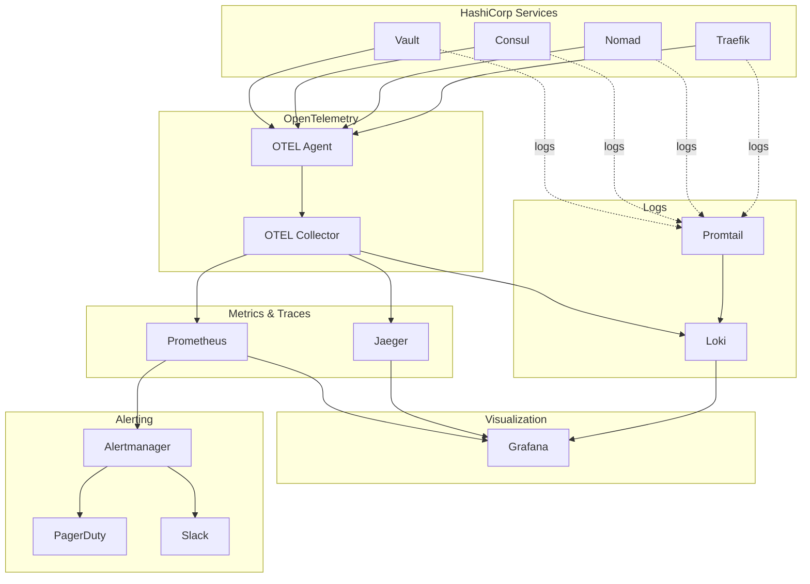

# Comprehensive Monitoring Architecture for HashiCorp Stack

## Overview

This document outlines a comprehensive monitoring solution for the HashiCorp stack (Vault, Consul, Nomad) using modern observability tools including OpenTelemetry, Prometheus, Grafana, Loki, and Alertmanager.

## Architecture Components

### Core Monitoring Stack



### Service Discovery Integration

The monitoring solution leverages Consul for dynamic service discovery, enabling:
- Automatic discovery of services running in Nomad
- Dynamic Prometheus target configuration
- Service mesh observability integration

## OpenTelemetry Architecture

### Collection Strategy

1. **Agent-based Collection**: Deploy OTEL agents on each node
2. **Collector Hub**: Central OTEL collector for data processing
3. **Multi-protocol Support**: OTLP, Prometheus, Jaeger formats
4. **Service Mesh Integration**: Native Consul Connect integration

### Configuration Layers

```yaml
# OTEL Collector Pipeline
receivers:
  - prometheus/hashicorp
  - jaeger/traces
  - otlp/metrics-traces-logs

processors:
  - batch
  - memory_limiter
  - resource/environment
  - attributes/service-mesh

exporters:
  - prometheus/metrics
  - jaeger/traces
  - loki/logs
```

## Telemetry Configuration

### Vault Telemetry Enhancement

Current configuration includes basic Prometheus support. Enhanced configuration:

```hcl
telemetry {
  # OpenTelemetry Configuration
  prometheus_retention_time = "30s"
  disable_hostname = false
  
  # Custom metrics collectors
  usage_gauge_period = "5m"
  maximum_gauge_cardinality = 500
  
  # OpenTelemetry OTLP endpoint
  dogstatsd_addr = "127.0.0.1:8125"
  dogstatsd_tags = ["vault", "production"]
  
  # Circonus integration for advanced analytics
  circonus_api_token = "${CIRCONUS_API_TOKEN}"
  circonus_api_app = "vault-prod"
  circonus_submission_interval = "10s"
}
```

### Nomad Telemetry Enhancement

```hcl
telemetry {
  collection_interval = "10s"
  disable_hostname = false
  prometheus_metrics = true
  
  # Enhanced metrics publication
  publish_allocation_metrics = true
  publish_node_metrics = true
  
  # OpenTelemetry integration
  statsd_address = "127.0.0.1:8125"
  datadog_address = "127.0.0.1:8125"
  datadog_tags = ["nomad", "production"]
  
  # Custom metric filters
  filter_default = true
  prefix_filter = ["+nomad.raft", "+nomad.serf", "+nomad.runtime"]
}
```

### Consul Telemetry

```hcl
telemetry = {
  prometheus_retention_time = "30s"
  disable_hostname = false
  
  # OpenTelemetry integration
  dogstatsd_addr = "127.0.0.1:8125"
  dogstatsd_tags = ["consul", "production"]
  
  # Service mesh metrics
  prefix_filter = [
    "+consul.catalog",
    "+consul.health",
    "+consul.raft",
    "+consul.serf",
    "+consul.connect"
  ]
}
```

## Monitoring Touchpoints Identified

### Vault Monitoring Points

1. **API Performance**: Request latency, throughput, error rates
2. **Storage Backend**: Raft consensus, storage I/O, replication lag
3. **Authentication**: Login attempts, token lifecycle, policy violations
4. **Secrets Management**: Secret access patterns, rotation events
5. **High Availability**: Leader election, seal/unseal events
6. **Security**: Audit log analysis, unauthorized access attempts

### Nomad Monitoring Points

1. **Cluster Health**: Node status, leader election, gossip protocol
2. **Job Scheduling**: Placement decisions, resource utilization
3. **Resource Management**: CPU, memory, disk usage per allocation
4. **Service Discovery**: Service registration, health checks
5. **Integration Points**: Vault token management, Consul registration

### Consul Monitoring Points

1. **Service Mesh**: Connect proxy metrics, traffic patterns
2. **Service Discovery**: Registration events, health check status
3. **Consensus**: Raft operations, leader changes
4. **Network**: Gossip protocol, WAN federation
5. **KV Store**: Read/write operations, watch events

### Traefik Monitoring Points

1. **Request Routing**: Route matching, load balancing
2. **SSL/TLS**: Certificate status, handshake performance
3. **Backend Health**: Service availability, response times
4. **Security**: Rate limiting, authentication events

## Key Metrics Dashboard Design

### Executive Dashboard
- Overall system health
- Service availability SLA
- Resource utilization trends
- Security incident count

### Vault Operations Dashboard
- API request rates and latency percentiles
- Storage backend performance
- Token lifecycle and usage patterns
- Seal/unseal events and HA status
- Secret access audit trail

### Nomad Cluster Dashboard
- Node health and resource allocation
- Job placement success rates
- Allocation failure reasons
- Resource utilization by job/namespace
- Integration health (Vault/Consul)

### Consul Service Mesh Dashboard
- Service topology and dependency mapping
- Connect proxy metrics
- Service discovery events
- Health check status distribution
- Network segmentation compliance

## Alert Categories and SLA Targets

### Critical Alerts (5-minute SLA)
- Vault sealed/unavailable
- Nomad leader election failure
- Consul cluster partition
- Service mesh security violations

### Warning Alerts (15-minute SLA)
- High resource utilization (>80%)
- Authentication failures spike
- Certificate expiration (30 days)
- Backup job failures

### Informational Alerts (1-hour SLA)
- Performance degradation trends
- Capacity planning thresholds
- Security audit anomalies
- Configuration drift detection

## Security and Compliance Monitoring

### Audit Integration
- Centralized audit log collection via Loki
- Real-time security event correlation
- Compliance reporting automation
- Privileged access monitoring

### RBAC Monitoring
- Permission escalation detection
- Role assignment tracking
- Policy violation alerts
- Token misuse identification

## Performance Baselines

### Vault Performance Targets
- API latency P99 < 500ms
- Secret retrieval P95 < 100ms
- Token validation < 50ms
- Storage operations P99 < 1s

### Nomad Performance Targets
- Job placement time P95 < 30s
- Resource allocation accuracy > 95%
- Scheduler queue depth < 100
- API response P99 < 200ms

### Consul Performance Targets
- Service discovery resolution < 10ms
- Health check propagation < 5s
- Connect proxy overhead < 5%
- KV operations P99 < 50ms

## Integration Patterns

### Service Mesh Observability
```yaml
# Consul Connect Proxy Configuration
connect {
  enabled = true
  
  proxy_defaults = {
    config = {
      envoy_prometheus_bind_addr = "0.0.0.0:9102"
      envoy_tracing_json = jsonencode({
        http = {
          name = "envoy.tracers.opentelemetry"
          typed_config = {
            "@type" = "type.googleapis.com/envoy.config.trace.v3.OpenTelemetryConfig"
            grpc_service = {
              envoy_grpc = {
                cluster_name = "opentelemetry_collector"
              }
            }
            service_name = "consul-connect-proxy"
          }
        }
      })
    }
  }
}
```

### Cross-Service Correlation
- Distributed tracing with correlation IDs
- Log correlation across service boundaries
- Metric dimension alignment
- Event timeline reconstruction

## Next Steps

1. Deploy OpenTelemetry collectors and agents
2. Enhanced telemetry configuration rollout
3. Custom dashboard development
4. Alert rule configuration and testing
5. Runbook development and training
6. Performance baseline establishment
7. Security monitoring integration
8. Automation script deployment