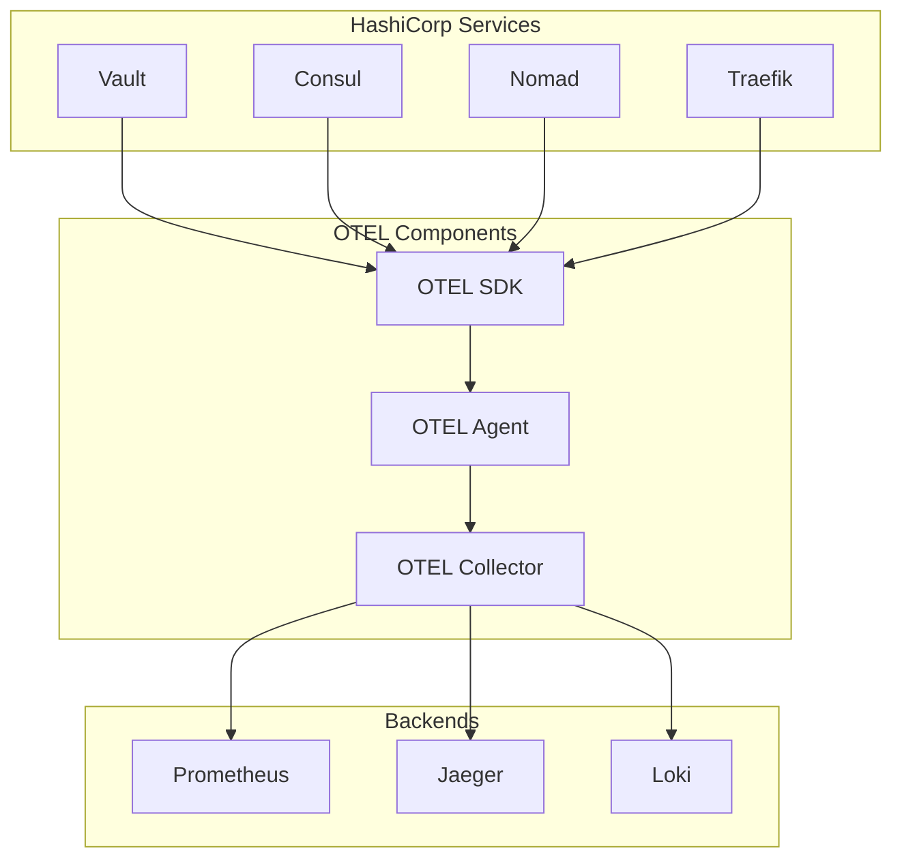

# OpenTelemetry Integration Guide for HashiCorp Stack

## Overview

This guide provides comprehensive instructions for integrating OpenTelemetry (OTEL) with HashiCorp Vault, Consul, and Nomad to enable distributed tracing, metrics collection, and observability across the entire stack.

## Architecture Overview



## OTEL Connector Integration Patterns

### 1. Agent-Based Collection Pattern

Deploy OTEL agents on each node to collect telemetry from HashiCorp services:

```yaml
# otel-agent.yaml
apiVersion: opentelemetry.io/v1alpha1
kind: OpenTelemetryCollector
metadata:
  name: otel-agent
spec:
  mode: daemonset
  config: |
    receivers:
      prometheus:
        config:
          scrape_configs:
            - job_name: 'vault-local'
              static_configs:
                - targets: ['localhost:8200']
              metrics_path: '/v1/sys/metrics'
              params:
                format: ['prometheus']
    processors:
      batch:
    exporters:
      otlp:
        endpoint: "otel-collector:4317"
    service:
      pipelines:
        metrics:
          receivers: [prometheus]
          processors: [batch]
          exporters: [otlp]
```

### 2. Sidecar Pattern for Nomad Jobs

Deploy OTEL collectors as sidecars for applications running in Nomad:

```hcl
# nomad-job-with-otel.nomad
job "app-with-otel" {
  group "app" {
    task "application" {
      driver = "docker"
      config {
        image = "myapp:latest"
      }
      env {
        OTEL_EXPORTER_OTLP_ENDPOINT = "http://localhost:4317"
        OTEL_SERVICE_NAME = "my-application"
        OTEL_RESOURCE_ATTRIBUTES = "service.version=1.0.0,deployment.environment=production"
      }
    }
    
    task "otel-collector" {
      driver = "docker"
      config {
        image = "otel/opentelemetry-collector-contrib:latest"
        args = ["--config=/local/otel-config.yaml"]
      }
      template {
        data = <<EOF
receivers:
  otlp:
    protocols:
      grpc:
        endpoint: 0.0.0.0:4317
      http:
        endpoint: 0.0.0.0:4318
processors:
  batch:
  resource:
    attributes:
      - key: nomad.job
        value: {{ env "NOMAD_JOB_NAME" }}
        action: upsert
      - key: nomad.alloc
        value: {{ env "NOMAD_ALLOC_ID" }}
        action: upsert
exporters:
  otlp:
    endpoint: "otel-collector.service.consul:4317"
service:
  pipelines:
    traces:
      receivers: [otlp]
      processors: [resource, batch]
      exporters: [otlp]
    metrics:
      receivers: [otlp]
      processors: [resource, batch]
      exporters: [otlp]
EOF
        destination = "local/otel-config.yaml"
      }
    }
  }
}
```

### 3. Service Discovery Integration

Leverage Consul service discovery for dynamic OTEL configuration:

```yaml
# otel-collector-consul-sd.yaml
receivers:
  prometheus:
    config:
      scrape_configs:
        - job_name: 'consul-sd'
          consul_sd_configs:
            - server: 'consul.service.consul:8500'
              services: []
              tags: ['otel-metrics']
          relabel_configs:
            - source_labels: [__meta_consul_service]
              target_label: service
            - source_labels: [__meta_consul_service_metadata_metrics_port]
              regex: '(.+)'
              target_label: __address__
              replacement: '${__meta_consul_service_address}:${1}'
```

## Service-Specific Integration

### Vault OTEL Integration

#### 1. Enhanced Telemetry Configuration

```hcl
# vault.hcl - Enhanced telemetry
telemetry {
  # Prometheus metrics
  prometheus_retention_time = "30s"
  disable_hostname = false
  
  # OTEL integration via StatsD
  dogstatsd_addr = "127.0.0.1:8125"
  dogstatsd_tags = ["vault", "production", "otel"]
  
  # Custom metric collection
  usage_gauge_period = "5m"
  maximum_gauge_cardinality = 500
}
```

#### 2. OTEL Agent Configuration for Vault

```yaml
receivers:
  statsd:
    endpoint: "0.0.0.0:8125"
    aggregation_interval: 60s
    enable_metric_type: true
  prometheus:
    config:
      scrape_configs:
        - job_name: 'vault'
          static_configs:
            - targets: ['localhost:8200']
          metrics_path: '/v1/sys/metrics'
          params:
            format: ['prometheus']
          bearer_token_file: '/etc/vault/token'
processors:
  attributes:
    actions:
      - key: service.name
        value: vault
        action: upsert
      - key: service.version
        from_attribute: version
        action: upsert
exporters:
  otlp:
    endpoint: "otel-collector:4317"
service:
  pipelines:
    metrics:
      receivers: [statsd, prometheus]
      processors: [attributes]
      exporters: [otlp]
```

### Nomad OTEL Integration

#### 1. Nomad Configuration with OTEL

```hcl
# nomad.hcl - OTEL integration
telemetry {
  collection_interval = "10s"
  disable_hostname = false
  prometheus_metrics = true
  
  # OTEL StatsD integration
  statsd_address = "127.0.0.1:8125"
  datadog_address = "127.0.0.1:8125"
  datadog_tags = ["nomad", "production", "otel"]
  
  # Enhanced metrics
  publish_allocation_metrics = true
  publish_node_metrics = true
}
```

#### 2. Job-Level Telemetry

```hcl
job "monitored-app" {
  group "app" {
    task "main" {
      driver = "docker"
      config {
        image = "myapp:latest"
      }
      
      # OTEL environment variables
      env {
        OTEL_EXPORTER_OTLP_ENDPOINT = "http://otel-collector.service.consul:4317"
        OTEL_SERVICE_NAME = "${NOMAD_JOB_NAME}"
        OTEL_RESOURCE_ATTRIBUTES = "nomad.job=${NOMAD_JOB_NAME},nomad.group=${NOMAD_GROUP_NAME},nomad.task=${NOMAD_TASK_NAME}"
      }
      
      # Telemetry service registration
      service {
        name = "${NOMAD_JOB_NAME}-metrics"
        port = "metrics"
        tags = ["otel-metrics", "prometheus"]
        
        check {
          type = "http"
          path = "/metrics"
          interval = "30s"
          timeout = "5s"
        }
        
        meta {
          metrics_port = "8080"
          metrics_path = "/metrics"
        }
      }
    }
  }
}
```

### Consul OTEL Integration

#### 1. Consul Configuration

```hcl
# consul.hcl - OTEL integration
telemetry = {
  prometheus_retention_time = "30s"
  disable_hostname = false
  
  # OTEL StatsD integration
  dogstatsd_addr = "127.0.0.1:8125"
  dogstatsd_tags = ["consul", "production", "otel"]
  
  # Service mesh metrics
  prefix_filter = [
    "+consul.connect",
    "+consul.proxy",
    "+consul.mesh"
  ]
}

# Connect proxy configuration for OTEL
connect {
  enabled = true
  
  proxy_defaults = {
    config = {
      # Envoy OTEL tracing
      envoy_tracing_json = jsonencode({
        http = {
          name = "envoy.tracers.opentelemetry"
          typed_config = {
            "@type" = "type.googleapis.com/envoy.config.trace.v3.OpenTelemetryConfig"
            grpc_service = {
              envoy_grpc = {
                cluster_name = "opentelemetry_collector"
              }
            }
            service_name = "consul-connect-proxy"
          }
        }
      })
      
      # Envoy clusters for OTEL
      envoy_extra_static_clusters_json = jsonencode([
        {
          name = "opentelemetry_collector"
          connect_timeout = "1s"
          type = "STRICT_DNS"
          lb_policy = "ROUND_ROBIN"
          load_assignment = {
            cluster_name = "opentelemetry_collector"
            endpoints = [
              {
                lb_endpoints = [
                  {
                    endpoint = {
                      address = {
                        socket_address = {
                          address = "otel-collector.service.consul"
                          port_value = 4317
                        }
                      }
                    }
                  }
                ]
              }
            ]
          }
          typed_extension_protocol_options = {
            "envoy.extensions.upstreams.http.v3.HttpProtocolOptions" = {
              "@type" = "type.googleapis.com/envoy.extensions.upstreams.http.v3.HttpProtocolOptions"
              explicit_http_config = {
                http2_protocol_options = {}
              }
            }
          }
        }
      ])
    }
  }
}
```

## Distributed Tracing Implementation

### 1. Cross-Service Correlation

Implement correlation IDs across HashiCorp services:

```yaml
# Correlation ID processor
processors:
  transform:
    trace_statements:
      - context: span
        statements:
          # Extract correlation ID from Vault request
          - set(attributes["vault.request_id"], resource.attributes["vault.request_id"])
          # Propagate to Nomad traces
          - set(attributes["nomad.alloc_id"], resource.attributes["nomad.alloc_id"])
          # Include Consul service information
          - set(attributes["consul.service"], resource.attributes["consul.service"])
```

### 2. Service Mesh Tracing

Configure Envoy proxies for distributed tracing:

```json
{
  "http": {
    "name": "envoy.tracers.opentelemetry",
    "typed_config": {
      "@type": "type.googleapis.com/envoy.config.trace.v3.OpenTelemetryConfig",
      "grpc_service": {
        "envoy_grpc": {
          "cluster_name": "opentelemetry_collector"
        },
        "timeout": "0.250s"
      },
      "service_name": "%CONSUL_SERVICE_NAME%"
    }
  }
}
```

## Auto-Instrumentation Patterns

### 1. SDK Configuration

```yaml
# OTEL SDK environment variables
environment:
  OTEL_EXPORTER_OTLP_ENDPOINT: "http://otel-collector:4317"
  OTEL_EXPORTER_OTLP_PROTOCOL: "grpc"
  OTEL_SERVICE_NAME: "vault-service"
  OTEL_SERVICE_VERSION: "1.15.0"
  OTEL_DEPLOYMENT_ENVIRONMENT: "production"
  OTEL_RESOURCE_ATTRIBUTES: "service.namespace=hashicorp,service.instance.id=${HOSTNAME}"
  
  # Sampling configuration
  OTEL_TRACES_SAMPLER: "traceidratio"
  OTEL_TRACES_SAMPLER_ARG: "0.1"
  
  # Propagators
  OTEL_PROPAGATORS: "tracecontext,baggage,b3,jaeger"
```

### 2. Custom Instrumentation

Example Go instrumentation for Vault plugins:

```go
package main

import (
    "go.opentelemetry.io/otel"
    "go.opentelemetry.io/otel/attribute"
    "go.opentelemetry.io/otel/trace"
)

var tracer = otel.Tracer("vault-plugin")

func (b *backend) handleRequest(ctx context.Context, req *logical.Request) (*logical.Response, error) {
    ctx, span := tracer.Start(ctx, "vault.plugin.request",
        trace.WithAttributes(
            attribute.String("vault.operation", req.Operation.String()),
            attribute.String("vault.path", req.Path),
            attribute.String("vault.namespace", req.Namespace.Path),
        ),
    )
    defer span.End()
    
    // Handle request
    resp, err := b.doRequest(ctx, req)
    if err != nil {
        span.SetStatus(codes.Error, err.Error())
        span.RecordError(err)
    }
    
    return resp, err
}
```

## Performance Optimization

### 1. Sampling Strategies

```yaml
# Adaptive sampling configuration
processors:
  probabilistic_sampler:
    hash_seed: 22
    sampling_percentage: 15
    
  tail_sampling:
    decision_wait: 10s
    num_traces: 50000
    expected_new_traces_per_sec: 10
    policies:
      - name: error_policy
        type: status_code
        status_code: {status_codes: [ERROR]}
      - name: high_latency_policy
        type: latency
        latency: {threshold_ms: 5000}
      - name: vault_critical
        type: string_attribute
        string_attribute: 
          key: service.name
          values: [vault]
          enabled_regex_matching: true
```

### 2. Resource Optimization

```yaml
# Resource limits and optimization
processors:
  memory_limiter:
    limit_mib: 1000
    spike_limit_mib: 200
    check_interval: 5s
    
  batch:
    timeout: 1s
    send_batch_size: 8192
    send_batch_max_size: 16384
    
exporters:
  otlp:
    endpoint: "otel-collector:4317"
    compression: gzip
    retry_on_failure:
      enabled: true
      initial_interval: 5s
      max_interval: 30s
      max_elapsed_time: 300s
    sending_queue:
      enabled: true
      num_consumers: 2
      queue_size: 100
```

## Security Considerations

### 1. TLS Configuration

```yaml
# Secure OTEL communication
exporters:
  otlp:
    endpoint: "otel-collector:4317"
    tls:
      ca_file: /etc/ssl/certs/ca.pem
      cert_file: /etc/ssl/certs/otel-client.pem
      key_file: /etc/ssl/private/otel-client-key.pem
      server_name_override: otel-collector.service.consul
```

### 2. Data Sanitization

```yaml
# Sanitize sensitive data
processors:
  attributes:
    actions:
      # Remove sensitive headers
      - key: http.request.header.authorization
        action: delete
      - key: http.request.header.x-vault-token
        action: delete
      # Hash user identifiers
      - key: user.id
        from_attribute: user.id
        action: hash
```

## Deployment Scripts

### 1. OTEL Collector Deployment

```bash
#!/bin/bash
# deploy-otel-collector.sh

set -e

OTEL_VERSION="0.88.0"
CONSUL_ADDR="${CONSUL_HTTP_ADDR:-http://localhost:8500}"

# Deploy OTEL collector via Nomad
nomad job run - <<EOF
job "otel-collector" {
  datacenters = ["dc1"]
  type = "service"
  
  group "collector" {
    count = 2
    
    service {
      name = "otel-collector"
      port = "otlp-grpc"
      tags = ["otel", "collector"]
      
      check {
        type = "grpc"
        port = "otlp-grpc"
        interval = "30s"
        timeout = "5s"
      }
    }
    
    task "otel-collector" {
      driver = "docker"
      
      config {
        image = "otel/opentelemetry-collector-contrib:${OTEL_VERSION}"
        args = ["--config=/local/otel-config.yaml"]
        ports = ["otlp-grpc", "otlp-http", "prometheus"]
      }
      
      template {
        data = file("otel-collector-config.yaml")
        destination = "local/otel-config.yaml"
      }
      
      resources {
        cpu = 500
        memory = 1024
        
        network {
          port "otlp-grpc" {
            static = 4317
          }
          port "otlp-http" {
            static = 4318
          }
          port "prometheus" {
            static = 8889
          }
        }
      }
    }
  }
}
EOF
```

### 2. Service Registration Script

```bash
#!/bin/bash
# register-otel-services.sh

# Register OTEL collector service in Consul
consul services register -address="${CONSUL_HTTP_ADDR:-http://localhost:8500}" - <<EOF
{
  "ID": "otel-collector-1",
  "Name": "otel-collector",
  "Tags": ["otel", "observability"],
  "Address": "127.0.0.1",
  "Port": 4317,
  "Check": {
    "GRPC": "127.0.0.1:4317",
    "Interval": "30s"
  },
  "Meta": {
    "version": "0.88.0",
    "protocol": "otlp"
  }
}
EOF
```

## Troubleshooting Guide

### Common Issues and Solutions

1. **High Memory Usage**
   - Implement memory limiter processor
   - Adjust batch sizes
   - Enable tail sampling

2. **Missing Traces**
   - Check service discovery configuration
   - Verify network connectivity
   - Validate sampling rates

3. **Authentication Failures**
   - Verify TLS certificates
   - Check bearer tokens
   - Review ACL policies

### Debug Configuration

```yaml
# Debug OTEL collector
service:
  telemetry:
    logs:
      level: debug
    metrics:
      address: 0.0.0.0:8888
  extensions: [pprof, zpages]
  
extensions:
  pprof:
    endpoint: 0.0.0.0:1777
  zpages:
    endpoint: 0.0.0.0:55679
```

This comprehensive OTEL integration guide provides the foundation for implementing distributed observability across your HashiCorp stack with modern telemetry practices.