# Unified Infrastructure Deployment Workflow

This document describes the comprehensive deployment workflow for the enterprise infrastructure stack consisting of Nomad, Vault, and Traefik. The workflow handles the circular dependency between these components and provides both automated CI/CD deployment via GitHub Actions and manual deployment options.

## 🏗️ Architecture Overview

The infrastructure stack is deployed in a specific sequence to handle dependencies:

```mermaid
graph TD
    A[GitHub Secrets<br/>Temporary Tokens] --> B[Nomad Cluster<br/>Bootstrap]
    B --> C[Vault on Nomad<br/>with Temp Tokens]
    C --> D[Vault Initialization<br/>& Policy Setup]
    D --> E[Token Migration<br/>Temp → Vault-managed]
    E --> F[Traefik on Nomad<br/>with Vault Integration]
    F --> G[Full Stack<br/>Operational]
    
    style A fill:#fff2cc
    style D fill:#d5e8d4
    style G fill:#e1d5e7
```



## 🔄 Circular Dependency Resolution

The bootstrap process resolves the circular dependency using this approach:

1. **Temporary Bootstrap Phase**: Use GitHub secrets to provide initial tokens for Nomad
2. **Vault Deployment**: Deploy Vault on Nomad using temporary tokens
3. **Token Migration**: Replace temporary tokens with Vault-managed tokens
4. **Full Integration**: Deploy remaining services with complete Vault integration

## 🚀 Deployment Options

### Option 1: GitHub Actions (Recommended)

The automated GitHub Actions workflow provides the most reliable and consistent deployment experience.

#### Triggering Deployments

**Automatic Triggers:**
- Push to `main` branch → Production deployment
- Push to `develop` branch → Development deployment
- Pull requests → Validation only

**Manual Triggers:**
```bash
# Via GitHub UI: Actions → Deploy Infrastructure → Run workflow
# Select environment: develop/staging/production
# Choose components: all/nomad,vault,traefik
# Enable dry run: true/false
```

**Via GitHub CLI:**
```bash
# Full deployment to development
gh workflow run deploy-infrastructure.yml \
  -f environment=develop \
  -f components=all \
  -f dry_run=false

# Production deployment with force bootstrap
gh workflow run deploy-infrastructure.yml \
  -f environment=production \
  -f components=all \
  -f force_bootstrap=true \
  -f dry_run=false

# Dry run for staging
gh workflow run deploy-infrastructure.yml \
  -f environment=staging \
  -f components=all \
  -f dry_run=true
```

### Option 2: Manual Deployment Scripts

For local development and emergency deployments, use the provided scripts.

#### Development Environment
```bash
# Quick development deployment
./scripts/deploy-develop.sh

# With options
./scripts/deploy-develop.sh --force-bootstrap --verbose

# Dry run
./scripts/deploy-develop.sh --dry-run
```

#### Staging Environment
```bash
# Staging deployment
./scripts/deploy-staging.sh

# Specific components only
./scripts/deploy-staging.sh --components vault,traefik

# Force bootstrap (destructive)
./scripts/deploy-staging.sh --force-bootstrap
```

#### Production Environment
```bash
# Production deployment (with safety checks)
./scripts/deploy-production.sh

# Dry run (always recommended first)
./scripts/deploy-production.sh --dry-run

# Emergency deployment (skips safety checks)
./scripts/deploy-production.sh --skip-safety-checks
```

#### Advanced Manual Deployment
```bash
# Direct use of unified bootstrap script
./scripts/unified-bootstrap.sh \
  --environment staging \
  --components nomad,vault \
  --verbose \
  --dry-run

# Component-specific deployment
./scripts/unified-bootstrap.sh \
  --environment develop \
  --components vault \
  --force-bootstrap
```

## 🔧 Configuration Files

### GitHub Actions Workflow
- **File**: `.github/workflows/deploy-infrastructure.yml`
- **Purpose**: Automated CI/CD deployment
- **Features**: 
  - Multi-environment support
  - Component selection
  - Dry run capability
  - Comprehensive validation

### Bootstrap Scripts
- **Main Script**: `scripts/unified-bootstrap.sh`
- **Environment Scripts**: `scripts/deploy-{develop,staging,production}.sh`
- **Features**:
  - Environment-specific configurations
  - Safety checks for production
  - Comprehensive logging
  - Rollback capabilities

### Configuration Files
- **Bootstrap Config**: `core/bootstrap-config.yaml`
- **Environment Config**: `core/environment-config.yaml`
- **Job Files**: `nomad/jobs/{environment}/vault.nomad`
- **Traefik Config**: `traefik/traefik.nomad`

## 🔐 Security Considerations

### Temporary Token Security
- Temporary tokens are generated and used only during bootstrap
- Tokens are stored in GitHub secrets or generated locally
- Tokens are automatically replaced with Vault-managed tokens
- Temporary tokens are cleaned up after successful deployment

### Production Security Checklist
- [ ] Recovery keys secured offline immediately after Vault initialization
- [ ] Root tokens revoked after initial setup completion
- [ ] Production TLS certificates properly configured
- [ ] Monitoring and alerting systems active
- [ ] Backup procedures tested and verified
- [ ] Network security policies implemented
- [ ] Audit logging enabled and monitored

### Secret Management
```yaml
# GitHub Secrets Required (per environment)
NOMAD_BOOTSTRAP_TOKEN_{ENVIRONMENT}    # Temporary Nomad token
CONSUL_BOOTSTRAP_TOKEN_{ENVIRONMENT}   # Temporary Consul token
VAULT_RECOVERY_KEYS_{ENVIRONMENT}      # Vault recovery keys (encrypted)
```

## 📊 Monitoring and Validation

### Deployment Validation
The workflow includes comprehensive validation at each step:

1. **Prerequisites Check**: Validates tools and dependencies
2. **Configuration Validation**: Ensures job files are valid
3. **Health Checks**: Verifies service health after deployment
4. **Integration Testing**: Tests cross-service communication
5. **Security Validation**: Confirms security policies are active

### Monitoring Endpoints
```bash
# Service Health Checks
curl http://localhost:4646/v1/status/leader    # Nomad
curl http://localhost:8200/v1/sys/health       # Vault
curl http://localhost:8080/ping                # Traefik

# Service UIs (Development)
open http://localhost:4646                     # Nomad UI
open http://localhost:8200                     # Vault UI
open http://localhost:8080                     # Traefik Dashboard
```

## 🔄 Deployment Environments

### Development Environment
- **Purpose**: Local development and testing
- **Configuration**: Single-node, auto-initialization, debug logging
- **Access**: HTTP endpoints, insecure for convenience
- **Data**: Ephemeral, can be safely destroyed

### Staging Environment
- **Purpose**: Production-like testing environment
- **Configuration**: Multi-node HA, manual initialization, structured logging
- **Access**: HTTPS with self-signed certificates
- **Data**: Persistent but can be reset for testing

### Production Environment
- **Purpose**: Live production workloads
- **Configuration**: Full HA, security hardening, comprehensive monitoring
- **Access**: HTTPS with valid certificates, restricted access
- **Data**: Critical - requires backup and DR procedures

## 📝 Deployment Workflow Steps

### Phase 1: Preparation
1. **Environment Determination**: Based on branch or manual selection
2. **Component Selection**: All components or specific subset
3. **Strategy Decision**: Bootstrap vs. update deployment
4. **Prerequisites Validation**: Tools, permissions, connectivity

### Phase 2: Nomad Bootstrap
1. **Consul Startup**: Service discovery foundation
2. **Nomad Configuration**: Environment-specific settings
3. **Cluster Formation**: Single or multi-node cluster
4. **Volume Setup**: Persistent storage for services

### Phase 3: Vault Deployment
1. **Job Validation**: Vault Nomad job file validation
2. **Deployment**: Deploy Vault as Nomad job
3. **Initialization**: Bootstrap-only Vault initialization
4. **Policy Setup**: Create service integration policies
5. **Token Generation**: Create service-specific tokens

### Phase 4: Token Migration
1. **Service Token Creation**: Vault-managed tokens for services
2. **Token Replacement**: Replace temporary with Vault-managed tokens
3. **Bootstrap Cleanup**: Remove temporary tokens and files
4. **Integration Validation**: Verify Vault integration works

### Phase 5: Traefik Deployment
1. **Secret Setup**: Store Traefik credentials in Vault
2. **Job Validation**: Traefik Nomad job file validation
3. **Deployment**: Deploy Traefik with Vault integration
4. **Route Configuration**: Setup service routing
5. **Health Validation**: Verify Traefik accessibility

### Phase 6: Validation and Finalization
1. **Service Health**: Comprehensive health checks
2. **Integration Testing**: Cross-service communication
3. **Security Validation**: Verify security policies
4. **Deployment Marker**: Mark successful deployment
5. **Summary Generation**: Deployment report and access information

## 🚨 Troubleshooting

### Common Issues

#### Nomad Cluster Formation Failed
```bash
# Check Consul connectivity
consul members

# Check Nomad logs
nomad monitor

# Verify network connectivity
netstat -tlnp | grep -E ":(4646|4647|4648)"
```

#### Vault Initialization Problems
```bash
# Check Vault status
vault status

# Review Vault logs
nomad alloc logs $(nomad job allocs vault-develop -json | jq -r '.[0].ID') vault

# Verify storage permissions
ls -la /opt/nomad/volumes/vault-*
```

#### Traefik Deployment Issues
```bash
# Check Traefik job status
nomad job status traefik

# Test Traefik connectivity
curl -v http://localhost:8080/ping

# Review Traefik logs
nomad alloc logs $(nomad job allocs traefik -json | jq -r '.[0].ID') traefik
```

#### Token and Secret Problems
```bash
# Verify Vault policies
vault policy list

# Test token permissions
vault auth -method=token

# Check secret access
vault kv list kv/
```

### Recovery Procedures

#### Emergency Rollback
```bash
# Stop all services
nomad job stop traefik
nomad job stop vault-{environment}

# Clean up volumes (if needed)
sudo rm -rf /opt/nomad/volumes/*

# Re-run deployment
./scripts/deploy-{environment}.sh --force-bootstrap
```

#### Vault Recovery
```bash
# Initialize Vault recovery
vault operator init -recovery-shares=5 -recovery-threshold=3

# Unseal with recovery keys (if auto-unseal failed)
vault operator unseal {recovery-key}
```

## 📋 Best Practices

### Pre-Deployment
- Always run with `--dry-run` first in production
- Verify all prerequisites are met
- Ensure backup procedures are tested
- Coordinate with monitoring teams

### During Deployment
- Monitor logs continuously
- Keep recovery team on standby for production
- Document any deviations from standard procedure
- Validate each phase before proceeding

### Post-Deployment
- Verify all services are accessible
- Test critical application workflows
- Update monitoring dashboards
- Document lessons learned

### Security Practices
- Rotate temporary tokens immediately after bootstrap
- Secure Vault recovery keys using proper key management
- Enable audit logging on all environments
- Regularly review and update security policies

## 🔗 Additional Resources

- [Nomad Documentation](https://developer.hashicorp.com/nomad)
- [Vault Documentation](https://developer.hashicorp.com/vault)
- [Traefik Documentation](https://doc.traefik.io/traefik/)
- [GitHub Actions Documentation](https://docs.github.com/en/actions)

## 📞 Support and Escalation

For deployment issues:
1. Check this documentation and troubleshooting section
2. Review service logs and status
3. Consult HashiCorp documentation
4. Escalate to platform engineering team
5. For production emergencies, activate incident response procedures