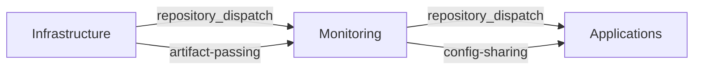

# GitOps Repository Structure Analysis: 3-Group Approach

## Executive Summary

This analysis evaluates three repository organization patterns for implementing a GitOps-based infrastructure consisting of three operational groups: infrastructure (Nomad + Vault), monitoring, and applications. Based on current industry best practices and 2024 patterns, we provide detailed recommendations for optimal developer experience, security, and operational efficiency.

## Repository Structure Options Analysis

### Option A: Monorepo with 3 Directories

#### Structure
```
vault/
├── infrastructure/          # Nomad + Vault configurations
│   ├── environments/
│   │   ├── dev/
│   │   ├── staging/
│   │   └── prod/
│   ├── base/
│   └── overlays/
├── monitoring/             # Observability stack
│   ├── environments/
│   ├── dashboards/
│   └── alerts/
├── applications/           # Application deployments
│   ├── environments/
│   ├── services/
│   └── configs/
└── .github/
    └── workflows/
```

#### Pros
- **Unified workflow orchestration** - Single CI/CD pipeline coordinates all components
- **Atomic deployments** - Infrastructure, monitoring, and apps deploy together
- **Simplified dependency tracking** - All dependencies visible in one repository
- **Centralized governance** - Single approval process for all changes
- **Efficient resource utilization** - Shared GitHub Actions workflows and caches
- **Developer simplicity** - One repository to clone and understand

#### Cons
- **Performance degradation** - Git operations slow down with repository growth
- **Security concerns** - All teams can access production configurations
- **Blast radius** - Single point of failure affects entire infrastructure
- **Scale limitations** - Becomes unwieldy as team and complexity grows
- **GitOps controller overhead** - Fetches entire repository for any change
- **Permission granularity** - Cannot restrict access to specific components

#### Recommendation Score: 6/10
**Best for:** Small teams (2-5 engineers), simple environments, startup phase

---

### Option B: 3 Separate Repositories with Dispatch Triggers

#### Structure
```
infrastructure-repo/        # Nomad + Vault
├── environments/
├── .github/workflows/
└── dispatch-config.yml

monitoring-repo/            # Observability
├── environments/
├── .github/workflows/
└── upstream-dependencies.yml

applications-repo/          # Applications
├── services/
├── .github/workflows/
└── deployment-matrix.yml
```

#### Workflow Dependencies


#### Implementation Pattern (2024)
```yaml
# infrastructure-repo/.github/workflows/deploy.yml
- name: Trigger Monitoring Deployment
  uses: peter-evans/repository-dispatch@v3
  with:
    token: ${{ secrets.PAT_TOKEN }}
    repository: org/monitoring-repo
    event-type: infrastructure-updated
    client-payload: |
      {
        "vault_addr": "${{ env.VAULT_ADDR }}",
        "nomad_version": "${{ env.NOMAD_VERSION }}",
        "environment": "${{ github.ref_name }}"
      }
```

#### Pros
- **Enhanced security** - Granular access control per repository
- **Performance optimization** - Faster GitOps controller reconciliation
- **Team autonomy** - Independent development and deployment cycles
- **Fault isolation** - Issues in one repo don't affect others
- **Specialized workflows** - Each repo optimized for its domain
- **Scalable organization** - Supports large, distributed teams

#### Cons
- **Complex orchestration** - Requires sophisticated workflow coordination
- **Dependency management overhead** - Manual tracking of cross-repo dependencies
- **Deployment coordination challenges** - Ensuring proper sequencing
- **Increased maintenance burden** - Multiple repositories to manage
- **Potential inconsistencies** - Risk of configuration drift between repos

#### Recommendation Score: 8/10
**Best for:** Large teams (10+ engineers), complex environments, enterprise scale

---

### Option C: Hybrid Approach (Infrastructure+Monitoring, Applications Separate)

#### Structure
```
platform-repo/             # Infrastructure + Monitoring
├── infrastructure/
│   ├── nomad/
│   └── vault/
├── monitoring/
│   ├── prometheus/
│   ├── grafana/
│   └── alerting/
├── environments/
└── .github/workflows/

applications-repo/          # Applications only
├── services/
├── environments/
├── .github/workflows/
└── platform-integration.yml
```

#### Pros
- **Balanced complexity** - Simpler than full multi-repo, more secure than monorepo
- **Platform cohesion** - Infrastructure and monitoring deployed together
- **Application independence** - Apps can iterate without platform changes
- **Reasonable security** - Platform team controls infrastructure, app teams control applications
- **Moderate maintenance** - Only two repositories to manage

#### Cons
- **Split governance** - Two different approval processes
- **Some coordination complexity** - Still requires workflow orchestration
- **Partial blast radius** - Platform changes affect all applications

#### Recommendation Score: 7/10
**Best for:** Medium teams (5-10 engineers), moderate complexity, balanced requirements

---

## Workflow Dependencies Implementation

### Repository Dispatch Pattern (2024 Best Practice)

```yaml
# Trigger workflow with payload
- name: Cross-repo trigger
  uses: peter-evans/repository-dispatch@v3
  with:
    token: ${{ secrets.PAT_TOKEN }}
    repository: target-org/target-repo
    event-type: upstream-updated
    client-payload: |
      {
        "source": "${{ github.repository }}",
        "commit": "${{ github.sha }}",
        "environment": "${{ inputs.environment }}",
        "artifacts": {
          "vault_config": "${{ steps.vault.outputs.config_url }}",
          "nomad_jobs": "${{ steps.nomad.outputs.jobs_manifest }}"
        }
      }

# Receive and process event
on:
  repository_dispatch:
    types: [upstream-updated]

jobs:
  deploy:
    runs-on: ubuntu-latest
    env:
      VAULT_CONFIG: ${{ github.event.client_payload.artifacts.vault_config }}
      NOMAD_JOBS: ${{ github.event.client_payload.artifacts.nomad_jobs }}
```

### Environment Variable Propagation

```yaml
# Shared configuration template
- name: Export environment config
  run: |
    echo "VAULT_ADDR=https://vault.${ENVIRONMENT}.example.com" >> $GITHUB_OUTPUT
    echo "NOMAD_ADDR=https://nomad.${ENVIRONMENT}.example.com" >> $GITHUB_OUTPUT
    echo "CONSUL_HTTP_ADDR=https://consul.${ENVIRONMENT}.example.com" >> $GITHUB_OUTPUT

- name: Create config artifact
  uses: actions/upload-artifact@v4
  with:
    name: environment-config-${{ inputs.environment }}
    path: |
      configs/
      secrets/vault-tokens.json
```

### Secret Sharing Strategy

```yaml
# Use GitHub environment secrets for cross-repo sharing
- name: Configure Vault access
  env:
    VAULT_TOKEN: ${{ secrets.VAULT_TOKEN }}
    VAULT_NAMESPACE: ${{ secrets.VAULT_NAMESPACE }}
  run: |
    vault auth -method=github token=${{ secrets.GITHUB_TOKEN }}
    vault kv get -mount=kv infrastructure/config > config.json
```

---

## Environment Configuration Strategies

### Directory-Based Environments (Recommended)

```
environments/
├── dev/
│   ├── infrastructure/
│   │   ├── kustomization.yml
│   │   ├── vault-config.yml
│   │   └── nomad-variables.yml
│   ├── monitoring/
│   └── applications/
├── staging/
└── prod/
```

#### Benefits
- **GitOps compliant** - Single branch, multiple directories
- **Clear promotion path** - Copy configurations between environments
- **Environment visibility** - Easy to see what's deployed where
- **Kustomize integration** - Native Kubernetes overlay support

### Configuration Management Pattern

```yaml
# base/kustomization.yml
apiVersion: kustomize.config.k8s.io/v1beta1
kind: Kustomization
resources:
  - vault-deployment.yml
  - nomad-cluster.yml
  - monitoring-stack.yml

# environments/prod/kustomization.yml
apiVersion: kustomize.config.k8s.io/v1beta1
kind: Kustomization
resources:
  - ../../base
patchesStrategicMerge:
  - vault-prod-config.yml
  - scaling-overrides.yml
```

### Values.yaml Pattern for Nomad/Vault

```yaml
# environments/prod/vault-values.yml
vault:
  server:
    ha:
      enabled: true
      replicas: 3
    dataStorage:
      enabled: true
      size: 100Gi
      storageClass: fast-ssd
  ui:
    enabled: true
    serviceType: LoadBalancer

nomad:
  server:
    replicas: 3
    resources:
      requests:
        cpu: 500m
        memory: 1Gi
  client:
    resources:
      requests:
        cpu: 2000m
        memory: 4Gi
```

---

## Version Management Strategies

### Dependency Pinning Strategy (2024 Best Practice)

```yaml
# Explicit version pinning
vault:
  image:
    repository: hashicorp/vault
    tag: "1.15.4"  # Never use 'latest' or floating tags
    
nomad:
  image:
    repository: hashicorp/nomad
    tag: "1.6.6"
    
# Git commit SHA pinning for critical components
monitoring:
  prometheus:
    source:
      repo: prometheus-community/kube-prometheus-stack
      revision: "4a76f2c8f5e3a9b2d1c7f8e9a3b4c5d6e7f8g9h0"  # Specific commit
```

### Coordinated Version Updates

```yaml
# .github/workflows/version-update.yml
name: Coordinated Version Update
on:
  schedule:
    - cron: '0 2 * * MON'  # Weekly on Monday at 2 AM
  
jobs:
  update-versions:
    runs-on: ubuntu-latest
    strategy:
      matrix:
        component: [vault, nomad, consul, prometheus]
    steps:
      - name: Check for updates
        id: version-check
        run: |
          CURRENT=$(yq '.${component}.image.tag' values.yml)
          LATEST=$(crane ls registry/hashicorp/${component} | tail -1)
          echo "current=${CURRENT}" >> $GITHUB_OUTPUT
          echo "latest=${LATEST}" >> $GITHUB_OUTPUT
          
      - name: Create update PR
        if: steps.version-check.outputs.current != steps.version-check.outputs.latest
        uses: peter-evans/create-pull-request@v5
        with:
          title: "chore: update ${{ matrix.component }} to ${{ steps.version-check.outputs.latest }}"
          body: |
            Automated version update for ${{ matrix.component }}
            - Current: ${{ steps.version-check.outputs.current }}
            - Latest: ${{ steps.version-check.outputs.latest }}
```

### Rollback Coordination

```yaml
# Multi-repo rollback workflow
- name: Coordinate rollback
  run: |
    # Rollback applications first
    gh workflow run rollback.yml --repo org/applications-repo --ref main
    
    # Wait for applications to stabilize
    sleep 30
    
    # Rollback monitoring
    gh workflow run rollback.yml --repo org/monitoring-repo --ref main
    
    # Finally rollback infrastructure
    gh workflow run rollback.yml --repo org/infrastructure-repo --ref main
```

### Canary Deployment Support

```yaml
# Canary deployment pattern
environments:
  prod:
    canary:
      enabled: true
      percentage: 10
      metrics:
        - success_rate > 99.5
        - response_time_p95 < 200ms
      duration: 30m
```

---

## Developer Experience Optimization

### Local Development Setup

```bash
#!/bin/bash
# scripts/local-setup.sh

echo "Setting up local GitOps development environment..."

# Clone repositories based on chosen pattern
if [ "$REPO_PATTERN" = "monorepo" ]; then
    git clone https://github.com/org/vault.git
    cd vault
elif [ "$REPO_PATTERN" = "multirepo" ]; then
    git clone https://github.com/org/infrastructure-repo.git
    git clone https://github.com/org/monitoring-repo.git
    git clone https://github.com/org/applications-repo.git
fi

# Setup local development tools
make install-tools
make setup-vault-dev
make setup-nomad-dev
make setup-monitoring-dev

echo "✅ Local environment ready!"
echo "Run 'make dev-deploy' to deploy to local cluster"
```

### PR Preview Environments (2024 Pattern)

```yaml
# .github/workflows/pr-preview.yml
name: PR Preview Environment
on:
  pull_request:
    types: [opened, synchronize, labeled]

jobs:
  preview:
    if: contains(github.event.pull_request.labels.*.name, 'preview')
    runs-on: ubuntu-latest
    steps:
      - name: Deploy preview environment
        run: |
          # Generate unique namespace
          PREVIEW_NS="pr-${PR_NUMBER}-$(echo $GITHUB_HEAD_REF | sed 's/[^a-z0-9]/-/g')"
          
          # Deploy infrastructure components
          kustomize build environments/dev | \
            sed "s/namespace: dev/namespace: $PREVIEW_NS/g" | \
            kubectl apply -f -
            
          # Wait for Vault to be ready
          kubectl wait --for=condition=Ready pod -l app=vault -n $PREVIEW_NS --timeout=300s
          
          # Deploy monitoring
          helm upgrade --install monitoring-$PREVIEW_NS ./monitoring/charts/stack \
            --namespace $PREVIEW_NS \
            --values environments/dev/values.yml
            
      - name: Comment preview URL
        uses: actions/github-script@v7
        with:
          script: |
            github.rest.issues.createComment({
              issue_number: context.issue.number,
              owner: context.repo.owner,
              repo: context.repo.repo,
              body: `🚀 Preview environment deployed!
              
              **URLs:**
              - Vault UI: https://vault-pr-${context.issue.number}.dev.example.com
              - Nomad UI: https://nomad-pr-${context.issue.number}.dev.example.com
              - Grafana: https://grafana-pr-${context.issue.number}.dev.example.com
              
              Environment will auto-cleanup after 24 hours or when PR is closed.`
            })
```

### Automated Testing Across Groups

```yaml
# .github/workflows/integration-test.yml
name: Integration Tests
on:
  workflow_run:
    workflows: ["Deploy Infrastructure"]
    types: [completed]

jobs:
  test-integration:
    runs-on: ubuntu-latest
    strategy:
      matrix:
        test-suite:
          - vault-integration
          - nomad-job-scheduling
          - monitoring-alerts
          - end-to-end-workflow
    steps:
      - name: Run test suite
        run: |
          case "${{ matrix.test-suite }}" in
            "vault-integration")
              # Test Vault API, secrets engine, auth methods
              pytest tests/vault/ -v --junit-xml=vault-results.xml
              ;;
            "nomad-job-scheduling")
              # Test Nomad job submission, allocation, networking
              pytest tests/nomad/ -v --junit-xml=nomad-results.xml
              ;;
            "monitoring-alerts")
              # Test Prometheus rules, Grafana dashboards, alerting
              pytest tests/monitoring/ -v --junit-xml=monitoring-results.xml
              ;;
            "end-to-end-workflow")
              # Test complete application deployment workflow
              pytest tests/e2e/ -v --junit-xml=e2e-results.xml
              ;;
          esac
```

---

## Final Recommendations

### For Small Teams (2-5 engineers) → Option A: Monorepo
- **Simplicity first** - Focus on getting GitOps working rather than optimizing for scale
- **Quick iteration** - Faster to implement and understand
- **Lower maintenance** - Single repository, single CI/CD pipeline
- **Migration path** - Can split into multiple repos later as team grows

### For Large Teams (10+ engineers) → Option B: Multi-repo
- **Security requirements** - Granular access control essential
- **Team specialization** - Different teams own different repositories
- **Performance needs** - Git operations must remain fast
- **Complex orchestration** - Investment in workflow automation pays off

### For Medium Teams (5-10 engineers) → Option C: Hybrid
- **Balanced approach** - Platform stability with application flexibility
- **Reasonable complexity** - Two repositories manageable for medium teams
- **Growth accommodation** - Can evolve in either direction based on needs

### Implementation Sequence (Recommended)

1. **Phase 1: Start with Monorepo** (Weeks 1-4)
   - Implement basic GitOps workflow
   - Establish patterns and practices
   - Get team familiar with GitOps principles

2. **Phase 2: Add Advanced Features** (Weeks 5-8)
   - Implement PR preview environments
   - Add automated testing
   - Establish monitoring and alerting

3. **Phase 3: Scale Decision Point** (Month 3)
   - Evaluate team growth and complexity
   - Consider splitting based on pain points
   - Implement chosen long-term pattern

### Key Success Factors

- **Version pinning discipline** - Always pin to specific versions, never use 'latest'
- **Environment parity** - Keep dev/staging/prod as similar as possible  
- **Automated testing** - Comprehensive test coverage for all components
- **Monitoring first** - Deploy observability before applications
- **Security by design** - Use Vault for all secrets, proper RBAC from day one
- **Documentation culture** - Keep README and runbooks updated

This analysis provides a comprehensive framework for choosing and implementing the optimal GitOPS repository structure for your 3-group infrastructure approach. The key is to start simple and evolve based on team growth and operational requirements.