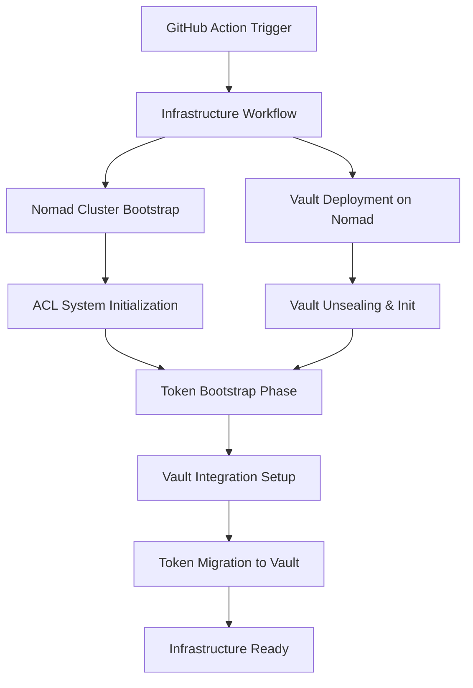

# Infrastructure Group: Nomad + Vault Integration Architecture

## Overview

The Infrastructure Group represents the foundational layer of the 3-group service split, deploying Nomad and Vault as a unified workflow to establish the platform foundation for Monitoring and Application groups.

## Deployment Pattern

### Single Workflow Architecture



### Bootstrap Sequence: Environment Variables → Vault Migration

#### Phase 1: Initial Bootstrap (Environment Variables)
1. **Nomad Server Initialization**
   ```bash
   # ACL Bootstrap
   curl -X POST http://nomad-server:4646/v1/acl/bootstrap
   export NOMAD_TOKEN=$(echo $RESPONSE | jq -r '.SecretID')
   ```

2. **Vault Deployment via Nomad**
   ```hcl
   job "vault" {
     datacenters = ["dc1"]
     type = "service"
     
     group "vault" {
       count = 3
       
       network {
         port "http" {
           to = 8200
         }
         port "cluster" {
           to = 8201
         }
       }
       
       task "vault" {
         driver = "docker"
         
         config {
           image = "vault:1.15"
           ports = ["http", "cluster"]
           args = ["vault", "server", "-config=/local/vault.hcl"]
         }
         
         template {
           data = <<EOF
storage "consul" {
  address = "{{ env "CONSUL_HTTP_ADDR" }}"
  path    = "vault/"
}

listener "tcp" {
  address = "0.0.0.0:8200"
  tls_disable = true
}

cluster_addr = "http://{{ env "NOMAD_ALLOC_IP" }}:8201"
api_addr = "http://{{ env "NOMAD_ALLOC_IP" }}:8200"
EOF
           destination = "local/vault.hcl"
         }
         
         service {
           name = "vault"
           port = "http"
           tags = ["vault", "secrets"]
           
           check {
             type = "http"
             path = "/v1/sys/health"
             interval = "10s"
             timeout = "3s"
           }
         }
       }
     }
   }
   ```

3. **Environment Variable Storage**
   ```bash
   # Store initial tokens in GitHub Secrets
   export BOOTSTRAP_NOMAD_TOKEN=$NOMAD_TOKEN
   export VAULT_ADDR="http://vault.service.consul:8200"
   export VAULT_ROOT_TOKEN=$VAULT_ROOT_TOKEN
   ```

#### Phase 2: Vault Integration Setup
1. **Vault Policy for Nomad**
   ```hcl
   # nomad-server.hcl
   path "auth/token/create/nomad-cluster" {
     capabilities = ["update"]
   }
   
   path "auth/token/roles/nomad-cluster" {
     capabilities = ["read"]
   }
   
   path "auth/token/lookup-self" {
     capabilities = ["read"]
   }
   
   path "auth/token/lookup" {
     capabilities = ["update"]
   }
   
   path "auth/token/revoke-accessor" {
     capabilities = ["update"]
   }
   
   path "sys/capabilities-self" {
     capabilities = ["update"]
   }
   
   path "auth/token/renew-self" {
     capabilities = ["update"]
   }
   ```

2. **Token Role Creation**
   ```bash
   vault write auth/token/roles/nomad-cluster \
     allowed_policies="nomad-server" \
     orphan=true \
     renewable=true \
     explicit_max_ttl=0
   ```

#### Phase 3: Token Migration to Vault
1. **Nomad Server Configuration Update**
   ```hcl
   vault {
     enabled = true
     address = "http://vault.service.consul:8200"
     token   = "vault-nomad-integration-token"
     
     create_from_role = "nomad-cluster"
   }
   ```

2. **Token Migration Script**
   ```bash
   #!/bin/bash
   # migrate-tokens.sh
   
   # Create Vault token for Nomad
   NOMAD_VAULT_TOKEN=$(vault write -field=token auth/token/create \
     policies="nomad-server" \
     orphan=true \
     renewable=true)
   
   # Update Nomad configuration
   consul kv put nomad/config/vault/token "$NOMAD_VAULT_TOKEN"
   
   # Restart Nomad with new config
   systemctl restart nomad
   
   # Verify integration
   nomad server members
   vault auth -method=token token="$NOMAD_VAULT_TOKEN"
   ```

## Shared Infrastructure Repository Structure

```
infrastructure/
├── nomad/
│   ├── config/
│   │   ├── server.hcl
│   │   ├── client.hcl
│   │   └── acl.hcl
│   ├── jobs/
│   │   ├── vault.nomad.hcl
│   │   ├── consul.nomad.hcl
│   │   └── traefik.nomad.hcl
│   └── policies/
│       ├── admin.json
│       └── developer.json
├── vault/
│   ├── config/
│   │   ├── vault.hcl
│   │   └── policies/
│   │       ├── nomad-server.hcl
│   │       ├── application.hcl
│   │       └── monitoring.hcl
│   └── scripts/
│       ├── init.sh
│       ├── unseal.sh
│       └── setup-nomad-integration.sh
├── consul/
│   ├── config/
│   │   └── consul.hcl
│   └── services/
├── .github/
│   └── workflows/
│       ├── infrastructure-deploy.yml
│       ├── infrastructure-test.yml
│       └── infrastructure-destroy.yml
├── terraform/
│   ├── infrastructure.tf
│   ├── variables.tf
│   └── outputs.tf
└── scripts/
    ├── bootstrap.sh
    ├── health-check.sh
    └── backup.sh
```

## Version Coupling Strategies

### Semantic Versioning Alignment
```yaml
# .github/workflows/infrastructure-deploy.yml
name: Infrastructure Deploy
on:
  push:
    tags:
      - 'infra-v*'

env:
  NOMAD_VERSION: "1.6.3"
  VAULT_VERSION: "1.15.2"
  CONSUL_VERSION: "1.16.1"
  TERRAFORM_VERSION: "1.6.0"
```

### Compatibility Matrix
```json
{
  "version_matrix": {
    "infra-v1.0.0": {
      "nomad": "1.6.3",
      "vault": "1.15.2",
      "consul": "1.16.1",
      "terraform": "1.6.0"
    },
    "infra-v1.1.0": {
      "nomad": "1.6.4",
      "vault": "1.15.3",
      "consul": "1.16.2",
      "terraform": "1.6.1"
    }
  }
}
```

## Upgrade Coordination

### Rolling Upgrade Strategy
```bash
#!/bin/bash
# upgrade-infrastructure.sh

# Pre-upgrade checks
echo "Performing pre-upgrade health checks..."
nomad server members | grep alive || exit 1
vault status | grep Sealed | grep false || exit 1

# Upgrade Vault first (stateful)
echo "Upgrading Vault cluster..."
nomad job stop vault
nomad job run -check-index 0 vault-v1.15.3.nomad.hcl

# Wait for Vault to be healthy
until curl -s http://vault.service.consul:8200/v1/sys/health | jq -r '.initialized' | grep true; do
  sleep 10
done

# Upgrade Nomad servers (rolling)
echo "Upgrading Nomad servers..."
for server in nomad-server-{1,2,3}; do
  echo "Upgrading $server"
  ssh $server "systemctl stop nomad && \
              wget https://releases.hashicorp.com/nomad/1.6.4/nomad_1.6.4_linux_amd64.zip && \
              unzip nomad_1.6.4_linux_amd64.zip -d /usr/local/bin/ && \
              systemctl start nomad"
  
  # Wait for server to rejoin
  until nomad server members | grep $server | grep alive; do
    sleep 10
  done
done

# Upgrade Nomad clients
echo "Upgrading Nomad clients..."
nomad node eligibility -disable -yes $(nomad node status -verbose | grep client | awk '{print $1}')

# Rolling client upgrade script
for client in $(nomad node status -verbose | grep client | awk '{print $1}'); do
  nomad node drain -enable -yes $client
  # Upgrade client
  nomad node drain -disable $client
  nomad node eligibility -enable $client
done
```

## High Availability Configuration

### Multi-Node Setup
```hcl
# nomad/config/server.hcl
datacenter = "dc1"
data_dir = "/opt/nomad/data"
log_level = "INFO"
node_name = "nomad-server-1"
bind_addr = "0.0.0.0"

server {
  enabled = true
  bootstrap_expect = 3
  
  server_join {
    retry_join = [
      "nomad-server-1.example.com",
      "nomad-server-2.example.com",
      "nomad-server-3.example.com"
    ]
  }
}

acl {
  enabled = true
}

vault {
  enabled = true
  address = "http://vault.service.consul:8200"
  create_from_role = "nomad-cluster"
}

consul {
  address = "127.0.0.1:8500"
  
  server_service_name = "nomad"
  client_service_name = "nomad-client"
  
  auto_advertise = true
  server_auto_join = true
  client_auto_join = true
}
```

## Monitoring and Observability

### Health Check Endpoints
```yaml
health_checks:
  nomad:
    - endpoint: "http://nomad.service.consul:4646/v1/status/leader"
      expected: "nomad-server-1:4647"
  vault:
    - endpoint: "http://vault.service.consul:8200/v1/sys/health"
      expected_status: 200
  consul:
    - endpoint: "http://consul.service.consul:8500/v1/status/leader"
      expected_format: "ip:port"
```

### Metrics Collection
```hcl
# nomad/config/telemetry.hcl
telemetry {
  collection_interval = "1s"
  disable_hostname = true
  prometheus_metrics = true
  publish_allocation_metrics = true
  publish_node_metrics = true
}
```

This infrastructure group architecture provides a solid foundation for the 3-group service split, ensuring reliable deployment and management of the core platform components.