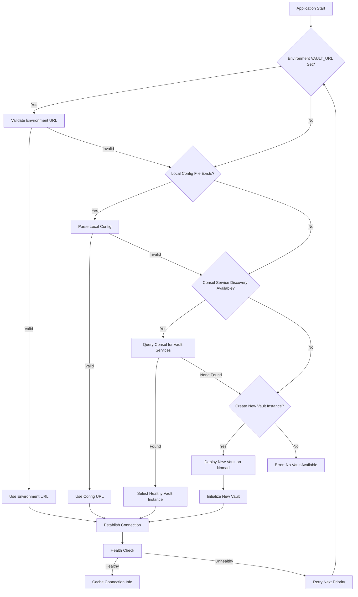
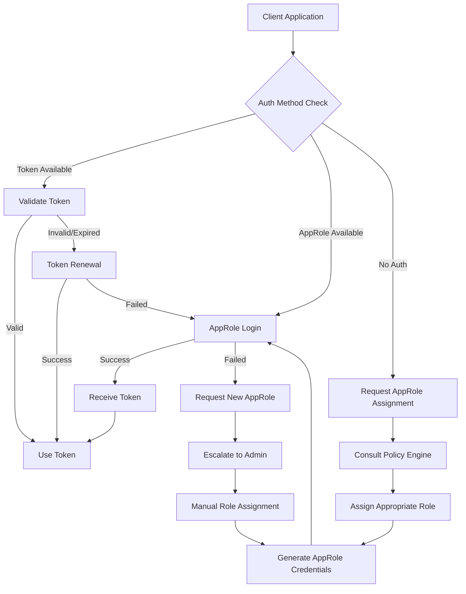

# Vault Discovery Pattern Architecture

## Overview

Dynamic Vault URL discovery pattern implementing a hierarchical fallback system for multi-environment Vault instances running on Nomad with automatic failover and load balancing capabilities.

## Discovery Priority Chain



## Implementation Architecture

### 1. Environment Variable Priority

```bash
# Priority 1: Environment Variables
export VAULT_ADDR="https://vault-prod.nomad:8200"
export VAULT_TOKEN="hvs.CAESIJ..."
export VAULT_NAMESPACE="production"

# Priority 2: Role-based discovery
export VAULT_ENV="production"  # Triggers: vault-${ENV}.nomad discovery
export VAULT_ROLE="application" # Selects appropriate AppRole
```

### 2. Local Configuration File

```json
{
  "vault_discovery": {
    "primary": {
      "url": "https://vault-prod.nomad:8200",
      "namespace": "production",
      "auth_method": "approle",
      "role_id": "vault-role-id",
      "health_check_interval": 30
    },
    "fallback": [
      {
        "url": "https://vault-prod-2.nomad:8200",
        "namespace": "production",
        "auth_method": "approle",
        "role_id": "vault-role-id"
      },
      {
        "url": "https://vault-staging.nomad:8200",
        "namespace": "staging",
        "auth_method": "approle",
        "role_id": "vault-staging-role-id"
      }
    ],
    "consul_discovery": {
      "service_name": "vault",
      "datacenter": "dc1",
      "tag_filter": ["active", "production"]
    }
  }
}
```

### 3. Consul Service Discovery Integration

```hcl
# vault-service-registration.hcl
service {
  name = "vault"
  id   = "vault-prod-1"
  port = 8200
  address = "{{ GetPrivateIP }}"
  
  tags = [
    "production",
    "active",
    "leader",
    "version-1.15.2"
  ]
  
  meta = {
    version = "1.15.2"
    environment = "production"
    cluster_name = "vault-prod-cluster"
    region = "us-west-2"
  }
  
  check {
    id = "vault-health"
    name = "Vault Health Check"
    http = "https://{{ GetPrivateIP }}:8200/v1/sys/health?standbyok=true"
    interval = "10s"
    timeout = "3s"
    deregister_critical_service_after = "30s"
  }
  
  check {
    id = "vault-leader"
    name = "Vault Leader Check"  
    http = "https://{{ GetPrivateIP }}:8200/v1/sys/leader"
    interval = "15s"
    timeout = "3s"
  }
}
```

### 4. DNS Patterns Implementation

```yaml
# DNS Configuration for Multi-Environment
dns_zones:
  - name: "nomad"
    type: "consul"
    records:
      - name: "vault-dev"
        service: "vault"
        tags: ["development", "active"]
        healthcheck: true
      - name: "vault-staging" 
        service: "vault"
        tags: ["staging", "active"]
        healthcheck: true
      - name: "vault-prod"
        service: "vault"
        tags: ["production", "active"] 
        healthcheck: true
      - name: "vault-dr"
        service: "vault"
        tags: ["disaster-recovery", "standby"]
        healthcheck: true

# Example DNS queries
# dig vault-prod.service.consul
# dig vault-dev.service.consul SRV
# dig vault-staging.nomad
```

## AppRole/Token Authentication Hierarchy

### Authentication Flow



### AppRole Configuration by Environment

```hcl
# Development Environment AppRole
resource "vault_auth_backend" "approle" {
  type = "approle"
  path = "approle"
}

resource "vault_approle_auth_backend_role" "dev_application" {
  backend        = vault_auth_backend.approle.path
  role_name      = "dev-application"
  token_policies = ["dev-application", "common-secrets"]
  
  token_ttl     = 3600    # 1 hour
  token_max_ttl = 86400   # 24 hours
  
  bind_secret_id = true
  secret_id_ttl  = 86400  # 24 hours
  
  # Development is more permissive
  secret_id_num_uses = 0  # Unlimited uses
  
  # Token renewal settings
  token_num_uses = 0      # Unlimited uses
  token_period   = 3600   # Renewable every hour
}

# Production Environment AppRole (More Restrictive)
resource "vault_approle_auth_backend_role" "prod_application" {
  backend        = vault_auth_backend.approle.path
  role_name      = "prod-application"
  token_policies = ["prod-application", "common-secrets"]
  
  token_ttl     = 1800    # 30 minutes
  token_max_ttl = 3600    # 1 hour
  
  bind_secret_id = true
  secret_id_ttl  = 3600   # 1 hour
  
  # Production is more restrictive
  secret_id_num_uses = 1  # Single use
  
  # Token settings
  token_num_uses = 10     # Limited uses
  token_period   = 1800   # Renewable every 30 minutes
  
  # CIDR binding for production
  secret_id_bound_cidrs = ["10.0.0.0/8", "172.16.0.0/12"]
  token_bound_cidrs     = ["10.0.0.0/8", "172.16.0.0/12"]
}
```

## Service Registration in Consul/DNS

### Nomad Job for Vault with Service Registration

```hcl
job "vault-multi-env" {
  datacenters = ["dc1"]
  type = "service"
  
  parameterized {
    payload = "required"
    meta_required = ["environment", "vault_config"]
  }
  
  group "vault" {
    count = 3
    
    constraint {
      attribute = "${node.class}"
      value     = "vault-eligible"
    }
    
    update {
      max_parallel = 1
      canary = 1
      min_healthy_time = "30s"
      healthy_deadline = "5m"
      auto_revert = true
      auto_promote = true
    }
    
    network {
      port "http" {
        to = 8200
      }
      port "cluster" {
        to = 8201
      }
    }
    
    service {
      name = "vault"
      port = "http"
      
      tags = [
        "vault",
        "secrets",
        "${NOMAD_META_environment}",
        "version-${NOMAD_META_vault_version}",
        "cluster-${NOMAD_META_cluster_name}"
      ]
      
      meta {
        environment = "${NOMAD_META_environment}"
        version = "${NOMAD_META_vault_version}"
        cluster_name = "${NOMAD_META_cluster_name}"
        api_addr = "https://${NOMAD_HOST_IP_http}:${NOMAD_HOST_PORT_http}"
      }
      
      check {
        type = "http"
        path = "/v1/sys/health?standbyok=true&perfstandbyok=true"
        interval = "10s"
        timeout = "3s"
        
        check_restart {
          limit = 3
          grace = "30s"
          ignore_warnings = false
        }
      }
      
      check {
        type = "http"
        path = "/v1/sys/leader"
        interval = "30s"
        timeout = "5s"
      }
    }
    
    # Environment-specific service registration
    service {
      name = "vault-${NOMAD_META_environment}"
      port = "http"
      
      tags = [
        "${NOMAD_META_environment}",
        "active"
      ]
      
      check {
        type = "http"
        path = "/v1/sys/health"
        interval = "15s"
        timeout = "3s"
      }
    }
    
    task "vault" {
      driver = "docker"
      
      config {
        image = "vault:${NOMAD_META_vault_version}"
        ports = ["http", "cluster"]
        args = ["vault", "server", "-config=/local/vault.hcl"]
        
        cap_add = ["IPC_LOCK"]
        
        mount {
          type = "tmpfs"
          target = "/vault/logs"
        }
      }
      
      template {
        data = <<EOF
{{ with secret (printf "kv/vault-config/%s" (env "NOMAD_META_environment")) }}
storage "consul" {
  address = "{{ env "CONSUL_HTTP_ADDR" }}"
  path = "vault/{{ env "NOMAD_META_environment" }}/"
  
  {{ if .Data.data.consul_token }}
  token = "{{ .Data.data.consul_token }}"
  {{ end }}
}

listener "tcp" {
  address = "0.0.0.0:8200"
  
  {{ if .Data.data.tls_cert }}
  tls_cert_file = "/local/vault.crt"
  tls_key_file = "/local/vault.key"
  {{ else }}
  tls_disable = true
  {{ end }}
}

cluster_addr = "http://{{ env "NOMAD_ALLOC_IP" }}:8201"
api_addr = "http://{{ env "NOMAD_ALLOC_IP" }}:8200"

ui = true
log_level = "{{ .Data.data.log_level | default "INFO" }}"

{{ if .Data.data.auto_unseal }}
seal "awskms" {
  region     = "{{ .Data.data.aws_region }}"
  kms_key_id = "{{ .Data.data.kms_key_id }}"
}
{{ end }}
{{ end }}
EOF
        destination = "local/vault.hcl"
        change_mode = "restart"
      }
      
      resources {
        cpu    = 1000
        memory = 1024
      }
      
      vault {
        policies = ["vault-${NOMAD_META_environment}"]
      }
    }
  }
}
```

## Fallback Mechanisms for Vault Unavailability

### Circuit Breaker Pattern

```go
// vault-client-with-fallback.go
package main

import (
    "context"
    "fmt"
    "time"
    "github.com/hashicorp/consul/api"
    "github.com/hashicorp/vault/api"
    "github.com/sony/gobreaker"
)

type VaultDiscoveryClient struct {
    consulClient *consul.Client
    vaultClients map[string]*vault.Client
    circuitBreaker *gobreaker.CircuitBreaker
    fallbackConfig FallbackConfig
}

type FallbackConfig struct {
    MaxRetries       int
    RetryInterval    time.Duration
    HealthCheckInterval time.Duration
    CircuitBreakerSettings gobreaker.Settings
}

func NewVaultDiscoveryClient(config FallbackConfig) (*VaultDiscoveryClient, error) {
    consulClient, err := consul.NewClient(consul.DefaultConfig())
    if err != nil {
        return nil, err
    }
    
    cb := gobreaker.NewCircuitBreaker(config.CircuitBreakerSettings)
    
    return &VaultDiscoveryClient{
        consulClient: consulClient,
        vaultClients: make(map[string]*vault.Client),
        circuitBreaker: cb,
        fallbackConfig: config,
    }, nil
}

func (vdc *VaultDiscoveryClient) GetVaultClient(ctx context.Context) (*vault.Client, error) {
    // Priority 1: Environment Variable
    if vaultAddr := os.Getenv("VAULT_ADDR"); vaultAddr != "" {
        return vdc.getClientWithFallback(ctx, vaultAddr)
    }
    
    // Priority 2: Local Config
    if client := vdc.tryLocalConfig(ctx); client != nil {
        return client, nil
    }
    
    // Priority 3: Consul Service Discovery
    if client := vdc.tryConsulDiscovery(ctx); client != nil {
        return client, nil
    }
    
    // Priority 4: Create new Vault instance
    return vdc.createNewVaultInstance(ctx)
}

func (vdc *VaultDiscoveryClient) getClientWithFallback(ctx context.Context, addr string) (*vault.Client, error) {
    result, err := vdc.circuitBreaker.Execute(func() (interface{}, error) {
        config := &vault.Config{Address: addr}
        client, err := vault.NewClient(config)
        if err != nil {
            return nil, err
        }
        
        // Health check
        _, err = client.Sys().Health()
        if err != nil {
            return nil, err
        }
        
        return client, nil
    })
    
    if err != nil {
        return nil, fmt.Errorf("circuit breaker open or vault unhealthy: %w", err)
    }
    
    return result.(*vault.Client), nil
}

func (vdc *VaultDiscoveryClient) tryConsulDiscovery(ctx context.Context) *vault.Client {
    services, _, err := vdc.consulClient.Health().Service("vault", "", true, nil)
    if err != nil || len(services) == 0 {
        return nil
    }
    
    // Sort by priority (leader first, then by health score)
    sort.Slice(services, func(i, j int) bool {
        iLeader := vdc.isVaultLeader(services[i])
        jLeader := vdc.isVaultLeader(services[j])
        
        if iLeader && !jLeader {
            return true
        }
        if !iLeader && jLeader {
            return false
        }
        
        // If both are leader/follower, sort by health score
        return len(services[i].Checks) > len(services[j].Checks)
    })
    
    for _, service := range services {
        addr := fmt.Sprintf("http://%s:%d", service.Service.Address, service.Service.Port)
        if client, err := vdc.getClientWithFallback(ctx, addr); err == nil {
            return client
        }
    }
    
    return nil
}

func (vdc *VaultDiscoveryClient) createNewVaultInstance(ctx context.Context) (*vault.Client, error) {
    // Deploy new Vault instance via Nomad API
    nomadClient, err := nomad.NewClient(nomad.DefaultConfig())
    if err != nil {
        return nil, err
    }
    
    // Submit Vault job with dynamic parameters
    job := vdc.generateVaultJob("emergency", "1.15.2")
    _, _, err = nomadClient.Jobs().Register(job, nil)
    if err != nil {
        return nil, err
    }
    
    // Wait for deployment and health checks
    return vdc.waitForVaultReady(ctx, "vault-emergency")
}
```

## Multi-Region Vault Discovery

### Global Service Mesh Configuration

```hcl
# consul-connect.hcl for multi-region
connect {
  enabled = true
}

# Mesh gateway for cross-region communication  
service {
  name = "mesh-gateway"
  kind = "mesh-gateway"
  port = 8443
  
  meta = {
    version = "1.16.1"
  }
  
  proxy {
    config {
      envoy_gateway_bind_addresses = {
        "vault-replication" = {
          address = "0.0.0.0"
          port = 8201
        }
      }
    }
  }
}

# Cross-region Vault discovery
service {
  name = "vault-global"
  port = 8200
  
  tags = [
    "global",
    "multi-region"
  ]
  
  meta = {
    region = "us-west-2"
    cluster_id = "vault-prod-usw2"
    replication_mode = "performance"
  }
  
  connect {
    sidecar_service {
      tags = ["vault-sidecar"]
      port = 21000
      
      proxy {
        upstreams = [
          {
            destination_name = "vault-global"
            datacenter = "us-east-1"
            local_bind_port = 8202
          }
        ]
      }
    }
  }
}
```

### Federation Configuration

```yaml
# vault-federation.yaml
regions:
  us-west-2:
    primary: true
    vault_clusters:
      - name: "vault-prod-usw2"
        address: "https://vault-prod.usw2.consul:8200"
        replication_mode: "performance"
        priority: 1
      - name: "vault-dr-usw2"
        address: "https://vault-dr.usw2.consul:8200"
        replication_mode: "dr"
        priority: 2
  us-east-1:
    primary: false
    vault_clusters:
      - name: "vault-prod-use1" 
        address: "https://vault-prod.use1.consul:8200"
        replication_mode: "performance"
        priority: 1
  eu-west-1:
    primary: false
    vault_clusters:
      - name: "vault-prod-euw1"
        address: "https://vault-prod.euw1.consul:8200" 
        replication_mode: "performance"
        priority: 1

discovery_algorithm:
  - check_local_region_primary
  - check_local_region_secondary  
  - check_nearest_region_by_latency
  - check_global_failover
  
failover_policy:
  max_retry_attempts: 3
  backoff_strategy: "exponential"
  circuit_breaker_threshold: 5
  health_check_interval: "30s"
```

This comprehensive Vault discovery pattern provides robust, scalable service discovery with multiple fallback mechanisms and multi-region support for high availability deployments.