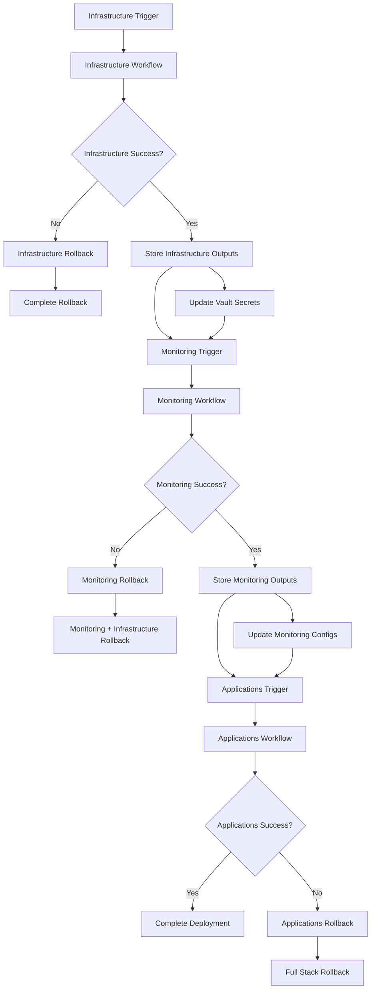

# GitHub Actions Workflow Architecture for 3-Group Deployment

## Overview

The 3-group service split architecture requires sophisticated GitHub Actions workflows that manage dependencies, secret propagation, and coordinated deployments across Infrastructure, Monitoring, and Applications groups.

## Workflow Dependency Architecture



## Infrastructure Group Workflow

### Main Infrastructure Deployment

```yaml
# .github/workflows/infrastructure-deploy.yml
name: Infrastructure Deployment
on:
  push:
    branches: [main]
    paths:
      - 'infrastructure/**'
      - 'terraform/**'
      - '.github/workflows/infrastructure-*'
  workflow_dispatch:
    inputs:
      environment:
        description: 'Target environment'
        required: true
        type: choice
        options: ['development', 'staging', 'production']
      force_redeploy:
        description: 'Force complete redeployment'
        required: false
        type: boolean
        default: false

env:
  NOMAD_VERSION: "1.6.3"
  VAULT_VERSION: "1.15.2"
  CONSUL_VERSION: "1.16.1"
  TERRAFORM_VERSION: "1.6.0"
  
  # Environment-specific configurations
  DEVELOPMENT_INSTANCE_TYPE: "t3.medium"
  STAGING_INSTANCE_TYPE: "t3.large"
  PRODUCTION_INSTANCE_TYPE: "m5.xlarge"

jobs:
  validate:
    name: Validate Infrastructure Configuration
    runs-on: ubuntu-latest
    
    outputs:
      terraform_plan: ${{ steps.plan.outputs.plan }}
      nomad_config_valid: ${{ steps.nomad_validate.outputs.valid }}
      vault_config_valid: ${{ steps.vault_validate.outputs.valid }}
      
    steps:
      - name: Checkout Code
        uses: actions/checkout@v4
        
      - name: Setup Terraform
        uses: hashicorp/setup-terraform@v3
        with:
          terraform_version: ${{ env.TERRAFORM_VERSION }}
          
      - name: Setup Nomad
        run: |
          wget https://releases.hashicorp.com/nomad/${{ env.NOMAD_VERSION }}/nomad_${{ env.NOMAD_VERSION }}_linux_amd64.zip
          unzip nomad_${{ env.NOMAD_VERSION }}_linux_amd64.zip -d /usr/local/bin/
          chmod +x /usr/local/bin/nomad
          
      - name: Setup Vault
        run: |
          wget https://releases.hashicorp.com/vault/${{ env.VAULT_VERSION }}/vault_${{ env.VAULT_VERSION }}_linux_amd64.zip
          unzip vault_${{ env.VAULT_VERSION }}_linux_amd64.zip -d /usr/local/bin/
          chmod +x /usr/local/bin/vault
          
      - name: Terraform Init
        run: |
          cd terraform/
          terraform init -backend-config="bucket=${{ secrets.TERRAFORM_S3_BUCKET }}" \
                        -backend-config="key=infrastructure/${{ github.event.inputs.environment || 'development' }}/terraform.tfstate" \
                        -backend-config="region=${{ secrets.AWS_REGION }}"
                        
      - name: Terraform Validate
        run: |
          cd terraform/
          terraform validate
          
      - name: Terraform Plan
        id: plan
        run: |
          cd terraform/
          terraform plan -var="environment=${{ github.event.inputs.environment || 'development' }}" \
                        -var="nomad_version=${{ env.NOMAD_VERSION }}" \
                        -var="vault_version=${{ env.VAULT_VERSION }}" \
                        -var="consul_version=${{ env.CONSUL_VERSION }}" \
                        -out=tfplan
          terraform show -no-color tfplan > plan.txt
          echo "plan=$(cat plan.txt)" >> $GITHUB_OUTPUT
          
      - name: Validate Nomad Configurations
        id: nomad_validate
        run: |
          for config in nomad/config/*.hcl; do
            nomad validate $config || exit 1
          done
          
          for job in nomad/jobs/*.nomad.hcl; do
            nomad job validate $job || exit 1
          done
          
          echo "valid=true" >> $GITHUB_OUTPUT
          
      - name: Validate Vault Configurations
        id: vault_validate
        run: |
          for config in vault/config/*.hcl; do
            vault server -config=$config -test || exit 1
          done
          
          echo "valid=true" >> $GITHUB_OUTPUT

  deploy-infrastructure:
    name: Deploy Infrastructure
    runs-on: ubuntu-latest
    needs: validate
    if: needs.validate.outputs.nomad_config_valid == 'true' && needs.validate.outputs.vault_config_valid == 'true'
    
    environment: 
      name: ${{ github.event.inputs.environment || 'development' }}
      
    outputs:
      nomad_endpoint: ${{ steps.deploy.outputs.nomad_endpoint }}
      vault_endpoint: ${{ steps.deploy.outputs.vault_endpoint }}
      consul_endpoint: ${{ steps.deploy.outputs.consul_endpoint }}
      vpc_id: ${{ steps.deploy.outputs.vpc_id }}
      private_subnets: ${{ steps.deploy.outputs.private_subnets }}
      security_groups: ${{ steps.deploy.outputs.security_groups }}
      
    steps:
      - name: Checkout Code
        uses: actions/checkout@v4
        
      - name: Configure AWS Credentials
        uses: aws-actions/configure-aws-credentials@v4
        with:
          aws-access-key-id: ${{ secrets.AWS_ACCESS_KEY_ID }}
          aws-secret-access-key: ${{ secrets.AWS_SECRET_ACCESS_KEY }}
          aws-region: ${{ secrets.AWS_REGION }}
          
      - name: Setup Terraform
        uses: hashicorp/setup-terraform@v3
        with:
          terraform_version: ${{ env.TERRAFORM_VERSION }}
          terraform_wrapper: false
          
      - name: Deploy Infrastructure
        id: deploy
        run: |
          cd terraform/
          terraform init -backend-config="bucket=${{ secrets.TERRAFORM_S3_BUCKET }}" \
                        -backend-config="key=infrastructure/${{ github.event.inputs.environment || 'development' }}/terraform.tfstate" \
                        -backend-config="region=${{ secrets.AWS_REGION }}"
          
          terraform apply -auto-approve \
                         -var="environment=${{ github.event.inputs.environment || 'development' }}" \
                         -var="nomad_version=${{ env.NOMAD_VERSION }}" \
                         -var="vault_version=${{ env.VAULT_VERSION }}" \
                         -var="consul_version=${{ env.CONSUL_VERSION }}"
          
          # Capture outputs
          echo "nomad_endpoint=$(terraform output -raw nomad_endpoint)" >> $GITHUB_OUTPUT
          echo "vault_endpoint=$(terraform output -raw vault_endpoint)" >> $GITHUB_OUTPUT
          echo "consul_endpoint=$(terraform output -raw consul_endpoint)" >> $GITHUB_OUTPUT
          echo "vpc_id=$(terraform output -raw vpc_id)" >> $GITHUB_OUTPUT
          echo "private_subnets=$(terraform output -json private_subnets)" >> $GITHUB_OUTPUT
          echo "security_groups=$(terraform output -json security_groups)" >> $GITHUB_OUTPUT

  bootstrap-nomad:
    name: Bootstrap Nomad Cluster
    runs-on: ubuntu-latest
    needs: deploy-infrastructure
    
    outputs:
      nomad_bootstrap_token: ${{ steps.bootstrap.outputs.bootstrap_token }}
      
    steps:
      - name: Checkout Code
        uses: actions/checkout@v4
        
      - name: Setup Nomad
        run: |
          wget https://releases.hashicorp.com/nomad/${{ env.NOMAD_VERSION }}/nomad_${{ env.NOMAD_VERSION }}_linux_amd64.zip
          unzip nomad_${{ env.NOMAD_VERSION }}_linux_amd64.zip -d /usr/local/bin/
          chmod +x /usr/local/bin/nomad
          
      - name: Bootstrap Nomad ACL
        id: bootstrap
        env:
          NOMAD_ADDR: ${{ needs.deploy-infrastructure.outputs.nomad_endpoint }}
        run: |
          # Wait for Nomad to be ready
          timeout 300 bash -c 'until nomad server members; do sleep 10; done'
          
          # Bootstrap ACL system
          BOOTSTRAP_RESPONSE=$(nomad acl bootstrap -json)
          BOOTSTRAP_TOKEN=$(echo $BOOTSTRAP_RESPONSE | jq -r '.SecretID')
          
          # Store in GitHub environment for this job
          echo "NOMAD_TOKEN=$BOOTSTRAP_TOKEN" >> $GITHUB_ENV
          echo "bootstrap_token=$BOOTSTRAP_TOKEN" >> $GITHUB_OUTPUT
          
          # Create policies
          nomad acl policy apply -description "Admin policy" admin ./nomad/policies/admin.json
          nomad acl policy apply -description "Developer policy" developer ./nomad/policies/developer.json
          
      - name: Store Nomad Token in Vault (when available)
        if: steps.bootstrap.outcome == 'success'
        run: |
          # This will be used later when Vault is ready
          echo "Bootstrap token stored for Vault integration"

  deploy-vault:
    name: Deploy Vault Cluster
    runs-on: ubuntu-latest
    needs: [deploy-infrastructure, bootstrap-nomad]
    
    outputs:
      vault_root_token: ${{ steps.vault_init.outputs.root_token }}
      vault_unseal_keys: ${{ steps.vault_init.outputs.unseal_keys }}
      
    steps:
      - name: Checkout Code
        uses: actions/checkout@v4
        
      - name: Setup Nomad & Vault
        run: |
          # Install Nomad
          wget https://releases.hashicorp.com/nomad/${{ env.NOMAD_VERSION }}/nomad_${{ env.NOMAD_VERSION }}_linux_amd64.zip
          unzip nomad_${{ env.NOMAD_VERSION }}_linux_amd64.zip -d /usr/local/bin/
          
          # Install Vault
          wget https://releases.hashicorp.com/vault/${{ env.VAULT_VERSION }}/vault_${{ env.VAULT_VERSION }}_linux_amd64.zip
          unzip vault_${{ env.VAULT_VERSION }}_linux_amd64.zip -d /usr/local/bin/
          
          chmod +x /usr/local/bin/{nomad,vault}
          
      - name: Deploy Vault via Nomad
        env:
          NOMAD_ADDR: ${{ needs.deploy-infrastructure.outputs.nomad_endpoint }}
          NOMAD_TOKEN: ${{ needs.bootstrap-nomad.outputs.nomad_bootstrap_token }}
        run: |
          # Prepare Vault job with environment variables
          sed -i "s/VAULT_VERSION/${{ env.VAULT_VERSION }}/g" nomad/jobs/vault.nomad.hcl
          sed -i "s/ENVIRONMENT/${{ github.event.inputs.environment || 'development' }}/g" nomad/jobs/vault.nomad.hcl
          
          # Deploy Vault
          nomad job run nomad/jobs/vault.nomad.hcl
          
          # Wait for Vault to be scheduled
          timeout 300 bash -c 'until nomad job status vault | grep running; do sleep 10; done'
          
      - name: Initialize Vault
        id: vault_init
        env:
          VAULT_ADDR: ${{ needs.deploy-infrastructure.outputs.vault_endpoint }}
        run: |
          # Wait for Vault API to be ready
          timeout 300 bash -c 'until vault status; do sleep 10; done'
          
          # Initialize Vault
          INIT_RESPONSE=$(vault operator init -key-shares=5 -key-threshold=3 -format=json)
          
          ROOT_TOKEN=$(echo $INIT_RESPONSE | jq -r '.root_token')
          UNSEAL_KEYS=$(echo $INIT_RESPONSE | jq -r '.unseal_keys_b64[]' | tr '\n' ',')
          
          echo "root_token=$ROOT_TOKEN" >> $GITHUB_OUTPUT
          echo "unseal_keys=$UNSEAL_KEYS" >> $GITHUB_OUTPUT
          
          # Unseal Vault
          IFS=',' read -ra KEYS <<< "$UNSEAL_KEYS"
          for i in {0..2}; do
            vault operator unseal "${KEYS[$i]}"
          done
          
          # Verify Vault is ready
          vault status

  configure-vault-nomad-integration:
    name: Configure Vault-Nomad Integration
    runs-on: ubuntu-latest
    needs: [deploy-infrastructure, bootstrap-nomad, deploy-vault]
    
    steps:
      - name: Checkout Code
        uses: actions/checkout@v4
        
      - name: Setup Tools
        run: |
          # Install required tools
          wget https://releases.hashicorp.com/nomad/${{ env.NOMAD_VERSION }}/nomad_${{ env.NOMAD_VERSION }}_linux_amd64.zip
          unzip nomad_${{ env.NOMAD_VERSION }}_linux_amd64.zip -d /usr/local/bin/
          
          wget https://releases.hashicorp.com/vault/${{ env.VAULT_VERSION }}/vault_${{ env.VAULT_VERSION }}_linux_amd64.zip
          unzip vault_${{ env.VAULT_VERSION }}_linux_amd64.zip -d /usr/local/bin/
          
          chmod +x /usr/local/bin/{nomad,vault}
          
      - name: Configure Vault for Nomad Integration
        env:
          VAULT_ADDR: ${{ needs.deploy-infrastructure.outputs.vault_endpoint }}
          VAULT_TOKEN: ${{ needs.deploy-vault.outputs.vault_root_token }}
        run: |
          # Create Nomad policy in Vault
          vault policy write nomad-server ./vault/config/policies/nomad-server.hcl
          
          # Create token role for Nomad
          vault write auth/token/roles/nomad-cluster \
            allowed_policies="nomad-server" \
            orphan=true \
            renewable=true \
            explicit_max_ttl=0
            
          # Create integration token
          NOMAD_VAULT_TOKEN=$(vault write -field=token auth/token/create \
            policies="nomad-server" \
            orphan=true \
            renewable=true)
          
          # Store integration token in GitHub secrets for Nomad configuration
          echo "::add-mask::$NOMAD_VAULT_TOKEN"
          echo "NOMAD_VAULT_TOKEN=$NOMAD_VAULT_TOKEN" >> $GITHUB_ENV
          
      - name: Update Nomad Configuration for Vault Integration
        env:
          NOMAD_ADDR: ${{ needs.deploy-infrastructure.outputs.nomad_endpoint }}
          NOMAD_TOKEN: ${{ needs.bootstrap-nomad.outputs.nomad_bootstrap_token }}
        run: |
          # Configure Nomad servers with Vault integration
          # This would typically involve updating server configuration and restarting
          # For now, we'll store the configuration for the next deployment cycle
          
          echo "Vault integration token configured for Nomad"

  store-infrastructure-secrets:
    name: Store Infrastructure Secrets
    runs-on: ubuntu-latest
    needs: [deploy-infrastructure, bootstrap-nomad, deploy-vault, configure-vault-nomad-integration]
    
    steps:
      - name: Store Infrastructure Outputs in Vault
        env:
          VAULT_ADDR: ${{ needs.deploy-infrastructure.outputs.vault_endpoint }}
          VAULT_TOKEN: ${{ needs.deploy-vault.outputs.vault_root_token }}
        run: |
          # Store infrastructure information for other groups
          vault kv put secret/infrastructure/endpoints \
            nomad_endpoint="${{ needs.deploy-infrastructure.outputs.nomad_endpoint }}" \
            vault_endpoint="${{ needs.deploy-infrastructure.outputs.vault_endpoint }}" \
            consul_endpoint="${{ needs.deploy-infrastructure.outputs.consul_endpoint }}"
            
          vault kv put secret/infrastructure/network \
            vpc_id="${{ needs.deploy-infrastructure.outputs.vpc_id }}" \
            private_subnets='${{ needs.deploy-infrastructure.outputs.private_subnets }}' \
            security_groups='${{ needs.deploy-infrastructure.outputs.security_groups }}'
            
          # Store tokens (encrypted)
          vault kv put secret/infrastructure/tokens \
            nomad_bootstrap_token="${{ needs.bootstrap-nomad.outputs.nomad_bootstrap_token }}"
            
      - name: Trigger Monitoring Workflow
        if: success()
        uses: peter-evans/repository-dispatch@v3
        with:
          token: ${{ secrets.GITHUB_TOKEN }}
          event-type: infrastructure-ready
          client-payload: |
            {
              "environment": "${{ github.event.inputs.environment || 'development' }}",
              "infrastructure_version": "${{ github.sha }}",
              "vault_endpoint": "${{ needs.deploy-infrastructure.outputs.vault_endpoint }}",
              "nomad_endpoint": "${{ needs.deploy-infrastructure.outputs.nomad_endpoint }}"
            }

  rollback:
    name: Infrastructure Rollback
    runs-on: ubuntu-latest
    if: failure()
    needs: [validate, deploy-infrastructure, bootstrap-nomad, deploy-vault, configure-vault-nomad-integration]
    
    steps:
      - name: Checkout Code
        uses: actions/checkout@v4
        
      - name: Configure AWS Credentials
        uses: aws-actions/configure-aws-credentials@v4
        with:
          aws-access-key-id: ${{ secrets.AWS_ACCESS_KEY_ID }}
          aws-secret-access-key: ${{ secrets.AWS_SECRET_ACCESS_KEY }}
          aws-region: ${{ secrets.AWS_REGION }}
          
      - name: Setup Terraform
        uses: hashicorp/setup-terraform@v3
        with:
          terraform_version: ${{ env.TERRAFORM_VERSION }}
          
      - name: Terraform Rollback
        run: |
          cd terraform/
          terraform init -backend-config="bucket=${{ secrets.TERRAFORM_S3_BUCKET }}" \
                        -backend-config="key=infrastructure/${{ github.event.inputs.environment || 'development' }}/terraform.tfstate" \
                        -backend-config="region=${{ secrets.AWS_REGION }}"
          
          # Destroy infrastructure if deployment failed
          terraform destroy -auto-approve \
                           -var="environment=${{ github.event.inputs.environment || 'development' }}" \
                           -var="nomad_version=${{ env.NOMAD_VERSION }}" \
                           -var="vault_version=${{ env.VAULT_VERSION }}" \
                           -var="consul_version=${{ env.CONSUL_VERSION }}"
          
      - name: Notify Rollback Complete
        run: |
          echo "Infrastructure rollback completed for environment: ${{ github.event.inputs.environment || 'development' }}"
```

## Monitoring Group Workflow

### Monitoring Deployment Workflow

```yaml
# .github/workflows/monitoring-deploy.yml
name: Monitoring Deployment
on:
  repository_dispatch:
    types: [infrastructure-ready]
  workflow_dispatch:
    inputs:
      environment:
        description: 'Target environment'
        required: true
        type: choice
        options: ['development', 'staging', 'production']

env:
  PROMETHEUS_VERSION: "2.47.0"
  GRAFANA_VERSION: "10.1.0"  
  ALERTMANAGER_VERSION: "0.25.0"
  JAEGER_VERSION: "1.49.0"

jobs:
  retrieve-infrastructure-info:
    name: Retrieve Infrastructure Information
    runs-on: ubuntu-latest
    
    outputs:
      vault_endpoint: ${{ steps.vault_info.outputs.vault_endpoint }}
      nomad_endpoint: ${{ steps.vault_info.outputs.nomad_endpoint }}
      consul_endpoint: ${{ steps.vault_info.outputs.consul_endpoint }}
      vpc_id: ${{ steps.vault_info.outputs.vpc_id }}
      private_subnets: ${{ steps.vault_info.outputs.private_subnets }}
      security_groups: ${{ steps.vault_info.outputs.security_groups }}
      
    steps:
      - name: Setup Vault CLI
        run: |
          wget https://releases.hashicorp.com/vault/1.15.2/vault_1.15.2_linux_amd64.zip
          unzip vault_1.15.2_linux_amd64.zip -d /usr/local/bin/
          chmod +x /usr/local/bin/vault
          
      - name: Authenticate to Vault
        env:
          VAULT_ADDR: ${{ github.event.client_payload.vault_endpoint }}
        run: |
          # Use AppRole authentication for monitoring
          ROLE_ID="${{ secrets.MONITORING_ROLE_ID }}"
          SECRET_ID="${{ secrets.MONITORING_SECRET_ID }}"
          
          VAULT_TOKEN=$(vault write -field=token auth/approle/login \
            role_id="$ROLE_ID" \
            secret_id="$SECRET_ID")
          
          echo "VAULT_TOKEN=$VAULT_TOKEN" >> $GITHUB_ENV
          
      - name: Retrieve Infrastructure Info from Vault
        id: vault_info
        env:
          VAULT_ADDR: ${{ github.event.client_payload.vault_endpoint }}
        run: |
          # Get infrastructure endpoints
          ENDPOINTS=$(vault kv get -format=json secret/infrastructure/endpoints)
          echo "vault_endpoint=$(echo $ENDPOINTS | jq -r '.data.data.vault_endpoint')" >> $GITHUB_OUTPUT
          echo "nomad_endpoint=$(echo $ENDPOINTS | jq -r '.data.data.nomad_endpoint')" >> $GITHUB_OUTPUT
          echo "consul_endpoint=$(echo $ENDPOINTS | jq -r '.data.data.consul_endpoint')" >> $GITHUB_OUTPUT
          
          # Get network information
          NETWORK=$(vault kv get -format=json secret/infrastructure/network)
          echo "vpc_id=$(echo $NETWORK | jq -r '.data.data.vpc_id')" >> $GITHUB_OUTPUT
          echo "private_subnets=$(echo $NETWORK | jq -r '.data.data.private_subnets')" >> $GITHUB_OUTPUT
          echo "security_groups=$(echo $NETWORK | jq -r '.data.data.security_groups')" >> $GITHUB_OUTPUT

  deploy-monitoring:
    name: Deploy Monitoring Stack
    runs-on: ubuntu-latest
    needs: retrieve-infrastructure-info
    
    outputs:
      prometheus_endpoint: ${{ steps.deploy.outputs.prometheus_endpoint }}
      grafana_endpoint: ${{ steps.deploy.outputs.grafana_endpoint }}
      
    steps:
      - name: Checkout Code
        uses: actions/checkout@v4
        
      - name: Setup Nomad
        run: |
          wget https://releases.hashicorp.com/nomad/1.6.3/nomad_1.6.3_linux_amd64.zip
          unzip nomad_1.6.3_linux_amd64.zip -d /usr/local/bin/
          chmod +x /usr/local/bin/nomad
          
      - name: Deploy Monitoring Jobs
        id: deploy
        env:
          NOMAD_ADDR: ${{ needs.retrieve-infrastructure-info.outputs.nomad_endpoint }}
          NOMAD_TOKEN: ${{ secrets.MONITORING_NOMAD_TOKEN }}
        run: |
          # Deploy Prometheus
          sed -i "s/PROMETHEUS_VERSION/${{ env.PROMETHEUS_VERSION }}/g" monitoring/nomad/prometheus.nomad.hcl
          nomad job run monitoring/nomad/prometheus.nomad.hcl
          
          # Deploy Grafana
          sed -i "s/GRAFANA_VERSION/${{ env.GRAFANA_VERSION }}/g" monitoring/nomad/grafana.nomad.hcl
          nomad job run monitoring/nomad/grafana.nomad.hcl
          
          # Deploy Alertmanager
          sed -i "s/ALERTMANAGER_VERSION/${{ env.ALERTMANAGER_VERSION }}/g" monitoring/nomad/alertmanager.nomad.hcl
          nomad job run monitoring/nomad/alertmanager.nomad.hcl
          
          # Wait for services to be healthy
          timeout 300 bash -c 'until nomad job status prometheus | grep running; do sleep 10; done'
          timeout 300 bash -c 'until nomad job status grafana | grep running; do sleep 10; done'
          
          # Get service endpoints
          PROMETHEUS_ENDPOINT=$(nomad job status prometheus -verbose | grep "prometheus.service.consul" | awk '{print $2}')
          GRAFANA_ENDPOINT=$(nomad job status grafana -verbose | grep "grafana.service.consul" | awk '{print $2}')
          
          echo "prometheus_endpoint=$PROMETHEUS_ENDPOINT" >> $GITHUB_OUTPUT
          echo "grafana_endpoint=$GRAFANA_ENDPOINT" >> $GITHUB_OUTPUT
          
      - name: Store Monitoring Configuration
        env:
          VAULT_ADDR: ${{ needs.retrieve-infrastructure-info.outputs.vault_endpoint }}
          VAULT_TOKEN: ${{ env.VAULT_TOKEN }}
        run: |
          # Store monitoring endpoints for applications
          vault kv put secret/monitoring/endpoints \
            prometheus_endpoint="${{ steps.deploy.outputs.prometheus_endpoint }}" \
            grafana_endpoint="${{ steps.deploy.outputs.grafana_endpoint }}"
            
      - name: Trigger Applications Workflow
        if: success()
        uses: peter-evans/repository-dispatch@v3
        with:
          token: ${{ secrets.GITHUB_TOKEN }}
          event-type: monitoring-ready
          client-payload: |
            {
              "environment": "${{ github.event.client_payload.environment }}",
              "monitoring_version": "${{ github.sha }}",
              "prometheus_endpoint": "${{ steps.deploy.outputs.prometheus_endpoint }}",
              "grafana_endpoint": "${{ steps.deploy.outputs.grafana_endpoint }}"
            }
```

## Applications Group Workflow

### Applications Deployment Workflow

```yaml
# .github/workflows/applications-deploy.yml  
name: Applications Deployment
on:
  repository_dispatch:
    types: [monitoring-ready]
  workflow_dispatch:
    inputs:
      environment:
        description: 'Target environment'
        required: true
        type: choice
        options: ['development', 'staging', 'production']
      applications:
        description: 'Applications to deploy (comma-separated)'
        required: false
        default: 'web-app,api-service,worker-service'

jobs:
  prepare-applications:
    name: Prepare Application Deployment
    runs-on: ubuntu-latest
    
    outputs:
      applications: ${{ steps.apps.outputs.applications }}
      vault_token: ${{ steps.auth.outputs.vault_token }}
      
    steps:
      - name: Parse Applications List
        id: apps
        run: |
          APPS="${{ github.event.client_payload.applications || github.event.inputs.applications || 'web-app,api-service,worker-service' }}"
          echo "applications=$(echo $APPS | jq -Rc 'split(",")' | jq -r '. | @json')" >> $GITHUB_OUTPUT
          
      - name: Authenticate to Vault
        id: auth
        env:
          VAULT_ADDR: ${{ github.event.client_payload.vault_endpoint }}
        run: |
          # Applications use AppRole authentication
          ROLE_ID="${{ secrets.APPLICATIONS_ROLE_ID }}"
          SECRET_ID="${{ secrets.APPLICATIONS_SECRET_ID }}"
          
          VAULT_TOKEN=$(vault write -field=token auth/approle/login \
            role_id="$ROLE_ID" \
            secret_id="$SECRET_ID")
            
          echo "vault_token=$VAULT_TOKEN" >> $GITHUB_OUTPUT

  deploy-applications:
    name: Deploy Applications
    runs-on: ubuntu-latest
    needs: prepare-applications
    
    strategy:
      matrix:
        application: ${{ fromJson(needs.prepare-applications.outputs.applications) }}
      max-parallel: 3
      fail-fast: false
      
    steps:
      - name: Checkout Code
        uses: actions/checkout@v4
        
      - name: Setup Tools
        run: |
          wget https://releases.hashicorp.com/nomad/1.6.3/nomad_1.6.3_linux_amd64.zip
          unzip nomad_1.6.3_linux_amd64.zip -d /usr/local/bin/
          
          wget https://releases.hashicorp.com/vault/1.15.2/vault_1.15.2_linux_amd64.zip
          unzip vault_1.15.2_linux_amd64.zip -d /usr/local/bin/
          
          chmod +x /usr/local/bin/{nomad,vault}
          
      - name: Get Application Configuration
        env:
          VAULT_ADDR: ${{ github.event.client_payload.vault_endpoint }}
          VAULT_TOKEN: ${{ needs.prepare-applications.outputs.vault_token }}
        run: |
          # Get infrastructure endpoints
          INFRA=$(vault kv get -format=json secret/infrastructure/endpoints)
          echo "NOMAD_ADDR=$(echo $INFRA | jq -r '.data.data.nomad_endpoint')" >> $GITHUB_ENV
          
          # Get monitoring endpoints
          MONITORING=$(vault kv get -format=json secret/monitoring/endpoints)
          echo "PROMETHEUS_ENDPOINT=$(echo $MONITORING | jq -r '.data.data.prometheus_endpoint')" >> $GITHUB_ENV
          
          # Get application-specific configuration
          APP_CONFIG=$(vault kv get -format=json secret/applications/${{ matrix.application }})
          echo "APP_IMAGE=$(echo $APP_CONFIG | jq -r '.data.data.image')" >> $GITHUB_ENV
          echo "APP_VERSION=$(echo $APP_CONFIG | jq -r '.data.data.version')" >> $GITHUB_ENV
          
      - name: Deploy Application
        env:
          NOMAD_TOKEN: ${{ secrets.APPLICATIONS_NOMAD_TOKEN }}
        run: |
          # Substitute variables in Nomad job file
          sed -i "s/APPLICATION_NAME/${{ matrix.application }}/g" applications/nomad/${{ matrix.application }}.nomad.hcl
          sed -i "s/APP_IMAGE/${APP_IMAGE}/g" applications/nomad/${{ matrix.application }}.nomad.hcl
          sed -i "s/APP_VERSION/${APP_VERSION}/g" applications/nomad/${{ matrix.application }}.nomad.hcl
          sed -i "s/ENVIRONMENT/${{ github.event.client_payload.environment }}/g" applications/nomad/${{ matrix.application }}.nomad.hcl
          
          # Deploy application
          nomad job run applications/nomad/${{ matrix.application }}.nomad.hcl
          
          # Wait for deployment
          timeout 300 bash -c "until nomad job status ${{ matrix.application }} | grep running; do sleep 10; done"
          
      - name: Health Check
        run: |
          # Verify application health through Consul
          timeout 120 bash -c "until curl -f http://consul.service.consul:8500/v1/health/service/${{ matrix.application }}?passing; do sleep 5; done"

  integration-tests:
    name: Run Integration Tests
    runs-on: ubuntu-latest
    needs: [prepare-applications, deploy-applications]
    
    steps:
      - name: Checkout Code
        uses: actions/checkout@v4
        
      - name: Setup Test Environment
        env:
          VAULT_ADDR: ${{ github.event.client_payload.vault_endpoint }}
          VAULT_TOKEN: ${{ needs.prepare-applications.outputs.vault_token }}
        run: |
          # Get test configuration from Vault
          TEST_CONFIG=$(vault kv get -format=json secret/testing/config)
          echo "TEST_ENDPOINT=$(echo $TEST_CONFIG | jq -r '.data.data.endpoint')" >> $GITHUB_ENV
          echo "TEST_API_KEY=$(echo $TEST_CONFIG | jq -r '.data.data.api_key')" >> $GITHUB_ENV
          
      - name: Run Integration Tests
        run: |
          # Run application integration tests
          ./scripts/run-integration-tests.sh ${{ github.event.client_payload.environment }}
          
      - name: Update Deployment Status
        if: success()
        env:
          VAULT_ADDR: ${{ github.event.client_payload.vault_endpoint }}
          VAULT_TOKEN: ${{ needs.prepare-applications.outputs.vault_token }}
        run: |
          # Update deployment status in Vault
          vault kv put secret/deployments/status \
            environment="${{ github.event.client_payload.environment }}" \
            status="success" \
            timestamp="$(date -u +%Y-%m-%dT%H:%M:%SZ)" \
            version="${{ github.sha }}"
```

This workflow architecture provides coordinated deployment across all three groups with proper dependency management, secret propagation, and rollback capabilities.