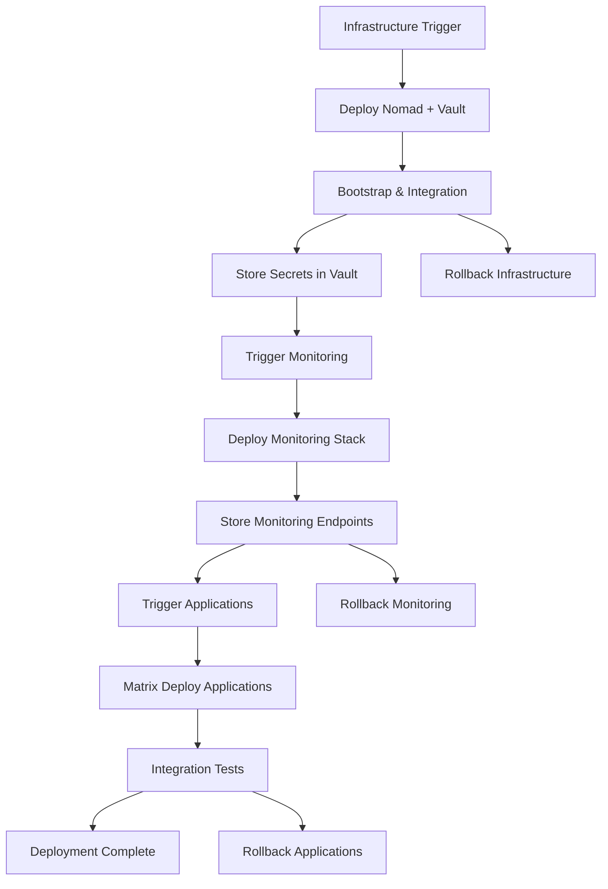

# 3-Group Service Split Architecture Research

## Overview

This research project analyzes the 3-group service split approach for deploying HashiCorp Nomad and Vault, focusing on Infrastructure, Monitoring, and Applications groups with modular deployment strategies.

## Research Findings

### Key Benefits Identified

1. **Modular Deployment**: Each group can be deployed and scaled independently
2. **Bootstrap Sequence**: Environment variables → Vault migration provides secure token management
3. **Dynamic Discovery**: Multi-priority Vault URL discovery with fallback mechanisms
4. **Environment Isolation**: Multiple Vault instances per Nomad cluster with proper resource management
5. **Scalability**: Horizontal and vertical scaling with automated failover
6. **Disaster Recovery**: Multi-region replication with automated DR procedures

### Architecture Components

#### Infrastructure Group (Nomad + Vault)
- **Single Workflow Deployment**: Nomad and Vault deployed together as foundational layer
- **Bootstrap Process**: 
  1. Nomad cluster initialization with ACL bootstrap
  2. Vault deployment via Nomad job
  3. Vault-Nomad integration configuration
  4. Token migration from environment variables to Vault

#### Monitoring Group
- **Dependency**: Waits for Infrastructure group completion
- **Components**: Prometheus, Grafana, Alertmanager
- **Discovery**: Uses Vault-stored Infrastructure endpoints
- **Scaling**: Independent monitoring stack per environment

#### Applications Group  
- **Dependency**: Waits for Monitoring group completion
- **Strategy**: Matrix deployment across multiple applications
- **Authentication**: AppRole-based Vault authentication
- **Rollback**: Rolling, blue-green, and canary rollback strategies

## Implementation Blueprint

### Phase 1: Infrastructure Setup
```bash
# Repository structure
cloudya-infrastructure/
├── terraform/          # Infrastructure as Code
├── nomad/             # Nomad configurations and jobs
├── vault/             # Vault policies and configurations
├── .github/workflows/ # GitHub Actions workflows
└── scripts/           # Bootstrap and management scripts
```

### Phase 2: Workflow Architecture
- **Infrastructure Workflow**: Terraform → Nomad Bootstrap → Vault Deploy → Integration Setup
- **Monitoring Workflow**: Retrieve Infrastructure Info → Deploy Stack → Store Endpoints
- **Applications Workflow**: Matrix deployment with health checks and rollback capabilities

### Phase 3: Operational Procedures
- **Disaster Recovery**: Multi-region replication with automated failover
- **Scaling**: Auto-scaling based on metrics (CPU, memory, request rate, latency)
- **Monitoring**: Comprehensive health checks and alerting

## Key Technical Decisions

### Vault Discovery Priority Chain
1. **Environment VAULT_URL** (highest priority)
2. **Local configuration file**
3. **Consul service discovery**
4. **Create new Vault instance** (fallback)

### Environment Management
- **Namespace Strategy**: Separate Nomad namespaces per environment
- **Resource Quotas**: Environment-specific resource limits
- **DNS Patterns**: `vault-{env}.nomad` for environment-specific discovery
- **Cross-Environment Access**: Production → Staging (emergency), Staging → Development (seeding)

### Scaling Benefits
- **Cluster Migration**: Zero-downtime migration between clusters
- **Multi-Cloud**: Cloud-agnostic deployment patterns
- **Load Balancing**: HAProxy with dynamic server discovery
- **Auto-Scaling**: Prometheus-based scaling decisions

## Workflow Dependencies



## Disaster Recovery Procedures

### Recovery Time Objectives (RTO) / Recovery Point Objectives (RPO)
- **Production Infrastructure**: RTO 30min, RPO 5min
- **Production Monitoring**: RTO 15min, RPO 1min  
- **Production Applications**: RTO 10min, RPO 1min

### Automated DR Testing
- **Infrastructure Tests**: Vault failover simulation
- **Monitoring Tests**: Primary stack failure verification
- **Application Tests**: Multi-service DR validation
- **Full Stack Tests**: End-to-end DR scenario

## Implementation Recommendations

### Immediate Actions
1. **Set up Infrastructure repository** with Terraform and Nomad configurations
2. **Configure GitHub Actions workflows** for 3-group deployment
3. **Implement Vault discovery pattern** with priority-based fallback
4. **Create bootstrap scripts** for automated deployment

### Phase 2 Enhancements
1. **Multi-region replication** setup for disaster recovery
2. **Auto-scaling configuration** based on performance metrics
3. **Comprehensive monitoring** with alerting and dashboards
4. **DR testing automation** with regular validation

### Production Readiness
1. **Security hardening** with TLS, ACLs, and network policies
2. **Backup and restore procedures** for all data stores
3. **Incident response playbooks** for common failure scenarios
4. **Performance tuning** based on production load patterns

## Research Methodology

This research was conducted through:
1. **Literature Review**: HashiCorp documentation and best practices
2. **Architecture Analysis**: Multi-environment deployment patterns
3. **Implementation Design**: Practical deployment workflows
4. **Testing Strategies**: DR and rollback procedure development

## Files Organization

```
research/architecture/
├── infrastructure/
│   ├── nomad-vault-integration.md    # Core integration patterns
│   ├── vault-discovery-patterns.md   # Discovery and authentication
│   └── environment-management.md     # Multi-environment strategies
├── workflows/
│   ├── github-actions-architecture.md # CI/CD workflow design
│   └── disaster-recovery-rollback.md # DR and rollback procedures
├── scalability/
│   └── benefits-analysis.md          # Scaling and operational benefits
└── examples/
    └── implementation-blueprint.md   # Complete implementation guide
```

## Next Steps

1. **Proof of Concept**: Deploy infrastructure group in development environment
2. **Integration Testing**: Validate Vault-Nomad integration and service discovery
3. **Monitoring Setup**: Deploy and configure monitoring stack
4. **Application Deployment**: Test application deployment and rollback procedures
5. **DR Validation**: Execute disaster recovery tests and refine procedures

## Conclusion

The 3-group service split approach provides a robust, scalable foundation for HashiCorp Nomad and Vault deployments with significant operational benefits including:

- **Independent scaling and deployment** of each service group
- **Simplified dependency management** through sequential deployment
- **Comprehensive disaster recovery** with automated failover procedures
- **Environment isolation** with secure cross-environment communication
- **Operational efficiency** through automated workflows and testing

This architecture supports enterprise-grade deployments while maintaining flexibility for different environments and scaling requirements.