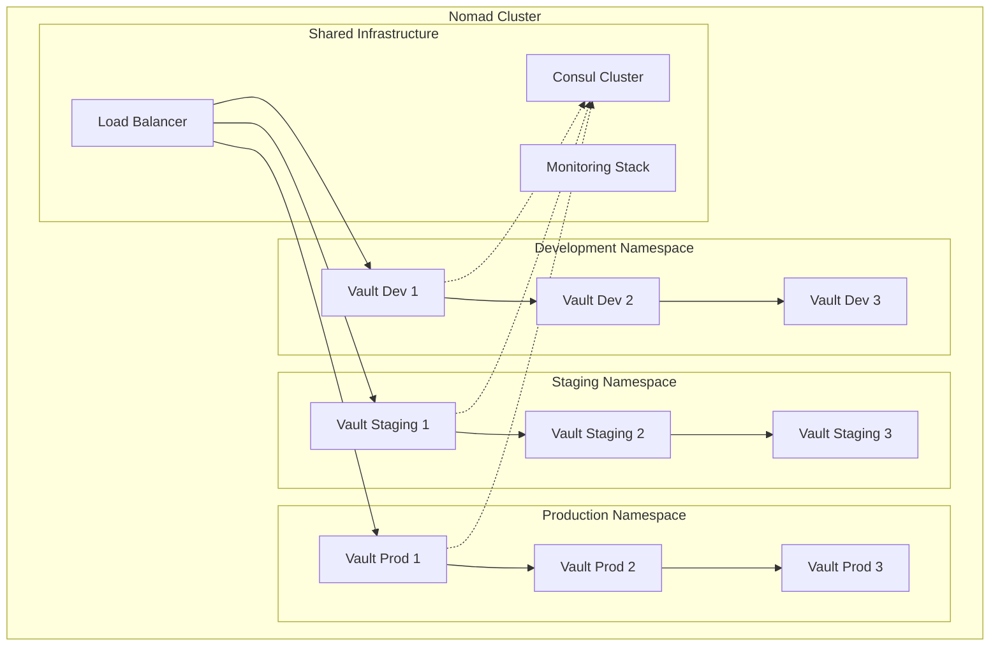

# Environment Management Architecture

## Overview

Multi-environment Vault deployment strategy running on a single Nomad cluster with proper isolation, resource management, and cross-environment access controls.

## Running Multiple Vaults on Single Nomad Cluster

### Architecture Overview



### Resource Isolation Configuration

#### Nomad Job Specification with Environment Isolation

```hcl
job "vault-multi-env" {
  datacenters = ["dc1"]
  type = "service"
  
  # Environment-specific namespace
  namespace = "${var.environment}"
  
  parameterized {
    payload = "required"
    meta_required = ["environment", "vault_version", "resource_tier"]
  }
  
  group "vault" {
    count = "${var.vault_count}"
    
    # Resource allocation by environment
    constraint {
      attribute = "${meta.environment_tier}"
      value = "${NOMAD_META_resource_tier}"
    }
    
    # Anti-affinity to spread across nodes
    constraint {
      operator = "distinct_hosts"
      value = "true"
    }
    
    # Environment-specific node selection
    constraint {
      attribute = "${node.class}"
      operator = "regexp"
      value = "${NOMAD_META_environment}-(vault|mixed)"
    }
    
    update {
      max_parallel = 1
      canary = 1
      min_healthy_time = "60s"
      healthy_deadline = "10m"
      auto_revert = true
      auto_promote = false  # Manual promotion for production
    }
    
    network {
      port "http" {
        to = 8200
      }
      port "cluster" {
        to = 8201
      }
    }
    
    # Environment-specific resource allocation
    dynamic "task" {
      for_each = var.environments
      content {
        name = "vault-${task.key}"
        
        resources {
          cpu    = task.value.cpu
          memory = task.value.memory
          
          # Reserved resources for production
          memory_max = task.value.memory_max
        }
        
        # Environment-specific storage
        volume_mount {
          volume = "${task.key}-vault-data"
          destination = "/vault/data"
          read_only = false
        }
      }
    }
    
    # Environment-specific volumes
    dynamic "volume" {
      for_each = var.environments
      content {
        name = "${volume.key}-vault-data"
        type = "csi"
        
        source = "${volume.key}-vault-storage"
        
        mount_options {
          fs_type = "xfs"
          mount_flags = ["noatime"]
        }
        
        # Environment-specific access modes
        access_mode = volume.value.storage_access_mode
        attachment_mode = "file-system"
      }
    }
    
    service {
      name = "vault"
      port = "http"
      
      tags = [
        "vault",
        "secrets",
        "${NOMAD_META_environment}",
        "version-${NOMAD_META_vault_version}",
        "tier-${NOMAD_META_resource_tier}"
      ]
      
      meta {
        environment = "${NOMAD_META_environment}"
        resource_tier = "${NOMAD_META_resource_tier}"
        vault_version = "${NOMAD_META_vault_version}"
        storage_path = "/vault/${NOMAD_META_environment}"
      }
      
      # Environment-specific health checks
      check {
        type = "http"
        path = "/v1/sys/health?standbyok=${var.allow_standby}"
        interval = "${var.health_check_interval}"
        timeout = "${var.health_check_timeout}"
        
        header {
          X-Vault-Namespace = "${NOMAD_META_environment}"
        }
      }
      
      # Consul Connect for secure service mesh
      connect {
        sidecar_service {
          tags = ["vault-proxy", "${NOMAD_META_environment}"]
          
          proxy {
            local_service_address = "127.0.0.1"
            local_service_port = 8200
            
            # Environment-specific upstream services
            upstreams {
              destination_name = "consul-${NOMAD_META_environment}"
              local_bind_port = 8500
            }
            
            # Cross-environment connectivity (production only)
            dynamic "upstreams" {
              for_each = var.cross_env_access[NOMAD_META_environment] || []
              content {
                destination_name = "vault-${upstreams.value}"
                local_bind_port = 8300 + upstreams.key
                datacenter = upstreams.value
              }
            }
          }
        }
      }
    }
    
    task "vault" {
      driver = "docker"
      
      config {
        image = "vault:${NOMAD_META_vault_version}"
        ports = ["http", "cluster"]
        args = ["vault", "server", "-config=/local/vault.hcl"]
        
        # Security configurations
        cap_add = ["IPC_LOCK"]
        cap_drop = ["ALL"]
        
        # Environment-specific resource limits
        memory_hard_limit = "${var.environments[NOMAD_META_environment].memory_limit}"
        
        # Logging configuration
        logging {
          type = "json-file"
          config {
            max-size = "10m"
            max-file = "3"
            labels = "environment,service,version"
          }
        }
        
        # Environment variables
        env {
          VAULT_LOG_LEVEL = "${var.environments[NOMAD_META_environment].log_level}"
          VAULT_ENVIRONMENT = "${NOMAD_META_environment}"
          VAULT_CLUSTER_NAME = "vault-${NOMAD_META_environment}"
        }
      }
      
      # Environment-specific Vault configuration template
      template {
        data = <<EOF
storage "consul" {
  address = "{{ env "CONSUL_HTTP_ADDR" | default "127.0.0.1:8500" }}"
  path = "vault/{{ env "NOMAD_META_environment" }}/"
  
  # Environment-specific storage configuration
  {{ with secret (printf "kv/vault-config/%s" (env "NOMAD_META_environment")) }}
  {{ if .Data.data.consul_token }}
  token = "{{ .Data.data.consul_token }}"
  {{ end }}
  
  {{ if .Data.data.consistency_mode }}
  consistency_mode = "{{ .Data.data.consistency_mode }}"
  {{ end }}
  
  # Session TTL based on environment
  session_ttl = "{{ .Data.data.session_ttl | default "15s" }}"
  lock_wait_time = "{{ .Data.data.lock_wait_time | default "15s" }}"
  {{ end }}
}

# Environment-specific listener configuration
listener "tcp" {
  address = "0.0.0.0:8200"
  
  {{ with secret (printf "kv/tls/%s" (env "NOMAD_META_environment")) }}
  {{ if .Data.data.tls_cert }}
  tls_cert_file = "/local/vault.crt"
  tls_key_file = "/local/vault.key"
  tls_min_version = "{{ .Data.data.tls_min_version | default "tls12" }}"
  
  # Production requires client certificates
  {{ if eq (env "NOMAD_META_environment") "production" }}
  tls_require_and_verify_client_cert = true
  tls_client_ca_file = "/local/ca.crt"
  {{ end }}
  {{ else }}
  tls_disable = true
  {{ end }}
  {{ end }}
}

# Cluster configuration
cluster_addr = "http://{{ env "NOMAD_ALLOC_IP" }}:8201"
api_addr = "http://{{ env "NOMAD_ALLOC_IP" }}:8200"

# Environment-specific seal configuration  
{{ with secret (printf "kv/seal-config/%s" (env "NOMAD_META_environment")) }}
{{ if .Data.data.auto_unseal }}
seal "awskms" {
  region = "{{ .Data.data.aws_region }}"
  kms_key_id = "{{ .Data.data.kms_key_id }}"
  endpoint = "{{ .Data.data.kms_endpoint }}"
}
{{ end }}
{{ end }}

# Environment-specific features
ui = {{ if eq (env "NOMAD_META_environment") "production" }}false{{ else }}true{{ end }}

# Logging
log_level = "{{ env "VAULT_LOG_LEVEL" | default "INFO" }}"
log_format = "json"

# Performance tuning by environment
default_lease_ttl = "{{ env "DEFAULT_LEASE_TTL" | default "768h" }}"
max_lease_ttl = "{{ env "MAX_LEASE_TTL" | default "8760h" }}"

# Environment-specific database connections
{{ range $db := (env "VAULT_DATABASES" | split ",") }}
# Database: {{ $db }}
{{ with secret (printf "kv/database-config/%s/%s" (env "NOMAD_META_environment") $db) }}
storage "postgresql" {
  connection_url = "{{ .Data.data.connection_url }}"
  table = "vault_kv_store_{{ env "NOMAD_META_environment" }}_{{ $db }}"
}
{{ end }}
{{ end }}
EOF
        destination = "local/vault.hcl"
        change_mode = "restart"
        perms = "0600"
      }
      
      # TLS certificate template (if enabled)
      template {
        data = <<EOF
{{ with secret (printf "kv/tls/%s" (env "NOMAD_META_environment")) }}
{{ if .Data.data.tls_cert }}
{{ .Data.data.tls_cert }}
{{ end }}
{{ end }}
EOF
        destination = "local/vault.crt"
        change_mode = "restart"
        perms = "0600"
      }
      
      # Auto-unseal configuration
      vault {
        policies = [
          "vault-${NOMAD_META_environment}",
          "vault-common"
        ]
        
        # Environment-specific Vault configuration
        change_mode = "restart"
        env = true
      }
      
      # Environment-specific resource allocation
      resources {
        cpu = "${var.environments[NOMAD_META_environment].cpu}"
        memory = "${var.environments[NOMAD_META_environment].memory}"
        
        # Network bandwidth limits
        network {
          mbits = "${var.environments[NOMAD_META_environment].network_mbits}"
        }
        
        # Device resources for HSM or specialized hardware
        dynamic "device" {
          for_each = var.environments[NOMAD_META_environment].devices || []
          content {
            name = device.value.name
            count = device.value.count
          }
        }
      }
      
      # Environment-specific shutdown configuration
      shutdown_delay = "${var.environments[NOMAD_META_environment].shutdown_delay}"
      kill_timeout = "${var.environments[NOMAD_META_environment].kill_timeout}"
      kill_signal = "${var.environments[NOMAD_META_environment].kill_signal}"
    }
  }
}
```

### Environment Configuration Variables

```hcl
# variables.tf
variable "environments" {
  description = "Environment-specific configurations"
  type = map(object({
    cpu = number
    memory = number
    memory_max = number
    memory_limit = number
    network_mbits = number
    log_level = string
    storage_access_mode = string
    shutdown_delay = string
    kill_timeout = string  
    kill_signal = string
    devices = optional(list(object({
      name = string
      count = number
    })))
  }))
  
  default = {
    development = {
      cpu = 500
      memory = 512
      memory_max = 1024
      memory_limit = 1024
      network_mbits = 10
      log_level = "DEBUG"
      storage_access_mode = "single-node-writer"
      shutdown_delay = "5s"
      kill_timeout = "10s"
      kill_signal = "SIGINT"
      devices = []
    }
    
    staging = {
      cpu = 1000
      memory = 1024
      memory_max = 2048
      memory_limit = 2048
      network_mbits = 50
      log_level = "INFO"
      storage_access_mode = "single-node-writer"
      shutdown_delay = "15s"
      kill_timeout = "30s"
      kill_signal = "SIGTERM"
      devices = []
    }
    
    production = {
      cpu = 2000
      memory = 4096
      memory_max = 8192
      memory_limit = 8192
      network_mbits = 100
      log_level = "WARN"
      storage_access_mode = "multi-node-multi-writer"
      shutdown_delay = "30s"
      kill_timeout = "60s"
      kill_signal = "SIGTERM"
      devices = [
        {
          name = "nvidia/gpu"
          count = 1
        }
      ]
    }
  }
}

variable "cross_env_access" {
  description = "Cross-environment access configuration"
  type = map(list(string))
  
  default = {
    development = []
    staging = ["development"]
    production = ["staging"]  # One-way access for emergency scenarios
  }
}
```

## Namespace Strategies in Nomad

### Namespace Configuration

```hcl
# Development namespace
resource "nomad_namespace" "development" {
  name        = "development"
  description = "Development environment for all applications"
  
  meta = {
    environment = "development"
    team = "platform"
    cost_center = "engineering"
    auto_cleanup = "true"
    max_job_ttl = "24h"
  }
  
  capabilities {
    enabled_task_drivers  = ["docker", "exec", "raw_exec"]
    disabled_task_drivers = ["java"]
  }
  
  node_pool_config {
    allowed = ["development", "shared"]
    default = "development"
    denied  = ["production"]
  }
}

# Staging namespace
resource "nomad_namespace" "staging" {
  name        = "staging"
  description = "Staging environment for pre-production testing"
  
  meta = {
    environment = "staging"
    team = "platform"
    cost_center = "engineering"
    auto_cleanup = "false"
    max_job_ttl = "72h"
  }
  
  capabilities {
    enabled_task_drivers  = ["docker", "exec"]
    disabled_task_drivers = ["raw_exec", "java"]
  }
  
  node_pool_config {
    allowed = ["staging", "shared"]
    default = "staging"
    denied  = ["production", "development"]
  }
}

# Production namespace
resource "nomad_namespace" "production" {
  name        = "production"
  description = "Production environment with strict controls"
  
  meta = {
    environment = "production"
    team = "platform"
    cost_center = "operations"
    auto_cleanup = "false"
    backup_required = "true"
    sla_tier = "tier1"
  }
  
  capabilities {
    enabled_task_drivers  = ["docker"]
    disabled_task_drivers = ["exec", "raw_exec", "java"]
  }
  
  node_pool_config {
    allowed = ["production"]
    default = "production"
    denied  = ["development", "staging", "shared"]
  }
}
```

### Resource Quotas by Environment

```hcl
# Development resource quota
resource "nomad_quota_specification" "development" {
  name        = "development-quota"
  description = "Resource limits for development environment"
  
  limits {
    region = "global"
    region_limit {
      cpu       = 10000  # 10 cores
      memory    = 20480  # 20GB
      memory_max = 40960 # 40GB burst
    }
  }
}

# Staging resource quota  
resource "nomad_quota_specification" "staging" {
  name        = "staging-quota"
  description = "Resource limits for staging environment"
  
  limits {
    region = "global"
    region_limit {
      cpu       = 20000  # 20 cores
      memory    = 51200  # 50GB
      memory_max = 102400 # 100GB burst
    }
  }
}

# Production resource quota
resource "nomad_quota_specification" "production" {
  name        = "production-quota"
  description = "Resource limits for production environment"
  
  limits {
    region = "global"
    region_limit {
      cpu       = 100000 # 100 cores
      memory    = 512000 # 500GB
      memory_max = 1024000 # 1TB burst
    }
  }
}

# Associate quotas with namespaces
resource "nomad_namespace" "development" {
  # ... other configuration ...
  quota = nomad_quota_specification.development.name
}

resource "nomad_namespace" "staging" {
  # ... other configuration ...
  quota = nomad_quota_specification.staging.name
}

resource "nomad_namespace" "production" {
  # ... other configuration ...
  quota = nomad_quota_specification.production.name
}
```

## DNS Patterns Implementation

### DNS Zone Configuration

```yaml
# DNS configuration for multi-environment Vault
consul_dns_config:
  # Environment-specific DNS entries
  services:
    - name: "vault-dev"
      service_name: "vault"
      environment: "development"
      tags: ["development", "active"]
      dns_config:
        ttl: 30
        prefer_nearest: true
        only_passing: true
        
    - name: "vault-staging"
      service_name: "vault" 
      environment: "staging"
      tags: ["staging", "active"]
      dns_config:
        ttl: 60
        prefer_nearest: true
        only_passing: true
        
    - name: "vault-prod"
      service_name: "vault"
      environment: "production" 
      tags: ["production", "active"]
      dns_config:
        ttl: 300
        prefer_nearest: true
        only_passing: true
        
    - name: "vault"
      service_name: "vault"
      environment: "any"
      tags: ["active"]
      dns_config:
        ttl: 60
        prefer_nearest: true
        only_passing: true

  # Prepared queries for intelligent routing
  prepared_queries:
    - name: "vault-by-environment"
      service: "vault"
      near: "_agent"
      only_passing: true
      tags:
        - "{{ .environment }}"
        - "active"
      failover:
        nearest_n: 3
        targets:
          - "{{ .environment }}"
          - "staging"
          - "development"
          
    - name: "vault-failover"
      service: "vault" 
      near: "_agent"
      only_passing: true
      connect: true
      failover:
        nearest_n: 5
        targets:
          - "production"
          - "staging"
          - "development"

# CoreDNS configuration for .nomad domain
coredns_config: |
  nomad:8053 {
      consul vault.service.consul:8600 {
          ttl 30
      }
      
      forward vault-dev.nomad vault.service.consul:8600 {
          force_tcp
      }
      
      forward vault-staging.nomad vault.service.consul:8600 {
          force_tcp
      }
      
      forward vault-prod.nomad vault.service.consul:8600 {
          force_tcp
      }
      
      log
      errors
  }
```

### DNS Resolution Examples

```bash
# Environment-specific DNS queries
dig vault-dev.service.consul
dig vault-staging.service.consul  
dig vault-prod.service.consul

# SRV records for service discovery
dig _vault._tcp.service.consul SRV

# Nomad-specific DNS
dig vault-dev.nomad
dig vault-staging.nomad
dig vault-prod.nomad

# Prepared query usage
dig vault-by-environment.query.consul
dig vault-failover.query.consul

# Health-aware queries
dig vault-prod.service.consul +short
dig vault-staging.service.consul +short
```

## Cross-Environment Access Controls

### Consul Connect Intentions

```hcl
# Cross-environment access policies
resource "consul_config_entry" "vault_intentions" {
  kind = "service-intentions"
  name = "vault"
  
  config_json = jsonencode({
    sources = [
      # Production can access staging for disaster recovery
      {
        name = "vault"
        namespace = "production"
        action = "allow"
        destination = {
          namespace = "staging"
        }
        permissions = [
          {
            action = "allow"
            http = {
              path_prefix = "/v1/sys/health"
            }
          },
          {
            action = "allow"
            http = {
              path_prefix = "/v1/sys/replication/status"
            }
          }
        ]
      },
      
      # Staging can access development for data seeding
      {
        name = "vault"
        namespace = "staging"  
        action = "allow"
        destination = {
          namespace = "development"
        }
        permissions = [
          {
            action = "allow"
            http = {
              path_prefix = "/v1/kv/"
              methods = ["GET"]
            }
          }
        ]
      },
      
      # Monitoring can access all environments
      {
        name = "monitoring"
        action = "allow"
        permissions = [
          {
            action = "allow"
            http = {
              path_prefix = "/v1/sys/metrics"
            }
          },
          {
            action = "allow"
            http = {
              path_prefix = "/v1/sys/health"
            }
          }
        ]
      },
      
      # Deny all other cross-environment access
      {
        name = "*"
        action = "deny"
      }
    ]
  })
}
```

### Vault Policy for Cross-Environment Access

```hcl
# Cross-environment emergency access policy
path "sys/replication/status" {
  capabilities = ["read"]
}

path "sys/health" {
  capabilities = ["read"]
}

path "sys/metrics" {
  capabilities = ["read"]
}

# Production emergency access to staging
path "staging/kv/data/emergency/*" {
  capabilities = ["read"]
  allowed_parameters = {
    "version" = []
  }
}

# Staging data seeding from development
path "development/kv/data/seed-data/*" {
  capabilities = ["read", "list"]
}

# Monitoring access across environments
path "+/sys/metrics" {
  capabilities = ["read"]
}

path "+/sys/health" {
  capabilities = ["read"]
}
```

### Network Segmentation

```yaml
# Network policies for environment isolation
network_policies:
  development:
    ingress:
      - from:
          - namespace: "development"
          - namespace: "staging"  # Allow staging to access dev
        ports:
          - protocol: TCP
            port: 8200
      - from:
          - namespace: "monitoring"
        ports:
          - protocol: TCP
            port: 8200
            path: "/v1/sys/health"
    egress:
      - to:
          - namespace: "development"
        ports:
          - protocol: TCP
            port: 8500  # Consul
  
  staging:
    ingress:
      - from:
          - namespace: "staging"
          - namespace: "production" # Allow prod to access staging for DR
        ports:
          - protocol: TCP
            port: 8200
      - from:
          - namespace: "monitoring"
        ports:
          - protocol: TCP
            port: 8200
    egress:
      - to:
          - namespace: "staging"
          - namespace: "development" # Allow staging to seed from dev
        ports:
          - protocol: TCP
            port: 8200
            
  production:
    ingress:
      - from:
          - namespace: "production"
        ports:
          - protocol: TCP
            port: 8200
      - from:
          - namespace: "monitoring"
        ports:
          - protocol: TCP
            port: 8200
    egress:
      - to:
          - namespace: "production"
          - namespace: "staging" # Emergency access only
        ports:
          - protocol: TCP
            port: 8200
```

This environment management architecture provides robust isolation while enabling necessary cross-environment communication for operational requirements and emergency scenarios.