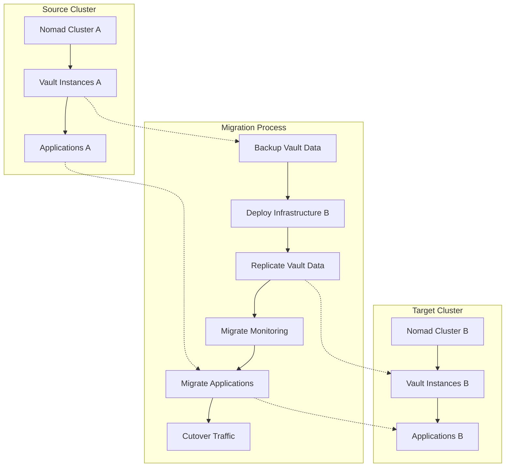
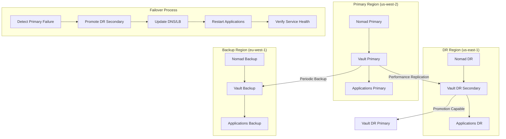

# Scalability Benefits Analysis

## Overview

The 3-group service split approach (Infrastructure, Monitoring, Applications) provides significant scalability benefits through modular deployment, independent scaling, and efficient resource utilization. This analysis examines the operational and technical advantages.

## Cluster Migration Benefits

### Seamless Infrastructure Portability



### Migration Procedure Implementation

```bash
#!/bin/bash
# cluster-migration.sh - Zero-downtime cluster migration

set -euo pipefail

SOURCE_CLUSTER="${1:-source}"
TARGET_CLUSTER="${2:-target}"
ENVIRONMENT="${3:-production}"

echo "Starting cluster migration: $SOURCE_CLUSTER -> $TARGET_CLUSTER"

# Phase 1: Infrastructure Setup
setup_target_infrastructure() {
    echo "Phase 1: Setting up target infrastructure..."
    
    # Deploy new Nomad cluster
    cd terraform/
    terraform workspace new "$TARGET_CLUSTER-$ENVIRONMENT" || terraform workspace select "$TARGET_CLUSTER-$ENVIRONMENT"
    
    terraform apply -auto-approve \
        -var="cluster_name=$TARGET_CLUSTER" \
        -var="environment=$ENVIRONMENT" \
        -var="enable_migration_mode=true"
    
    # Get new cluster endpoints
    export TARGET_NOMAD_ADDR=$(terraform output -raw nomad_endpoint)
    export TARGET_CONSUL_ADDR=$(terraform output -raw consul_endpoint)
    
    echo "Target infrastructure ready: $TARGET_NOMAD_ADDR"
}

# Phase 2: Vault Data Replication
setup_vault_replication() {
    echo "Phase 2: Setting up Vault replication..."
    
    # Enable performance replication on source
    vault write -f sys/replication/performance/primary/enable
    
    # Generate secondary token
    SECONDARY_TOKEN=$(vault write -field=wrapping_token \
        sys/replication/performance/primary/secondary-token \
        id="$TARGET_CLUSTER-secondary")
    
    # Deploy Vault on target cluster
    export NOMAD_ADDR=$TARGET_NOMAD_ADDR
    sed -i "s/REPLICATION_TOKEN/$SECONDARY_TOKEN/g" nomad/jobs/vault-secondary.nomad.hcl
    nomad job run nomad/jobs/vault-secondary.nomad.hcl
    
    # Wait for replication to sync
    echo "Waiting for replication sync..."
    until vault read sys/replication/performance/status | grep "mode.*secondary"; do
        sleep 30
        echo "Replication still syncing..."
    done
    
    echo "Vault replication established"
}

# Phase 3: Monitoring Migration
migrate_monitoring() {
    echo "Phase 3: Migrating monitoring stack..."
    
    # Deploy monitoring on target with dual scraping
    export NOMAD_ADDR=$TARGET_NOMAD_ADDR
    
    # Update Prometheus config to scrape both clusters during migration
    cat > /tmp/prometheus-migration.yml <<EOF
global:
  scrape_interval: 15s
  evaluation_interval: 15s

rule_files:
  - "rules/*.yml"

scrape_configs:
  # Source cluster (legacy)
  - job_name: 'nomad-source'
    static_configs:
      - targets: ['${SOURCE_NOMAD_ADDR}:4646']
    metrics_path: '/v1/metrics'
    params:
      format: ['prometheus']
    
  # Target cluster (new)
  - job_name: 'nomad-target'
    static_configs:
      - targets: ['${TARGET_NOMAD_ADDR}:4646']
    metrics_path: '/v1/metrics'
    params:
      format: ['prometheus']
      
  # Vault clusters
  - job_name: 'vault-source'
    static_configs:
      - targets: ['vault-source.service.consul:8200']
  
  - job_name: 'vault-target'
    static_configs:
      - targets: ['vault-target.service.consul:8200']

alerting:
  alertmanagers:
    - static_configs:
        - targets: ['alertmanager.service.consul:9093']

EOF
    
    # Deploy updated monitoring
    nomad job run -var="config_template=/tmp/prometheus-migration.yml" monitoring/nomad/prometheus.nomad.hcl
    
    echo "Dual-cluster monitoring active"
}

# Phase 4: Application Migration with Canary Deployment
migrate_applications() {
    echo "Phase 4: Migrating applications with canary deployment..."
    
    local apps=("web-app" "api-service" "worker-service")
    
    for app in "${apps[@]}"; do
        echo "Migrating $app..."
        
        # Deploy canary on target cluster
        export NOMAD_ADDR=$TARGET_NOMAD_ADDR
        sed -i "s/count = [0-9]*/count = 1/g" applications/nomad/$app.nomad.hcl
        sed -i "s/version = \"[^\"]*\"/version = \"canary\"/g" applications/nomad/$app.nomad.hcl
        
        nomad job run applications/nomad/$app.nomad.hcl
        
        # Health check canary
        echo "Health checking $app canary..."
        timeout 300 bash -c "
            until curl -f http://$app-canary.service.consul/health; do
                sleep 10
            done
        "
        
        # Gradually shift traffic (using Consul Connect or load balancer)
        for weight in 10 25 50 75 100; do
            echo "Shifting ${weight}% traffic to $app canary..."
            
            # Update traffic split configuration
            cat > /tmp/$app-traffic-split.json <<EOF
{
  "Kind": "service-splitter",
  "Name": "$app",
  "Splits": [
    {
      "Weight": $((100 - weight)),
      "Service": "$app-source"
    },
    {
      "Weight": $weight,
      "Service": "$app-canary"
    }
  ]
}
EOF
            consul config write /tmp/$app-traffic-split.json
            
            # Monitor for 5 minutes
            sleep 300
            
            # Check error rates
            ERROR_RATE=$(curl -s "http://prometheus.service.consul:9090/api/v1/query" \
                --data-urlencode "query=rate(http_requests_total{job=\"$app-canary\",status=~\"5..\"}[5m])" | \
                jq -r '.data.result[0].value[1]' || echo "0")
            
            if (( $(echo "$ERROR_RATE > 0.01" | bc -l) )); then
                echo "Error rate too high ($ERROR_RATE), rolling back..."
                consul config write /tmp/$app-rollback.json
                exit 1
            fi
            
            echo "$app canary performing well at ${weight}% traffic"
        done
        
        # Scale up target, scale down source
        echo "Completing migration for $app..."
        sed -i "s/count = 1/count = 3/g" applications/nomad/$app.nomad.hcl
        nomad job run applications/nomad/$app.nomad.hcl
        
        # Stop source application
        export NOMAD_ADDR=$SOURCE_NOMAD_ADDR
        nomad job stop $app
        
        echo "$app migration completed"
    done
}

# Phase 5: Cutover and Cleanup
complete_migration() {
    echo "Phase 5: Completing migration..."
    
    # Promote Vault secondary to primary
    export VAULT_ADDR=$TARGET_VAULT_ADDR
    vault write -f sys/replication/performance/secondary/promote
    
    # Update DNS/load balancer to point to target cluster
    # This would be environment-specific
    
    # Verify all services are healthy
    export NOMAD_ADDR=$TARGET_NOMAD_ADDR
    for job in $(nomad job status | grep running | awk '{print $1}'); do
        if ! nomad job status $job | grep -q "Healthy"; then
            echo "WARNING: $job not healthy after migration"
        fi
    done
    
    # Cleanup source cluster (after verification period)
    echo "Migration completed successfully"
    echo "Source cluster can be decommissioned after verification period"
}

# Execute migration phases
main() {
    setup_target_infrastructure
    setup_vault_replication
    migrate_monitoring
    migrate_applications
    complete_migration
    
    echo "Cluster migration completed: $SOURCE_CLUSTER -> $TARGET_CLUSTER"
}

# Run migration if script is executed directly
if [[ "${BASH_SOURCE[0]}" == "${0}" ]]; then
    main "$@"
fi
```

## Horizontal Scaling of Vault Instances

### Auto-Scaling Configuration

```hcl
# nomad-autoscaler.hcl
nomad_autoscaler {
  nomad {
    address = "http://nomad.service.consul:4646"
  }
  
  apm "prometheus" {
    driver = "prometheus"
    config = {
      prometheus_url = "http://prometheus.service.consul:9090"
    }
  }
  
  target "nomad-target" {
    driver = "nomad-target"
    config = {
      nomad_region = "global"
    }
  }
}

scaling "vault-horizontal" {
  enabled = true
  
  target {
    nomad {
      Job = "vault"
      Group = "vault"
    }
  }
  
  policy {
    cooldown = "2m"
    
    check "cpu_allocated_percentage" {
      source = "prometheus"
      query  = "nomad_client_allocs_cpu_allocated{job=\"vault\"}/nomad_client_allocs_cpu_total{job=\"vault\"} * 100"
      
      strategy "target-value" {
        target = 70
      }
    }
    
    check "memory_allocated_percentage" {
      source = "prometheus"
      query  = "nomad_client_allocs_memory_allocated{job=\"vault\"}/nomad_client_allocs_memory_total{job=\"vault\"} * 100"
      
      strategy "target-value" {
        target = 80
      }
    }
    
    check "vault_request_rate" {
      source = "prometheus"
      query  = "rate(vault_core_handle_request_count[5m])"
      
      strategy "target-value" {
        target = 100  # Scale up when >100 requests/sec
      }
    }
    
    check "vault_response_time" {
      source = "prometheus" 
      query  = "vault_core_handle_request{quantile=\"0.99\"}"
      
      strategy "threshold" {
        upper_bound = 500  # Scale up if 99th percentile > 500ms
        delta       = 1
      }
    }
  }
}

scaling "vault-vertical" {
  enabled = true
  
  target {
    nomad {
      Job = "vault"
      Group = "vault"
    }
  }
  
  policy {
    cooldown = "5m"
    
    check "vault_memory_usage" {
      source = "prometheus"
      query  = "vault_runtime_sys_bytes / (1024 * 1024)"
      
      strategy "threshold" {
        upper_bound = 3072  # Scale up when using >3GB
        lower_bound = 1024  # Scale down when using <1GB
        delta       = 1024  # Add/remove 1GB at a time
      }
    }
  }
}
```

### Dynamic Vault Job Template

```hcl
# vault-scalable.nomad.hcl
job "vault" {
  datacenters = ["dc1"]
  type = "service"
  
  # Enable scaling
  constraint {
    attribute = "${node.class}"
    value = "vault-eligible"
  }
  
  group "vault" {
    # Dynamic count based on scaling requirements
    count = ${VAULT_COUNT}
    
    # Update strategy for zero-downtime scaling
    update {
      max_parallel = 1
      health_deadline = "10m"
      min_healthy_time = "30s"
      healthy_deadline = "5m"
      auto_revert = true
      canary = 1
      auto_promote = false
    }
    
    # Spread across zones for HA
    spread {
      attribute = "${node.datacenter}"
      weight = 100
    }
    
    spread {
      attribute = "${meta.availability_zone}"
      weight = 50
    }
    
    network {
      port "http" {
        to = 8200
      }
      port "cluster" {
        to = 8201
      }
    }
    
    service {
      name = "vault"
      port = "http"
      tags = ["vault", "secrets", "version-${VAULT_VERSION}"]
      
      meta {
        version = "${VAULT_VERSION}"
        cluster_size = "${VAULT_COUNT}"
        auto_scaling = "enabled"
      }
      
      # Health check with custom intervals based on load
      check {
        type = "http"
        path = "/v1/sys/health?standbyok=true&perfstandbyok=true"
        interval = "${HEALTH_CHECK_INTERVAL}"
        timeout = "5s"
        
        check_restart {
          limit = 2
          grace = "30s"
        }
      }
      
      # Performance standby check
      check {
        type = "http" 
        path = "/v1/sys/health?perfstandbyok=false"
        interval = "30s"
        timeout = "5s"
      }
    }
    
    # Consul Connect for service mesh
    service {
      name = "vault-connect"
      port = "http"
      
      connect {
        sidecar_service {
          tags = ["vault-proxy"]
          
          proxy {
            local_service_address = "127.0.0.1"
            local_service_port = 8200
            
            # Dynamic upstream configuration
            upstreams {
              destination_name = "consul"
              local_bind_port = 8500
            }
            
            config {
              protocol = "http"
              
              # Load balancing configuration
              passive_health_check {
                interval = "10s"
                max_failures = 3
              }
              
              # Circuit breaker
              circuit_breakers {
                thresholds = [{
                  max_requests = 1000
                  max_pending_requests = 100
                  max_retries = 3
                  consecutive_5xx = 5
                }]
              }
            }
          }
        }
      }
    }
    
    task "vault" {
      driver = "docker"
      
      config {
        image = "vault:${VAULT_VERSION}"
        ports = ["http", "cluster"]
        args = ["vault", "server", "-config=/local/vault.hcl"]
        
        # Resource limits based on scaling tier
        memory_hard_limit = ${VAULT_MEMORY_LIMIT}
        
        # Logging
        logging {
          type = "json-file"
          config {
            max-size = "10m"
            max-file = "3"
            labels = "vault,cluster_size,version"
          }
        }
      }
      
      # Environment-specific configuration template
      template {
        data = <<EOF
storage "consul" {
  address = "{{ env "CONSUL_HTTP_ADDR" }}"
  path = "vault/{{ env "VAULT_ENVIRONMENT" }}/"
  
  # Performance tuning based on cluster size
  {{ if gt (env "VAULT_COUNT" | parseInt) 3 }}
  consistency_mode = "strong"
  session_ttl = "10s"
  lock_wait_time = "10s"
  {{ else }}
  consistency_mode = "default"
  session_ttl = "15s" 
  lock_wait_time = "15s"
  {{ end }}
}

listener "tcp" {
  address = "0.0.0.0:8200"
  tls_disable = {{ env "VAULT_TLS_DISABLE" | default "true" }}
  
  # Connection limits based on expected load
  {{ if gt (env "VAULT_COUNT" | parseInt) 5 }}
  max_request_size = "33554432"  # 32MB for large clusters
  max_request_duration = "60s"
  {{ else }}
  max_request_size = "1048576"   # 1MB for smaller clusters  
  max_request_duration = "30s"
  {{ end }}
}

cluster_addr = "http://{{ env "NOMAD_ALLOC_IP" }}:8201"
api_addr = "http://{{ env "NOMAD_ALLOC_IP" }}:8200"

# Performance tuning
default_lease_ttl = "{{ env "DEFAULT_LEASE_TTL" | default "768h" }}"
max_lease_ttl = "{{ env "MAX_LEASE_TTL" | default "8760h" }}"

# Cache size based on available memory
cache_size = "{{ env "VAULT_CACHE_SIZE" | default "32000" }}"

# UI disabled in production clusters with >3 nodes
ui = {{ if and (eq (env "VAULT_ENVIRONMENT") "production") (gt (env "VAULT_COUNT" | parseInt) 3) }}false{{ else }}true{{ end }}

log_level = "{{ env "VAULT_LOG_LEVEL" | default "INFO" }}"
log_format = "json"

# Enable performance standby for large clusters
{{ if gt (env "VAULT_COUNT" | parseInt) 3 }}
disable_performance_standby = false
{{ else }}
disable_performance_standby = true
{{ end }}

# Telemetry for autoscaling
telemetry {
  prometheus_retention_time = "30s"
  disable_hostname = true
  
  {{ if env "PROMETHEUS_ADDR" }}
  prometheus_addr = "{{ env "PROMETHEUS_ADDR" }}"
  {{ end }}
}
EOF
        destination = "local/vault.hcl"
        change_mode = "restart"
      }
      
      # Dynamic resource allocation based on scaling configuration
      resources {
        cpu = ${VAULT_CPU}
        memory = ${VAULT_MEMORY}
        
        # Disk performance based on workload
        device "ssd" {
          name = "storage"
          count = 1
          
          constraint {
            attribute = "${device.attr.storage_type}"
            value = "ssd"
          }
        }
      }
      
      # Scaling-aware vault configuration
      vault {
        policies = ["vault-${VAULT_ENVIRONMENT}"]
        change_mode = "restart"
        env = true
      }
      
      # Environment variables for scaling
      env {
        VAULT_COUNT = "${VAULT_COUNT}"
        VAULT_ENVIRONMENT = "${VAULT_ENVIRONMENT}"
        VAULT_MEMORY_LIMIT = "${VAULT_MEMORY_LIMIT}"
        VAULT_CACHE_SIZE = "${VAULT_CACHE_SIZE}"
        
        # Performance tuning
        GOMAXPROCS = "${VAULT_CPU / 1000}"
        GOGC = "100"  # Go GC tuning
        
        # Prometheus integration
        PROMETHEUS_ADDR = "prometheus.service.consul:9090"
      }
      
      # Graceful shutdown for scaling down
      shutdown_delay = "30s"
      kill_timeout = "60s"
      kill_signal = "SIGTERM"
    }
  }
}
```

### Load Balancing Configuration

```yaml
# haproxy-vault-lb.cfg
global
  daemon
  log stdout local0
  stats socket /var/run/haproxy.sock mode 660 level admin
  stats timeout 30s

defaults
  mode http
  log global
  option httplog
  option log-health-checks
  option dontlognull
  timeout connect 5000
  timeout client 50000
  timeout server 50000
  
  # Health check configuration
  option httpchk GET /v1/sys/health?standbyok=true&perfstandbyok=true
  http-check expect status 200

# Stats page
listen stats
  bind *:8404
  stats enable
  stats uri /stats
  stats refresh 30s
  stats admin if TRUE

# Vault cluster load balancing
backend vault-cluster
  balance roundrobin
  option httpchk
  
  # Dynamic server configuration based on Consul service discovery
  server-template vault- 10 vault.service.consul:8200 check inter 5s rise 2 fall 3 resolvers consul
  
frontend vault-frontend
  bind *:8200
  default_backend vault-cluster
  
  # Connection rate limiting
  stick-table type ip size 100k expire 30s store conn_rate(3s)
  http-request track-sc0 src
  http-request reject if { sc_conn_rate(0) gt 20 }
  
  # Request rate limiting
  stick-table type ip size 100k expire 30s store http_req_rate(10s)
  http-request track-sc1 src
  http-request reject if { sc_http_req_rate(1) gt 100 }

# Consul resolver
resolvers consul
  nameserver consul 127.0.0.1:8600
  accepted_payload_size 8192
  hold valid 5s
```

## Disaster Recovery Architecture

### Multi-Region DR Setup



### Automated DR Failover Script

```bash
#!/bin/bash
# vault-dr-failover.sh - Automated disaster recovery failover

set -euo pipefail

PRIMARY_REGION="${1:-us-west-2}"
DR_REGION="${2:-us-east-1}"
ENVIRONMENT="${3:-production}"

# Configuration
PRIMARY_VAULT_ADDR="https://vault.${PRIMARY_REGION}.example.com:8200"
DR_VAULT_ADDR="https://vault.${DR_REGION}.example.com:8200"
CONSUL_ADDR="https://consul.${DR_REGION}.example.com:8500"
NOMAD_ADDR="https://nomad.${DR_REGION}.example.com:4646"

# Health check thresholds
MAX_FAILED_CHECKS=3
CHECK_INTERVAL=30
FAILOVER_TIMEOUT=600

check_primary_health() {
    local failed_checks=0
    
    echo "Checking primary Vault health..."
    
    while [ $failed_checks -lt $MAX_FAILED_CHECKS ]; do
        if curl -f -s --max-time 10 "$PRIMARY_VAULT_ADDR/v1/sys/health" >/dev/null 2>&1; then
            echo "Primary Vault is healthy"
            return 0
        else
            echo "Primary Vault health check failed ($((failed_checks + 1))/$MAX_FAILED_CHECKS)"
            failed_checks=$((failed_checks + 1))
            sleep $CHECK_INTERVAL
        fi
    done
    
    echo "Primary Vault is unhealthy after $MAX_FAILED_CHECKS checks"
    return 1
}

promote_dr_secondary() {
    echo "Promoting DR secondary to primary..."
    
    export VAULT_ADDR="$DR_VAULT_ADDR"
    
    # Check DR secondary status
    local dr_status
    dr_status=$(vault read -format=json sys/replication/performance/status)
    local mode=$(echo "$dr_status" | jq -r '.data.mode')
    
    if [ "$mode" != "secondary" ]; then
        echo "ERROR: DR Vault is not in secondary mode (current: $mode)"
        return 1
    fi
    
    # Promote secondary to primary
    vault write -f sys/replication/performance/secondary/promote
    
    # Wait for promotion to complete
    local timeout=$FAILOVER_TIMEOUT
    while [ $timeout -gt 0 ]; do
        local current_mode
        current_mode=$(vault read -format=json sys/replication/performance/status | jq -r '.data.mode')
        
        if [ "$current_mode" = "primary" ]; then
            echo "DR secondary successfully promoted to primary"
            return 0
        fi
        
        echo "Waiting for promotion to complete... ($timeout seconds remaining)"
        sleep 10
        timeout=$((timeout - 10))
    done
    
    echo "ERROR: Promotion timed out"
    return 1
}

update_service_discovery() {
    echo "Updating service discovery for failover..."
    
    # Update Consul DNS entries to point to DR region
    cat > /tmp/vault-dr-service.json <<EOF
{
  "Node": "vault-dr-lb",
  "Address": "$(echo $DR_VAULT_ADDR | cut -d'/' -f3 | cut -d':' -f1)",
  "Service": {
    "ID": "vault-primary",
    "Service": "vault",
    "Tags": ["primary", "active", "dr-promoted"],
    "Address": "$(echo $DR_VAULT_ADDR | cut -d'/' -f3 | cut -d':' -f1)",
    "Port": 8200,
    "Check": {
      "HTTP": "$DR_VAULT_ADDR/v1/sys/health",
      "Interval": "10s"
    }
  }
}
EOF
    
    curl -X PUT "$CONSUL_ADDR/v1/catalog/register" -d @/tmp/vault-dr-service.json
    
    # Update external DNS if using Route 53 or similar
    if command -v aws >/dev/null 2>&1; then
        aws route53 change-resource-record-sets \
            --hosted-zone-id "$HOSTED_ZONE_ID" \
            --change-batch '{
                "Changes": [{
                    "Action": "UPSERT",
                    "ResourceRecordSet": {
                        "Name": "vault.example.com",
                        "Type": "CNAME",
                        "TTL": 60,
                        "ResourceRecords": [{
                            "Value": "vault.'$DR_REGION'.example.com"
                        }]
                    }
                }]
            }'
    fi
    
    echo "Service discovery updated"
}

restart_applications() {
    echo "Restarting applications in DR region..."
    
    export NOMAD_ADDR="$NOMAD_ADDR"
    export VAULT_ADDR="$DR_VAULT_ADDR"
    
    # Get list of applications to restart
    local apps
    apps=$(nomad job status | grep running | awk '{print $1}' | grep -v -E '^(vault|consul|nomad)')
    
    for app in $apps; do
        echo "Restarting $app..."
        
        # Rolling restart to pick up new Vault address
        nomad job restart "$app"
        
        # Wait for health checks
        local timeout=300
        while [ $timeout -gt 0 ]; do
            if nomad job status "$app" | grep -q "running.*healthy"; then
                echo "$app is healthy"
                break
            fi
            
            echo "Waiting for $app to be healthy... ($timeout seconds remaining)"
            sleep 10
            timeout=$((timeout - 10))
        done
        
        if [ $timeout -le 0 ]; then
            echo "WARNING: $app health check timed out"
        fi
    done
    
    echo "Application restarts completed"
}

verify_service_health() {
    echo "Verifying service health after failover..."
    
    local services=("vault" "consul" "nomad")
    local failed_services=()
    
    for service in "${services[@]}"; do
        echo "Checking $service health..."
        
        if curl -f -s --max-time 10 "$CONSUL_ADDR/v1/health/service/$service?passing" | jq -e '.[] | length > 0' >/dev/null; then
            echo "$service is healthy"
        else
            echo "$service is unhealthy"
            failed_services+=("$service")
        fi
    done
    
    if [ ${#failed_services[@]} -eq 0 ]; then
        echo "All services are healthy"
        return 0
    else
        echo "Failed services: ${failed_services[*]}"
        return 1
    fi
}

send_notification() {
    local status="$1"
    local message="$2"
    
    # Send to Slack/Teams/PagerDuty
    if [ -n "${SLACK_WEBHOOK_URL:-}" ]; then
        curl -X POST -H 'Content-type: application/json' \
            --data "{\"text\":\"🚨 DR Failover $status: $message\"}" \
            "$SLACK_WEBHOOK_URL"
    fi
    
    # Send email notification
    if command -v aws >/dev/null 2>&1; then
        aws ses send-email \
            --from "alerts@example.com" \
            --destination "ToAddresses=oncall@example.com" \
            --message "Subject={Data=\"DR Failover $status\",Charset=utf8},Body={Text={Data=\"$message\",Charset=utf8}}"
    fi
    
    echo "Notification sent: $status - $message"
}

# Main failover process
main() {
    echo "Starting DR failover process..."
    echo "Primary Region: $PRIMARY_REGION"
    echo "DR Region: $DR_REGION" 
    echo "Environment: $ENVIRONMENT"
    
    # Check if failover is needed
    if check_primary_health; then
        echo "Primary Vault is healthy, no failover needed"
        exit 0
    fi
    
    send_notification "STARTED" "DR failover initiated due to primary region failure"
    
    # Execute failover steps
    if promote_dr_secondary && 
       update_service_discovery && 
       restart_applications && 
       verify_service_health; then
        
        send_notification "SUCCESS" "DR failover completed successfully. Services are now running in $DR_REGION"
        echo "DR failover completed successfully"
        exit 0
    else
        send_notification "FAILED" "DR failover failed. Manual intervention required"
        echo "DR failover failed"
        exit 1
    fi
}

# Handle script termination
trap 'send_notification "INTERRUPTED" "DR failover was interrupted"' INT TERM

# Execute main function
main "$@"
```

## Multi-Cloud Portability

### Cloud-Agnostic Infrastructure

```hcl
# terraform/modules/vault-cluster/main.tf
# Multi-cloud Vault deployment module

variable "cloud_provider" {
  description = "Cloud provider (aws, azure, gcp)"
  type        = string
  validation {
    condition     = contains(["aws", "azure", "gcp"], var.cloud_provider)
    error_message = "Cloud provider must be aws, azure, or gcp."
  }
}

variable "region" {
  description = "Cloud region"
  type        = string
}

variable "environment" {
  description = "Environment (dev, staging, prod)"
  type        = string
}

variable "instance_count" {
  description = "Number of Vault instances"
  type        = number
  default     = 3
}

# Cloud-specific instance configurations
locals {
  instance_configs = {
    aws = {
      instance_type = {
        small  = "t3.medium"
        medium = "t3.large"
        large  = "m5.xlarge"
      }
      disk_type = "gp3"
      disk_size = 100
    }
    azure = {
      instance_type = {
        small  = "Standard_B2s"
        medium = "Standard_B4ms"
        large  = "Standard_D4s_v3"
      }
      disk_type = "Premium_LRS"
      disk_size = 100
    }
    gcp = {
      instance_type = {
        small  = "e2-medium"
        medium = "e2-standard-4"
        large  = "n1-standard-8"
      }
      disk_type = "pd-ssd"
      disk_size = 100
    }
  }
  
  instance_type = local.instance_configs[var.cloud_provider].instance_type[var.size]
  disk_type     = local.instance_configs[var.cloud_provider].disk_type
  disk_size     = local.instance_configs[var.cloud_provider].disk_size
}

# AWS Resources
module "aws_vault" {
  count  = var.cloud_provider == "aws" ? 1 : 0
  source = "./aws"
  
  region        = var.region
  environment   = var.environment
  instance_type = local.instance_type
  instance_count = var.instance_count
  disk_type     = local.disk_type
  disk_size     = local.disk_size
}

# Azure Resources
module "azure_vault" {
  count  = var.cloud_provider == "azure" ? 1 : 0
  source = "./azure"
  
  region        = var.region
  environment   = var.environment
  vm_size       = local.instance_type
  instance_count = var.instance_count
  disk_type     = local.disk_type
  disk_size     = local.disk_size
}

# GCP Resources
module "gcp_vault" {
  count  = var.cloud_provider == "gcp" ? 1 : 0
  source = "./gcp"
  
  region        = var.region
  environment   = var.environment
  machine_type  = local.instance_type
  instance_count = var.instance_count
  disk_type     = local.disk_type
  disk_size     = local.disk_size
}

# Output normalized values
output "vault_endpoints" {
  value = var.cloud_provider == "aws" ? module.aws_vault[0].vault_endpoints : (
    var.cloud_provider == "azure" ? module.azure_vault[0].vault_endpoints :
    module.gcp_vault[0].vault_endpoints
  )
}

output "nomad_endpoints" {
  value = var.cloud_provider == "aws" ? module.aws_vault[0].nomad_endpoints : (
    var.cloud_provider == "azure" ? module.azure_vault[0].nomad_endpoints :
    module.gcp_vault[0].nomad_endpoints
  )
}

output "consul_endpoints" {
  value = var.cloud_provider == "aws" ? module.aws_vault[0].consul_endpoints : (
    var.cloud_provider == "azure" ? module.azure_vault[0].consul_endpoints :
    module.gcp_vault[0].consul_endpoints
  )
}
```

This scalability benefits analysis demonstrates the significant advantages of the 3-group architecture in terms of operational flexibility, disaster recovery, and multi-cloud portability.