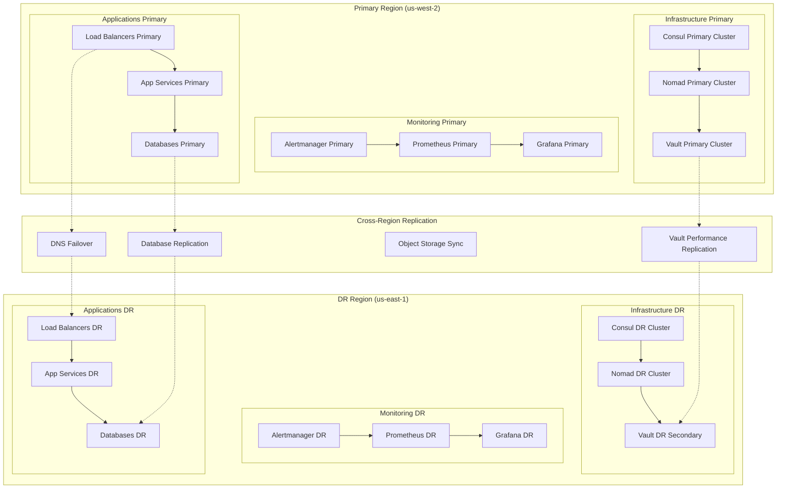

# Disaster Recovery and Rollback Procedures

## Overview

Comprehensive disaster recovery and rollback procedures for the 3-group service split architecture, ensuring business continuity and rapid recovery from failures at any level of the stack.

## Disaster Recovery Strategy

### Recovery Time Objectives (RTO) and Recovery Point Objectives (RPO)

```yaml
# rto-rpo-matrix.yml
disaster_recovery_objectives:
  infrastructure_group:
    production:
      rto: "30 minutes"      # Time to restore service
      rpo: "5 minutes"       # Acceptable data loss
    staging:
      rto: "2 hours"
      rpo: "15 minutes"
    development:
      rto: "4 hours"
      rpo: "1 hour"
      
  monitoring_group:
    production:
      rto: "15 minutes"      # Critical for observability
      rpo: "1 minute"
    staging:
      rto: "1 hour"
      rpo: "10 minutes"
    development:
      rto: "2 hours"
      rpo: "30 minutes"
      
  applications_group:
    production:
      rto: "10 minutes"      # Customer-facing services
      rpo: "1 minute"
    staging:
      rto: "30 minutes"
      rpo: "5 minutes"
    development:
      rto: "1 hour"
      rpo: "15 minutes"
```

### Multi-Region DR Architecture



## Infrastructure Group DR Procedures

### Vault Disaster Recovery

#### 1. Vault Performance Replication Setup

```bash
#!/bin/bash
# scripts/setup-vault-replication.sh

set -euo pipefail

PRIMARY_VAULT_ADDR="${1:-https://vault.us-west-2.example.com:8200}"
SECONDARY_VAULT_ADDR="${2:-https://vault.us-east-1.example.com:8200}"
REPLICATION_TOKEN_FILE="${3:-/tmp/vault-replication-token}"

echo "Setting up Vault performance replication"

# Enable replication on primary
echo "Enabling performance replication on primary..."
export VAULT_ADDR="$PRIMARY_VAULT_ADDR"
vault write -f sys/replication/performance/primary/enable

# Generate secondary token
echo "Generating secondary token..."
vault write -field=wrapping_token \
    sys/replication/performance/primary/secondary-token \
    id="secondary-dr" > "$REPLICATION_TOKEN_FILE"

echo "Secondary token saved to: $REPLICATION_TOKEN_FILE"

# Enable replication on secondary (to be run on DR region)
echo "Enable replication on secondary with:"
echo "export VAULT_ADDR=\"$SECONDARY_VAULT_ADDR\""
echo "vault write sys/replication/performance/secondary/enable token=\"\$(cat $REPLICATION_TOKEN_FILE)\""

# Monitor replication status
echo "Monitor replication status with:"
echo "vault read sys/replication/performance/status"
```

#### 2. Vault DR Failover Script

```bash
#!/bin/bash
# scripts/vault-dr-failover.sh

set -euo pipefail

PRIMARY_REGION="${1:-us-west-2}"
DR_REGION="${2:-us-east-1}"
ENVIRONMENT="${3:-production}"

PRIMARY_VAULT_ADDR="https://vault.$PRIMARY_REGION.example.com:8200"
DR_VAULT_ADDR="https://vault.$DR_REGION.example.com:8200"

log() {
    echo "[$(date +'%Y-%m-%d %H:%M:%S')] $*" >&2
}

check_primary_health() {
    log "Checking primary Vault health..."
    
    local max_attempts=3
    local attempt=1
    
    while [ $attempt -le $max_attempts ]; do
        if timeout 10 vault status -address="$PRIMARY_VAULT_ADDR" >/dev/null 2>&1; then
            log "Primary Vault is healthy (attempt $attempt/$max_attempts)"
            return 0
        fi
        
        log "Primary Vault health check failed (attempt $attempt/$max_attempts)"
        attempt=$((attempt + 1))
        sleep 30
    done
    
    log "Primary Vault is unhealthy after $max_attempts attempts"
    return 1
}

promote_dr_secondary() {
    log "Promoting DR secondary to primary..."
    
    export VAULT_ADDR="$DR_VAULT_ADDR"
    
    # Check current replication status
    local status
    status=$(vault read -format=json sys/replication/performance/status)
    local mode=$(echo "$status" | jq -r '.data.mode')
    
    if [ "$mode" != "secondary" ]; then
        log "ERROR: DR Vault is not in secondary mode (current: $mode)"
        return 1
    fi
    
    # Check replication lag
    local last_wal=$(echo "$status" | jq -r '.data.last_wal')
    local last_remote_wal=$(echo "$status" | jq -r '.data.last_remote_wal')
    
    if [ "$last_wal" != "$last_remote_wal" ]; then
        log "WARNING: Replication lag detected (local: $last_wal, remote: $last_remote_wal)"
        read -p "Continue with promotion? (y/N): " -n 1 -r
        echo
        if [[ ! $REPLY =~ ^[Yy]$ ]]; then
            log "Promotion cancelled"
            return 1
        fi
    fi
    
    # Promote secondary
    vault write -f sys/replication/performance/secondary/promote
    
    # Wait for promotion
    local timeout=300
    while [ $timeout -gt 0 ]; do
        local current_mode
        current_mode=$(vault read -format=json sys/replication/performance/status | jq -r '.data.mode' 2>/dev/null || echo "unknown")
        
        if [ "$current_mode" = "primary" ]; then
            log "DR secondary promoted to primary successfully"
            return 0
        fi
        
        log "Waiting for promotion... (${timeout}s remaining, current mode: $current_mode)"
        sleep 10
        timeout=$((timeout - 10))
    done
    
    log "ERROR: Promotion timed out"
    return 1
}

update_dns_failover() {
    log "Updating DNS for failover..."
    
    # Update Route 53 DNS records
    if command -v aws >/dev/null 2>&1; then
        # Get current record
        local current_record
        current_record=$(aws route53 list-resource-record-sets \
            --hosted-zone-id "$HOSTED_ZONE_ID" \
            --query "ResourceRecordSets[?Name=='vault.example.com.']" \
            --output json)
        
        # Update to point to DR region
        aws route53 change-resource-record-sets \
            --hosted-zone-id "$HOSTED_ZONE_ID" \
            --change-batch "{
                \"Changes\": [{
                    \"Action\": \"UPSERT\",
                    \"ResourceRecordSet\": {
                        \"Name\": \"vault.example.com\",
                        \"Type\": \"CNAME\",
                        \"TTL\": 60,
                        \"ResourceRecords\": [{
                            \"Value\": \"vault.$DR_REGION.example.com\"
                        }]
                    }
                }]
            }"
        
        log "DNS updated to point to DR region: $DR_REGION"
    else
        log "WARNING: AWS CLI not available, manual DNS update required"
    fi
}

restart_nomad_integration() {
    log "Restarting Nomad Vault integration..."
    
    # Update Nomad servers to use new Vault address
    local nomad_servers
    nomad_servers=$(nomad server members -address="http://nomad.$DR_REGION.example.com:4646" | grep alive | awk '{print $1}')
    
    for server in $nomad_servers; do
        log "Updating Vault integration on Nomad server: $server"
        
        # This would typically involve updating the Nomad configuration
        # and restarting the Nomad service on each server
        # Implementation depends on your deployment method (systemd, docker, etc.)
        
        ssh "$server" "sudo systemctl restart nomad" || {
            log "WARNING: Failed to restart Nomad on $server"
        }
    done
    
    log "Nomad Vault integration updated"
}

verify_failover() {
    log "Verifying failover completion..."
    
    export VAULT_ADDR="$DR_VAULT_ADDR"
    
    # Check Vault status
    if ! vault status | grep -q "Sealed.*false"; then
        log "ERROR: Vault is sealed after failover"
        return 1
    fi
    
    # Test basic operations
    if ! vault kv put secret/dr-test value="failover-test-$(date +%s)"; then
        log "ERROR: Cannot write to Vault after failover"
        return 1
    fi
    
    if ! vault kv get secret/dr-test >/dev/null; then
        log "ERROR: Cannot read from Vault after failover"
        return 1
    fi
    
    # Clean up test secret
    vault kv delete secret/dr-test
    
    log "Failover verification completed successfully"
    return 0
}

send_alerts() {
    local status="$1"
    local message="$2"
    
    # Send to Slack
    if [ -n "${SLACK_WEBHOOK_URL:-}" ]; then
        curl -s -X POST -H 'Content-type: application/json' \
            --data "{\"text\":\"🚨 Vault DR Failover $status: $message\"}" \
            "$SLACK_WEBHOOK_URL"
    fi
    
    # Send to PagerDuty
    if [ -n "${PAGERDUTY_INTEGRATION_KEY:-}" ]; then
        curl -s -X POST \
            -H "Content-Type: application/json" \
            -d "{
                \"routing_key\": \"$PAGERDUTY_INTEGRATION_KEY\",
                \"event_action\": \"trigger\",
                \"payload\": {
                    \"summary\": \"Vault DR Failover $status\",
                    \"source\": \"$HOSTNAME\",
                    \"severity\": \"critical\",
                    \"custom_details\": {\"message\": \"$message\"}
                }
            }" \
            "https://events.pagerduty.com/v2/enqueue"
    fi
    
    log "Alert sent: $status - $message"
}

# Main execution
main() {
    log "Starting Vault DR failover process"
    log "Primary region: $PRIMARY_REGION"
    log "DR region: $DR_REGION"
    log "Environment: $ENVIRONMENT"
    
    # Check if failover is needed
    if check_primary_health; then
        log "Primary Vault is healthy, no failover needed"
        exit 0
    fi
    
    send_alerts "STARTED" "DR failover initiated for $ENVIRONMENT environment"
    
    # Execute failover
    if promote_dr_secondary && \
       update_dns_failover && \
       restart_nomad_integration && \
       verify_failover; then
        
        send_alerts "SUCCESS" "DR failover completed successfully. Vault is now running in $DR_REGION"
        log "DR failover completed successfully"
        exit 0
    else
        send_alerts "FAILED" "DR failover failed. Manual intervention required"
        log "DR failover failed"
        exit 1
    fi
}

# Set up signal handling
trap 'send_alerts "INTERRUPTED" "DR failover process was interrupted"; exit 1' INT TERM

# Execute main function
main "$@"
```

### Nomad Cluster Recovery

#### 1. Nomad Server Recovery

```bash
#!/bin/bash
# scripts/nomad-server-recovery.sh

set -euo pipefail

ENVIRONMENT="${1:-production}"
REGION="${2:-us-west-2}"
RECOVERY_MODE="${3:-auto}"  # auto, manual, rebuild

log() {
    echo "[$(date +'%Y-%m-%d %H:%M:%S')] $*"
}

check_nomad_cluster_health() {
    log "Checking Nomad cluster health..."
    
    local healthy_servers
    healthy_servers=$(nomad server members | grep alive | wc -l || echo "0")
    
    log "Healthy Nomad servers: $healthy_servers"
    
    if [ "$healthy_servers" -ge 2 ]; then
        log "Nomad cluster has quorum"
        return 0
    else
        log "Nomad cluster has lost quorum"
        return 1
    fi
}

recover_single_server() {
    local server_name="$1"
    
    log "Recovering Nomad server: $server_name"
    
    # Stop the problematic server
    ssh "$server_name" "sudo systemctl stop nomad" || {
        log "Could not stop Nomad on $server_name via SSH, attempting AWS API"
        aws ec2 stop-instances --instance-ids "$(aws ec2 describe-instances \
            --filters "Name=tag:Name,Values=$server_name" \
            --query 'Reservations[0].Instances[0].InstanceId' --output text)"
    }
    
    # Remove server from cluster (if possible)
    if nomad server members | grep -q "$server_name"; then
        nomad server force-leave "$server_name" || log "Could not force-leave $server_name"
    fi
    
    # Restart server
    ssh "$server_name" "sudo systemctl start nomad" || {
        log "Could not start Nomad via SSH, attempting AWS API"
        aws ec2 start-instances --instance-ids "$(aws ec2 describe-instances \
            --filters "Name=tag:Name,Values=$server_name" \
            --query 'Reservations[0].Instances[0].InstanceId' --output text)"
        
        # Wait for instance to be running
        aws ec2 wait instance-running --instance-ids "$(aws ec2 describe-instances \
            --filters "Name=tag:Name,Values=$server_name" \
            --query 'Reservations[0].Instances[0].InstanceId' --output text)"
    fi
    
    # Wait for server to rejoin
    local timeout=300
    while [ $timeout -gt 0 ]; do
        if nomad server members | grep "$server_name" | grep -q alive; then
            log "Server $server_name rejoined cluster successfully"
            return 0
        fi
        
        log "Waiting for $server_name to rejoin... (${timeout}s remaining)"
        sleep 10
        timeout=$((timeout - 10))
    done
    
    log "ERROR: Server $server_name failed to rejoin cluster"
    return 1
}

perform_outage_recovery() {
    log "Performing Nomad outage recovery..."
    
    # Create recovery configuration
    cat > /tmp/recovery.json <<EOF
{
    "last_log_index": $(nomad operator raft list-peers | tail -1 | awk '{print $3}'),
    "last_log_term": $(nomad operator raft list-peers | tail -1 | awk '{print $4}'),
    "servers": [
EOF
    
    # Get surviving servers
    local survivors
    survivors=$(nomad server members | grep alive | awk '{print $1}')
    
    local first=true
    for server in $survivors; do
        local ip
        ip=$(nomad server members | grep "$server" | awk '{print $2}' | cut -d: -f1)
        
        if [ "$first" = true ]; then
            first=false
        else
            echo "," >> /tmp/recovery.json
        fi
        
        cat >> /tmp/recovery.json <<EOF
        {
            "id": "$server",
            "address": "$ip:4647",
            "non_voter": false
        }
EOF
    done
    
    echo "]}" >> /tmp/recovery.json
    
    # Apply recovery configuration
    nomad operator raft recovery -config-file=/tmp/recovery.json
    
    log "Outage recovery configuration applied"
}

rebuild_cluster() {
    log "Rebuilding Nomad cluster from scratch..."
    
    # This would typically involve:
    # 1. Backing up any critical job specifications
    # 2. Destroying the current cluster
    # 3. Deploying a fresh cluster using infrastructure automation
    # 4. Restoring job specifications
    
    log "WARNING: Cluster rebuild requires manual intervention"
    log "1. Backup job specifications: nomad job inspect [job] > job.json"
    log "2. Run terraform destroy to remove infrastructure"
    log "3. Run terraform apply to recreate infrastructure"
    log "4. Restore jobs: nomad job run job.json"
}

# Main recovery logic
main() {
    log "Starting Nomad server recovery for $ENVIRONMENT environment"
    
    case "$RECOVERY_MODE" in
        "auto")
            if check_nomad_cluster_health; then
                log "Cluster is healthy, no recovery needed"
                exit 0
            fi
            
            # Try to recover individual unhealthy servers
            local unhealthy_servers
            unhealthy_servers=$(nomad server members | grep -v alive | awk '{print $1}' | grep -v "Name")
            
            for server in $unhealthy_servers; do
                if recover_single_server "$server"; then
                    log "Successfully recovered $server"
                else
                    log "Failed to recover $server, trying outage recovery"
                    perform_outage_recovery
                    break
                fi
            done
            ;;
            
        "manual")
            log "Manual recovery mode - administrator intervention required"
            check_nomad_cluster_health
            exit 1
            ;;
            
        "rebuild")
            rebuild_cluster
            ;;
            
        *)
            log "ERROR: Unknown recovery mode: $RECOVERY_MODE"
            exit 1
            ;;
    esac
    
    # Final health check
    if check_nomad_cluster_health; then
        log "Nomad cluster recovery completed successfully"
        exit 0
    else
        log "ERROR: Nomad cluster recovery failed"
        exit 1
    fi
}

main "$@"
```

## Application Group Rollback Procedures

### Rolling Rollback Strategy

```bash
#!/bin/bash
# scripts/application-rollback.sh

set -euo pipefail

APPLICATION="${1:-}"
TARGET_VERSION="${2:-}"
ENVIRONMENT="${3:-production}"
ROLLBACK_STRATEGY="${4:-rolling}"  # rolling, blue-green, canary

if [ -z "$APPLICATION" ] || [ -z "$TARGET_VERSION" ]; then
    echo "Usage: $0 <application> <target-version> [environment] [strategy]"
    exit 1
fi

log() {
    echo "[$(date +'%Y-%m-%d %H:%M:%S')] $*"
}

get_current_version() {
    nomad job status "$APPLICATION" | grep "Version" | awk '{print $3}' | head -1
}

validate_target_version() {
    local target="$1"
    
    # Check if target version exists in job history
    if ! nomad job history "$APPLICATION" | grep -q "Version $target"; then
        log "ERROR: Target version $target not found in job history"
        return 1
    fi
    
    # Verify target version is stable (not failed)
    local status
    status=$(nomad job history "$APPLICATION" | grep "Version $target" | awk '{print $2}')
    
    if [ "$status" != "successful" ]; then
        log "WARNING: Target version $target status is: $status"
        read -p "Continue rollback to potentially unstable version? (y/N): " -n 1 -r
        echo
        if [[ ! $REPLY =~ ^[Yy]$ ]]; then
            return 1
        fi
    fi
    
    return 0
}

rolling_rollback() {
    local app="$1"
    local version="$2"
    
    log "Performing rolling rollback of $app to version $version"
    
    # Revert to target version
    nomad job revert "$app" "$version"
    
    # Monitor rollback progress
    local timeout=600  # 10 minutes
    local start_time=$(date +%s)
    
    while [ $(($(date +%s) - start_time)) -lt $timeout ]; do
        local current_status
        current_status=$(nomad job status "$app" | grep "Status" | awk '{print $3}')
        
        case "$current_status" in
            "running")
                # Check if all allocations are healthy
                local healthy_allocs
                local total_allocs
                healthy_allocs=$(nomad job status "$app" | grep "Healthy" | wc -l)
                total_allocs=$(nomad job status "$app" | grep -E "(running|pending)" | wc -l)
                
                if [ "$healthy_allocs" -eq "$total_allocs" ] && [ "$total_allocs" -gt 0 ]; then
                    log "Rolling rollback completed successfully"
                    return 0
                fi
                ;;
            "dead")
                log "ERROR: Application died during rollback"
                return 1
                ;;
            "pending")
                log "Rollback in progress..."
                ;;
        esac
        
        sleep 10
    done
    
    log "ERROR: Rollback timed out"
    return 1
}

blue_green_rollback() {
    local app="$1"
    local version="$2"
    
    log "Performing blue-green rollback of $app to version $version"
    
    # Deploy target version with different job name
    local green_job="${app}-green"
    
    # Create green deployment job spec from target version
    nomad job inspect "$app" "$version" > "/tmp/${green_job}.json"
    
    # Modify job name in spec
    jq ".Job.Name = \"$green_job\"" "/tmp/${green_job}.json" > "/tmp/${green_job}-modified.json"
    
    # Deploy green version
    nomad job run "/tmp/${green_job}-modified.json"
    
    # Wait for green deployment to be healthy
    local timeout=300
    while [ $timeout -gt 0 ]; do
        if nomad job status "$green_job" | grep -q "running.*healthy"; then
            log "Green deployment is healthy"
            break
        fi
        
        log "Waiting for green deployment... (${timeout}s remaining)"
        sleep 10
        timeout=$((timeout - 10))
    done
    
    if [ $timeout -le 0 ]; then
        log "ERROR: Green deployment failed to become healthy"
        nomad job stop "$green_job"
        return 1
    fi
    
    # Switch traffic (implementation depends on load balancer)
    switch_traffic_to_green "$app" "$green_job"
    
    # Stop old version
    nomad job stop "$app"
    
    # Rename green to original name
    nomad job stop "$green_job"
    jq ".Job.Name = \"$app\"" "/tmp/${green_job}-modified.json" > "/tmp/${app}-final.json"
    nomad job run "/tmp/${app}-final.json"
    
    log "Blue-green rollback completed successfully"
}

switch_traffic_to_green() {
    local blue_service="$1"
    local green_service="$2"
    
    log "Switching traffic from $blue_service to $green_service"
    
    # Update Consul service weights (if using Consul Connect)
    cat > "/tmp/traffic-switch.json" <<EOF
{
  "Kind": "service-splitter",
  "Name": "$blue_service",
  "Splits": [
    {
      "Weight": 0,
      "Service": "$blue_service"
    },
    {
      "Weight": 100,
      "Service": "$green_service"
    }
  ]
}
EOF
    
    consul config write "/tmp/traffic-switch.json"
    
    # Wait for traffic switch to take effect
    sleep 30
    
    # Verify traffic is flowing to green
    local green_requests
    green_requests=$(curl -s "http://prometheus.service.consul:9090/api/v1/query" \
        --data-urlencode "query=rate(http_requests_total{job=\"$green_service\"}[1m])" | \
        jq -r '.data.result[0].value[1]' || echo "0")
    
    if (( $(echo "$green_requests > 0" | bc -l) )); then
        log "Traffic successfully switched to green deployment"
    else
        log "WARNING: No traffic detected on green deployment"
    fi
}

canary_rollback() {
    local app="$1"
    local version="$2"
    
    log "Performing canary rollback of $app to version $version"
    
    # Deploy canary version (10% of traffic)
    local canary_count=1
    local total_count
    total_count=$(nomad job status "$app" | grep "Desired" | awk '{print $3}')
    
    # Update job spec for canary
    nomad job inspect "$app" > "/tmp/${app}-canary.json"
    jq ".Job.TaskGroups[0].Count = $canary_count | .Job.Name = \"${app}-canary\"" \
        "/tmp/${app}-canary.json" > "/tmp/${app}-canary-modified.json"
    
    # Deploy canary
    nomad job run "/tmp/${app}-canary-modified.json"
    
    # Configure traffic split (90% old, 10% canary)
    configure_canary_traffic "$app" "${app}-canary" 10
    
    # Monitor canary metrics for 5 minutes
    monitor_canary_health "${app}-canary" 300
    
    if [ $? -eq 0 ]; then
        log "Canary rollback successful, promoting to full deployment"
        
        # Scale up canary, scale down original
        nomad job scale "$app" 0
        nomad job scale "${app}-canary" "$total_count"
        
        # Switch all traffic to canary
        configure_canary_traffic "$app" "${app}-canary" 100
        
        # Clean up original deployment
        nomad job stop "$app"
        
        # Rename canary to original
        nomad job stop "${app}-canary"
        jq ".Job.Name = \"$app\" | .Job.TaskGroups[0].Count = $total_count" \
            "/tmp/${app}-canary-modified.json" > "/tmp/${app}-final.json"
        nomad job run "/tmp/${app}-final.json"
        
        log "Canary rollback completed successfully"
    else
        log "Canary rollback failed, rolling back canary"
        nomad job stop "${app}-canary"
        configure_canary_traffic "$app" "$app" 100
        return 1
    fi
}

configure_canary_traffic() {
    local primary_service="$1"
    local canary_service="$2"
    local canary_weight="$3"
    local primary_weight=$((100 - canary_weight))
    
    cat > "/tmp/canary-traffic.json" <<EOF
{
  "Kind": "service-splitter",
  "Name": "$primary_service",
  "Splits": [
    {
      "Weight": $primary_weight,
      "Service": "$primary_service"
    },
    {
      "Weight": $canary_weight,
      "Service": "$canary_service"
    }
  ]
}
EOF
    
    consul config write "/tmp/canary-traffic.json"
    log "Traffic split configured: $primary_weight% primary, $canary_weight% canary"
}

monitor_canary_health() {
    local canary_service="$1"
    local duration="$2"
    
    log "Monitoring canary health for ${duration} seconds..."
    
    local start_time=$(date +%s)
    local end_time=$((start_time + duration))
    
    while [ $(date +%s) -lt $end_time ]; do
        # Check error rate
        local error_rate
        error_rate=$(curl -s "http://prometheus.service.consul:9090/api/v1/query" \
            --data-urlencode "query=rate(http_requests_total{job=\"$canary_service\",status=~\"5..\"}[1m])" | \
            jq -r '.data.result[0].value[1]' || echo "0")
        
        # Check response time
        local response_time
        response_time=$(curl -s "http://prometheus.service.consul:9090/api/v1/query" \
            --data-urlencode "query=histogram_quantile(0.99, rate(http_request_duration_seconds_bucket{job=\"$canary_service\"}[1m]))" | \
            jq -r '.data.result[0].value[1]' || echo "0")
        
        log "Canary metrics - Error rate: $error_rate, 99th percentile latency: ${response_time}s"
        
        # Check thresholds
        if (( $(echo "$error_rate > 0.01" | bc -l) )); then
            log "ERROR: Canary error rate too high: $error_rate"
            return 1
        fi
        
        if (( $(echo "$response_time > 1.0" | bc -l) )); then
            log "ERROR: Canary response time too high: ${response_time}s"
            return 1
        fi
        
        sleep 30
    done
    
    log "Canary health monitoring completed successfully"
    return 0
}

# Main execution
main() {
    log "Starting rollback for application: $APPLICATION"
    log "Target version: $TARGET_VERSION"
    log "Environment: $ENVIRONMENT"
    log "Strategy: $ROLLBACK_STRATEGY"
    
    # Validate inputs
    if ! nomad job status "$APPLICATION" >/dev/null 2>&1; then
        log "ERROR: Application $APPLICATION not found"
        exit 1
    fi
    
    if ! validate_target_version "$TARGET_VERSION"; then
        log "ERROR: Target version validation failed"
        exit 1
    fi
    
    local current_version
    current_version=$(get_current_version)
    
    log "Current version: $current_version"
    
    if [ "$current_version" = "$TARGET_VERSION" ]; then
        log "Application is already at target version $TARGET_VERSION"
        exit 0
    fi
    
    # Perform rollback based on strategy
    case "$ROLLBACK_STRATEGY" in
        "rolling")
            rolling_rollback "$APPLICATION" "$TARGET_VERSION"
            ;;
        "blue-green")
            blue_green_rollback "$APPLICATION" "$TARGET_VERSION"
            ;;
        "canary")
            canary_rollback "$APPLICATION" "$TARGET_VERSION"
            ;;
        *)
            log "ERROR: Unknown rollback strategy: $ROLLBACK_STRATEGY"
            exit 1
            ;;
    esac
    
    if [ $? -eq 0 ]; then
        log "Application rollback completed successfully"
        
        # Send success notification
        send_notification "SUCCESS" "Application $APPLICATION rolled back to version $TARGET_VERSION"
    else
        log "ERROR: Application rollback failed"
        
        # Send failure notification
        send_notification "FAILED" "Rollback of $APPLICATION to version $TARGET_VERSION failed"
        exit 1
    fi
}

send_notification() {
    local status="$1"
    local message="$2"
    
    if [ -n "${SLACK_WEBHOOK_URL:-}" ]; then
        curl -s -X POST -H 'Content-type: application/json' \
            --data "{\"text\":\"📦 Application Rollback $status: $message\"}" \
            "$SLACK_WEBHOOK_URL"
    fi
}

main "$@"
```

## Automated DR Testing

### DR Test Automation

```bash
#!/bin/bash
# scripts/dr-test-automation.sh

set -euo pipefail

ENVIRONMENT="${1:-staging}"
TEST_TYPE="${2:-full}"  # infrastructure, monitoring, applications, full
DRY_RUN="${3:-false}"

log() {
    echo "[$(date +'%Y-%m-%d %H:%M:%S')] DR-TEST: $*"
}

run_infrastructure_dr_test() {
    log "Running infrastructure DR test..."
    
    if [ "$DRY_RUN" = "true" ]; then
        log "DRY RUN: Would simulate Vault primary failure"
        log "DRY RUN: Would promote DR secondary"
        log "DRY RUN: Would update DNS records"
        return 0
    fi
    
    # Simulate primary failure by blocking traffic
    log "Simulating primary Vault failure..."
    
    # Block primary Vault in security groups (reversible)
    aws ec2 authorize-security-group-ingress \
        --group-id "$PRIMARY_VAULT_SG" \
        --protocol tcp \
        --port 8200 \
        --source-group "$BLOCK_ALL_SG" \
        --tag-specifications "ResourceType=security-group-rule,Tags=[{Key=DR-Test,Value=true}]"
    
    # Wait for health checks to fail
    sleep 120
    
    # Trigger DR failover
    ./vault-dr-failover.sh us-west-2 us-east-1 "$ENVIRONMENT"
    
    # Verify failover
    if vault status -address="https://vault.us-east-1.example.com:8200" | grep -q "Sealed.*false"; then
        log "✅ Infrastructure DR test passed"
        
        # Clean up - restore primary access
        aws ec2 revoke-security-group-ingress \
            --group-id "$PRIMARY_VAULT_SG" \
            --protocol tcp \
            --port 8200 \
            --source-group "$BLOCK_ALL_SG"
        
        # Failback to primary (in staging/dev only)
        if [ "$ENVIRONMENT" != "production" ]; then
            log "Performing DR failback..."
            # Re-enable replication and failback
            ./vault-dr-failback.sh us-east-1 us-west-2 "$ENVIRONMENT"
        fi
        
        return 0
    else
        log "❌ Infrastructure DR test failed"
        return 1
    fi
}

run_monitoring_dr_test() {
    log "Running monitoring DR test..."
    
    if [ "$DRY_RUN" = "true" ]; then
        log "DRY RUN: Would stop primary Prometheus"
        log "DRY RUN: Would verify DR Prometheus takes over"
        return 0
    fi
    
    # Stop primary monitoring stack
    nomad job stop prometheus -address="http://nomad.us-west-2.example.com:4646"
    nomad job stop grafana -address="http://nomad.us-west-2.example.com:4646"
    
    # Verify DR monitoring is collecting metrics
    sleep 60
    
    local dr_prometheus_url="http://prometheus.us-east-1.example.com:9090"
    local metrics_available
    metrics_available=$(curl -s "$dr_prometheus_url/api/v1/query?query=up" | jq '.data.result | length')
    
    if [ "$metrics_available" -gt 0 ]; then
        log "✅ Monitoring DR test passed - $metrics_available metrics available"
        
        # Restart primary monitoring (cleanup)
        nomad job run prometheus.nomad.hcl -address="http://nomad.us-west-2.example.com:4646"
        nomad job run grafana.nomad.hcl -address="http://nomad.us-west-2.example.com:4646"
        
        return 0
    else
        log "❌ Monitoring DR test failed - no metrics available"
        return 1
    fi
}

run_application_dr_test() {
    log "Running application DR test..."
    
    if [ "$DRY_RUN" = "true" ]; then
        log "DRY RUN: Would stop primary applications"
        log "DRY RUN: Would verify DR applications are serving traffic"
        return 0
    fi
    
    # Get list of applications
    local apps
    apps=$(nomad job status -address="http://nomad.us-west-2.example.com:4646" | grep running | grep -v "vault\|consul\|prometheus\|grafana" | awk '{print $1}')
    
    # Stop primary applications
    for app in $apps; do
        log "Stopping primary $app"
        nomad job stop "$app" -address="http://nomad.us-west-2.example.com:4646"
    done
    
    # Wait for DNS failover
    sleep 180
    
    # Test application endpoints
    local failed_tests=0
    for app in $apps; do
        local app_url="http://$app.example.com/health"
        
        if curl -f -s --max-time 10 "$app_url" >/dev/null; then
            log "✅ $app DR test passed"
        else
            log "❌ $app DR test failed"
            failed_tests=$((failed_tests + 1))
        fi
    done
    
    # Restart primary applications (cleanup)
    for app in $apps; do
        log "Restarting primary $app"
        nomad job run "$app.nomad.hcl" -address="http://nomad.us-west-2.example.com:4646"
    done
    
    if [ $failed_tests -eq 0 ]; then
        log "✅ All application DR tests passed"
        return 0
    else
        log "❌ $failed_tests application DR tests failed"
        return 1
    fi
}

generate_dr_test_report() {
    local test_results="$1"
    local test_duration="$2"
    
    cat > "/tmp/dr-test-report-$(date +%Y%m%d-%H%M%S).md" <<EOF
# DR Test Report

**Date:** $(date)
**Environment:** $ENVIRONMENT
**Test Type:** $TEST_TYPE
**Duration:** ${test_duration} seconds
**Dry Run:** $DRY_RUN

## Test Results

$test_results

## Recommendations

$(if echo "$test_results" | grep -q "❌"; then
    echo "- Review failed test cases and address underlying issues"
    echo "- Consider additional monitoring for failed components"
    echo "- Schedule follow-up testing after remediation"
else
    echo "- All tests passed successfully"
    echo "- DR procedures are working as expected"
    echo "- Consider testing with higher load scenarios"
fi)

## Next Steps

- Schedule next DR test for $(date -d "+1 month" +%Y-%m-%d)
- Review and update DR runbooks based on test results
- Ensure all team members are trained on DR procedures
EOF
    
    log "DR test report generated: /tmp/dr-test-report-$(date +%Y%m%d-%H%M%S).md"
}

# Main execution
main() {
    log "Starting DR test automation"
    log "Environment: $ENVIRONMENT"
    log "Test type: $TEST_TYPE"
    log "Dry run: $DRY_RUN"
    
    local start_time=$(date +%s)
    local test_results=""
    
    case "$TEST_TYPE" in
        "infrastructure")
            if run_infrastructure_dr_test; then
                test_results="✅ Infrastructure DR test: PASSED"
            else
                test_results="❌ Infrastructure DR test: FAILED"
            fi
            ;;
        "monitoring")
            if run_monitoring_dr_test; then
                test_results="✅ Monitoring DR test: PASSED"
            else
                test_results="❌ Monitoring DR test: FAILED"
            fi
            ;;
        "applications")
            if run_application_dr_test; then
                test_results="✅ Applications DR test: PASSED"
            else
                test_results="❌ Applications DR test: FAILED"
            fi
            ;;
        "full")
            # Run all tests
            local infrastructure_result monitoring_result applications_result
            
            run_infrastructure_dr_test && infrastructure_result="✅ PASSED" || infrastructure_result="❌ FAILED"
            run_monitoring_dr_test && monitoring_result="✅ PASSED" || monitoring_result="❌ FAILED"
            run_application_dr_test && applications_result="✅ PASSED" || applications_result="❌ FAILED"
            
            test_results="Infrastructure DR test: $infrastructure_result
Monitoring DR test: $monitoring_result
Applications DR test: $applications_result"
            ;;
        *)
            log "ERROR: Unknown test type: $TEST_TYPE"
            exit 1
            ;;
    esac
    
    local end_time=$(date +%s)
    local duration=$((end_time - start_time))
    
    log "DR test automation completed in ${duration} seconds"
    log "Results:"
    echo "$test_results"
    
    # Generate report
    generate_dr_test_report "$test_results" "$duration"
    
    # Exit with appropriate code
    if echo "$test_results" | grep -q "❌"; then
        exit 1
    else
        exit 0
    fi
}

main "$@"
```

This comprehensive disaster recovery and rollback documentation provides automated, tested procedures for maintaining business continuity across all three service groups.